# Lab 1 - Exercise 3 - Create and manage sensitivity labels

Joni Sherman, an Information Security Administrator at Contoso Ltd., is rolling out a sensitivity labeling strategy to help protect sensitive data across departments. As part of this effort, she's configuring manual and automatic labeling, sublabels, and encryption options, including support for Double Key Encryption (DKE) and integration with Microsoft Defender for Cloud Apps.

## Lab Objectives

In this lab, you will perform the following:

- Task 01: Enable support for sensitivity labels
- Task 02: Create a sensitivity label
- Task 03: Create a sublabel
- Task 04: Publish sensitivity labels
- Task 05: Configure auto labeling
- Task 06: Create and publish a DKE label for highly confidential content
- Task 07: Enable Microsoft Purview integration in Defender for Cloud Apps

## Task 1 – Enable support for sensitivity labels

In this task, you'll enable co-authoring for sensitivity labels, which also enables sensitivity labels for files in SharePoint and OneDrive.

1. Open **Microsoft Edge**, then navigate to `https://purview.microsoft.com` using below credentials.

   - **Email/Username:** **<inject key="User 01 UPN"></inject>**

   - **Password:** **<inject key="User 01 Password"></inject>**

1. In the left navigation, select **Settings** > **Information Protection**.

1. On the **Information Protection settings** ensure you're on the **Co-authoring for files with sensitivity labels** tab.

1. Select the checkbox for **Turn on co-authoring for files with sensitivity labels (1)**.

1. Select **Apply (2)** at the bottom of the screen.

    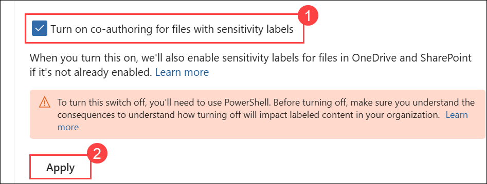

You have successfully enabled support for sensitivity labels for files in SharePoint and OneDrive.

## Task 2 – Create a sensitivity label

In this task, you'll create a parent sensitivity label for internal content. This label includes basic settings and acts as a parent label for department-specific sublabels.

1. In **Microsoft Edge**, navigate to `https://purview.microsoft.com`.

1. In the Microsoft Purview portal, select **Solutions** from the left sidebar, then select **Information Protection**.

1. On the **Microsoft Information Protection** page, on the left sidebar, select **Sensitivity labels**.

1. On the **Sensitivity labels** page select **+ Create a label**.

1. The **New sensitivity label** configuration will start. On the **Provide basic details for this label**, enter:

    - **Name**: `Internal`
    - **Display name**: `Internal`
    - **Description for users**: `Internal sensitivity label.`
    - **Description for admins**: `Internal sensitivity label for Contoso.`

1. Select **Next**.

1. On the **Define the scope for this label** page, select **Files** and **Emails**. If the checkbox for **Meetings** is selected, make sure it's deselected.

1. Select **Next**.

1. On the **Choose protection settings for labeled items** page, select **Next**.

1. On the **Auto-labeling for files and emails** page, select **Next**.

1. On the **Define protection settings for groups and sites** page, select **Next**.

1. On the **Review your settings and finish** page, select **Create label**.

1. On the **Your sensitivity label was created** page, select **Don't create a policy yet (1)**, then select **Done (2)**.

    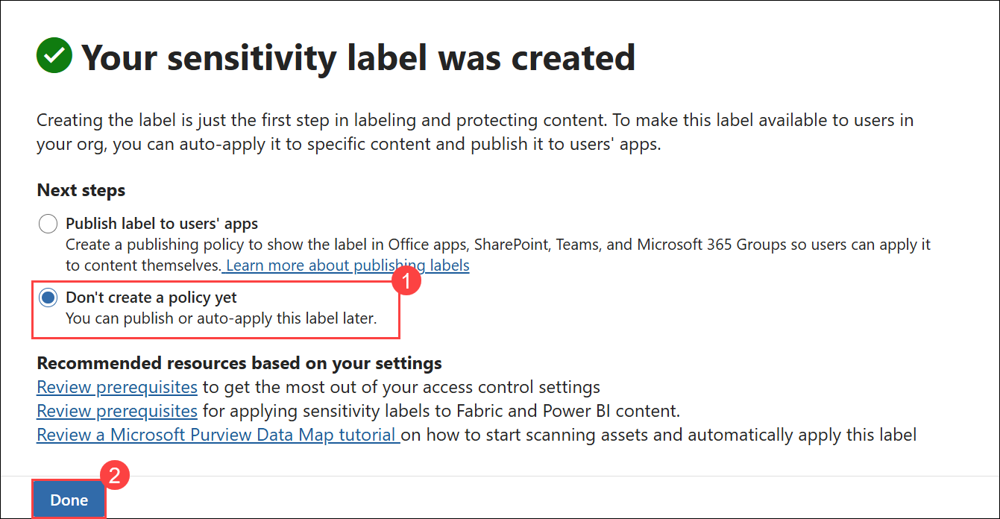

You've created a sensitivity label for internal use. This label will act as a parent label for more specific sublabels used across different departments.

## Task 3 – Create a sublabel

Now that you have a base label, you'll create a sublabel for HR-related documents. This sublabel includes protection settings and visible content markings to support internal data handling practices for the HR department.

1. On the **Sensitivity labels** page, find the newly created **Internal** sensitivity label. Select the vertical ellipsis (**...**) next to it, then select **+ Create sublabel** from the dropdown menu.

    

1. The **New sensitivity label** wizard will start. On the **Provide basic details for this label** page enter:

   - **Name**: `Employee data (HR)`
   - **Display name**: `Employee data (HR)`
   - **Description for users**: `This HR label is the default label for all specified documents in the HR Department.`
   - **Description for admins**: `This label is created in consultation with Ms. Jones (Head of HR department). Contact her if you need to change the label settings.`

1. Select **Next**.

1. On the **Define the scope for this label** page, select **Files** and **Emails**. If the checkbox for **Meetings** is selected, make sure it's deselected.

1. Select **Next**.

1. On the **Choose protection settings for labeled items** page, select the **Control access** and **Apply content marking** options, then select **Next**.

1. On the **Access control** page, select **Configure access control settings**.

1. Configure the encryption settings with these options:

   - **Assign permissions now or let users decide?**: Assign permissions now
   - **User access to content expires**: Never
   - **Allow offline access**: Only for a number of days
   - **Users have offline access to the content for this many days**: 15
   - Select the **Assign permissions** link. On the **Assign permissions** flyout panel, select the **+ Add any authenticated users**, then select **Save** to apply this setting.

1. On the **Access control** page, select **Next**.

1. On the **Content marking** page, select the toggle to enable **Content marking**.

1. For each of the following marking types, select the checkbox, then select the edit icon to enter the text:

   |Marking type|Text|
   |:---|:---|
   |Add a watermark|`INTERNAL USE ONLY`|
   |Add a header|`Internal Document`|
   |Add a footer|`Contoso Confidential`|

1. Select **Next**.

1. On the **Auto-labeling for files and emails** page, select **Next**.

1. On the **Define protection settings for groups and sites** page, select **Next**.

1. On the **Review your settings and finish** page, select **Create label**.

1. On the **Your sensitivity label was created** page, select **Don't create a policy yet**, then select **Done**.

You've created a sublabel that applies encryption and content markings to HR documents. This label helps ensure HR data is only accessible to authenticated users and can be identified by visual markings.

## Task 4 – Publish labels

You will now publish the Internal and HR sensitivity label so that the published sensitivity labels will be available for the HR users to apply to their HR documents.

1. In **Microsoft Edge**, the Microsoft Purview portal tab should still be open. If not, navigate to **`https://purview.microsoft.com`** > **Solutions** > **Information Protection** > **Sensitivity labels**.

1. On the **Sensitivity labels** page select **Publish labels**.

1. The publish sensitivity labels configuration will start.

1. On the **Choose sensitivity labels to publish** page, select the **Choose sensitivity labels to publish (1)** link.

1. On the **Sensitivity labels to publish** flyout panel, select the **Internal** and **Internal/Employee data (HR) (2)** checkboxes, then select **Add (3)** at the bottom of the flyout page.

    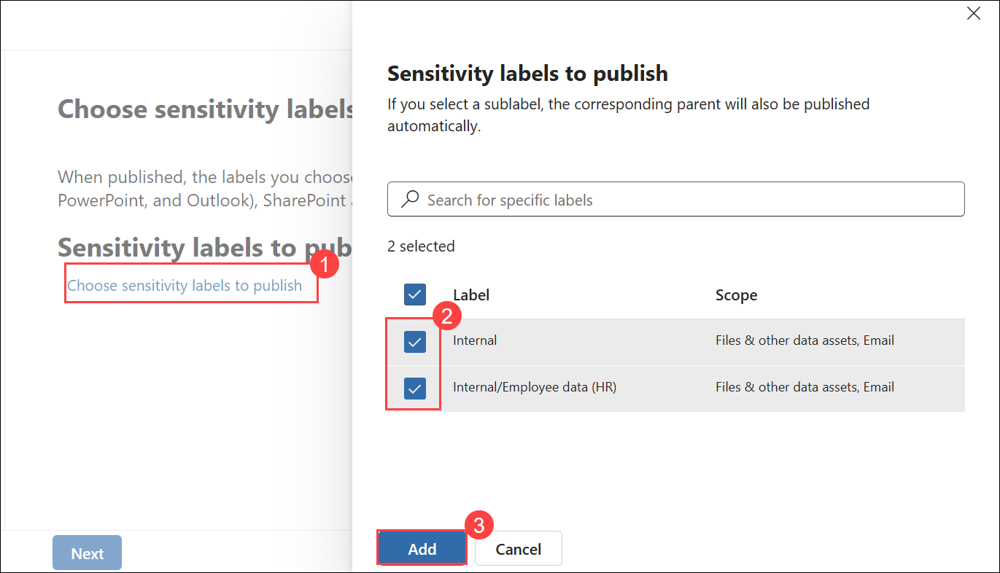

1. Back on the **Choose sensitivity labels to publish** page, select **Next**.

1. On the **Assign admin units** page, select **Next**

1. On the **Publish to users and groups** page, select **Next**.

1. On the **Policy settings** page, select **Next**.

1. On the **Default settings for documents** select **Next**.

1. On the **Default settings for emails** select **Next**.

1. On the **Default settings for meetings and calendar events** select **Next**.

1. On the **Default settings for Fabric and Power BI Content** page, select **Next**.

1. On the **Name your policy** page, enter:

   - **Name**: `Internal HR employee data`

   - **Enter a description for your sensitivity label policy**: `This HR label is to be applied to internal HR employee data.`

1. Select **Next**.

1. On the **Review and finish** page, select **Submit**.

1. On the **New policy created** page, select **Done** to finish publishing your label policy.

You have successfully published the Internal and HR sensitivity labels. Note that it can take up to 24 hours for changes to replicate to all users and services.

## Task 5 – Configure auto labeling

In this task, you'll create a sensitivity label for financial data and configure it to apply automatically to content containing specific financial identifiers, such as credit card numbers and bank routing information.

1. You should still be logged into the **LabVM**, signed in as demouser.

1. In **Microsoft Edge**, navigate to `https://purview.microsoft.com` and log into the Microsoft Purview portal as **Joni Sherman**.

1. In the Microsoft Purview portal, select **Solutions** > **Information protection** > **Sensitivity labels**.

1. On the **Sensitivity labels** page, find the **Internal** sensitivity label. Select the vertical ellipsis (**...**), then select **+ Create sublabel** from the dropdown menu.

1. On the **Provide basic details for this label** page, enter:

   |Details|Text|
   |---|---|
   |**Name**|`Financial Data`|
   |**Display name**|`Financial Data`|
   |**Description for users**|`This content contains financial data that must be labeled and protected.`|
   |**Description for admins**|`This label is used for content that includes sensitive financial identifiers.`|

1. Select **Next**.

1. On the **Define the scope for this label** page, select **Files** and **Emails**. If the checkbox for **Meetings** is selected, make sure it's deselected.

1. Select **Next**.

1. On the **Choose protection settings for labeled items** page, select **Next**.

1. On the **Auto-labeling for files and emails** page, set the **Auto-labeling for files and emails** to enabled.

1. In the **Detect content that matches these conditions** section, select **+ Add condition** > **Content contains**.

1. In **Content contains** section select the **Add** > **Sensitive info types**.

1. In the **Sensitive info types** flyout page, search for and select these sensitive info types:

   - `Credit Card Number`
   - `ABA Routing Number`
   - `SWIFT Code`

1. Select **Add**.

1. Back on the **Auto-labeling for files and emails** page, select **Next**.

1. On the **Define protection settings for groups and sites** page, select **Next**.

1. On the **Review your settings and finish** page, select **Create label**.

1. On the **Your sensitivity label was created** page, select **Automatically apply label to sensitive content (1)**, then select **Done (2)**.

    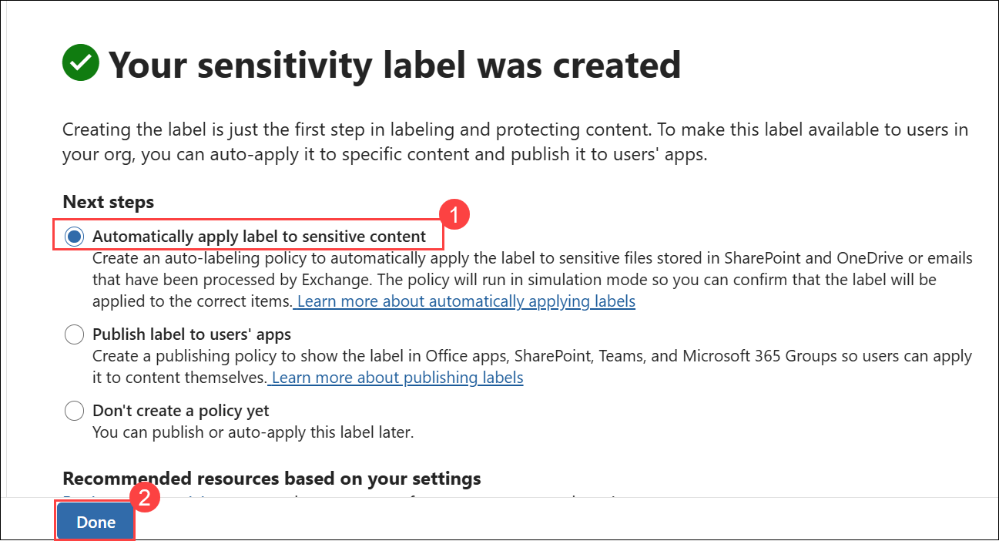

1. On the **Create auto-labeling policy** flyout page, select **Review policy**.

    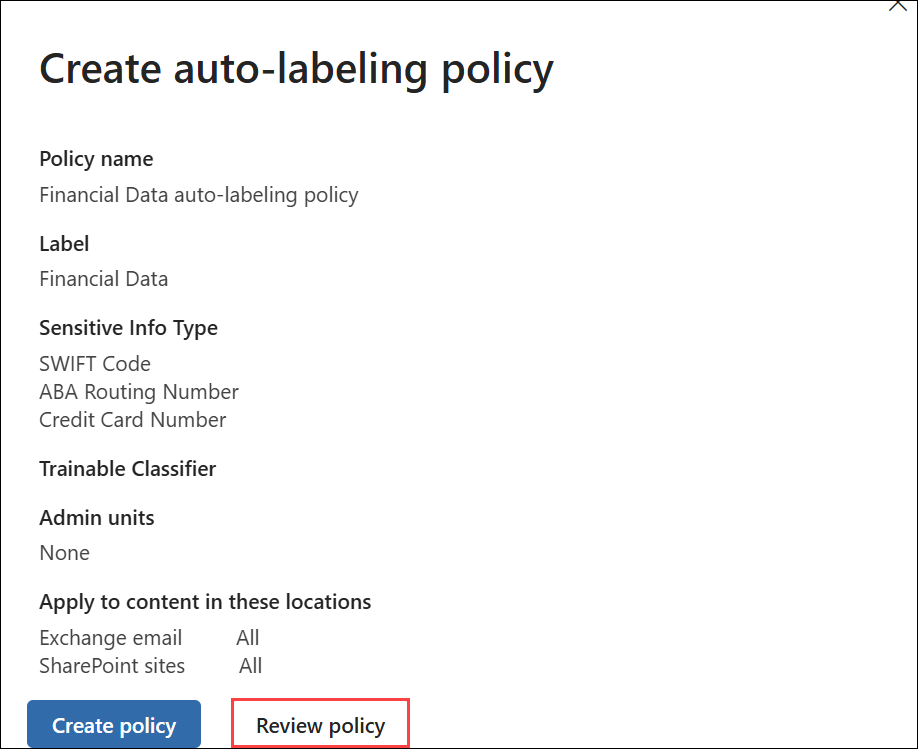

1. On the **Name your auto-labeling policy** page, leave the default, then select **Next**.

1. On the **Choose a label to auto-apply** page, review to ensure the _Internal/Financial Data_ label is selected, then select **Next**.

1. On the **Assign admin units** page, select **Next**.

1. On the **Choose locations where you want to apply the label** page, select the options for:

   - Exchange email
   - SharePoint sites
   - OneDrive accounts

1. Select **Next**.

1. On the **Set up common or advanced rules** page, leave the default **Common rules** selected, then select **Next**.

1. On the **Define rules for content in all locations** page, expand the rules for _Financial Data rule_ to ensure the expected rules are defined, then select **Next**.

1. On the **Additional settings for email** page, select **Next**.

1. On the **Decide if you want to test out the policy now or later** page, select **Run policy in simulation mode (1)**, and select the checkbox for **Automatically turn on policy if not modified after 7 days in simulation. (2)**

1. Select **Next (3)**.

    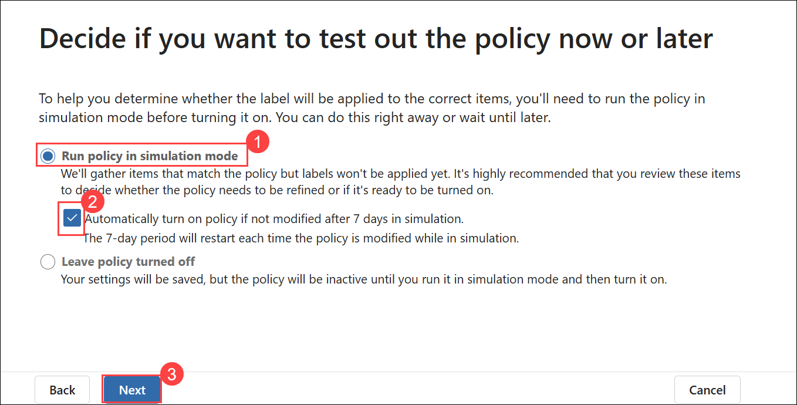

1. On the **Review and finish** page, select **Create policy**.

    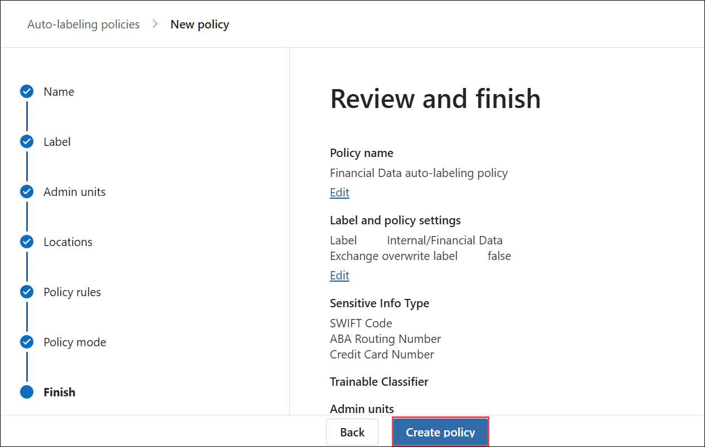

    > **Note:** Please anticipate a delay of two to three hours for the allocation of the required permissions to the user. This process necessitates time and effort before we can proceed with the following task.

1. On the **Your auto-labeling policy was created** page, select **Done**.

    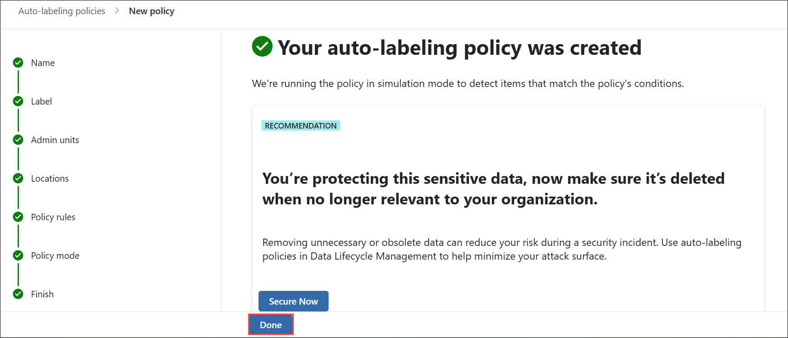

You have successfully created a sensitivity label for financial data and configured an auto-labeling policy to detect and label content that contains sensitive financial information.

## Task 6 – Create and publish a DKE label for confidential content

In this task, you'll create a sublabel under the Internal label. This sublabel will use Double Key Encryption (DKE) and dynamic watermarking to protect sensitive content accessed only by Legal. You'll also configure a label policy that requires justification for downgrading the label.

1. In **Microsoft Edge**, navigate to `https://purview.microsoft.com` and log into the Microsoft Purview portal as **Joni Sherman**.

1. In the Microsoft Purview portal, select **Solutions** > **Information protection** > **Sensitivity labels**.

1. On the **Sensitivity labels** page, find the **Internal** sensitivity label. Select the vertical ellipsis (**...**), then select **+ Create sublabel** from the dropdown menu.

1. On the **Provide basic details for this label** page, enter:

   |Details|Text|
   |---|---|
   |**Name**|`Confidential Legal`|
   |**Display name**|`Confidential Legal`|
   |**Description for users**|`Use this label for highly sensitive legal content that must be encrypted using Double Key Encryption.`|
   |**Description for admins**|`Label configured with DKE and dynamic watermarking for highly sensitive legal content.`|

1. Select **Next**.

1. On the **Define the scope for this label** page, select **Files** and **Emails**. If the checkbox for **Meetings** is selected, make sure it's deselected.

1. On the **Choose protection settings for the types of items you selected** page, select **Control access**, then select **Next**.

1. On the **Access control** page, select **Configure access control settings**.

1. Configure the encryption settings with these options:

   - **Assign permissions now or let users decide?**: Assign permissions now

   - **User access to content expires**: A number of days after label is applied

   - **Access expires this many days after the label is applied**: 5

   - **Allow offline access**: Never

   - Select the **Assign permissions** link. On the **Assign permissions** flyout panel, select the **+ Add users or groups**.

   - On the **Add users or groups** flyout page, search for and select `Legal Team` and `Joni Sherman`, and select **Add**.

   - On the **Assign permissions** page, select **Save**.

1. Back on the **Access control** page, select the checkbox for **Use dynamic watermarking**, then select **Customize text (optional)**.

1. On the **Add custom text to watermark (optional)** page, Enter `Confidential`, then select the links for **UPN** and **Timestamp**.

1. Select **Save** at the bottom of the flyout page.

1. Back on the **Access control** page, select the checkbox for **Use Double Key Encryption**, and enter `https://testingdke1.azurewebsites.net/Test` as the URL for the Double Key Encryption service.

1. Select **Next**.

1. On the **Auto-labeling for files and emails** page, select **Next**.

1. On the **Define protection settings for groups and sites** page, select **Next**.

1. On the **Review your settings and finish** page, select **Create label**.

1. On the **Your sensitivity label was created** page, select **Publish label to users' apps (1)**, then select **Done (1)**.

    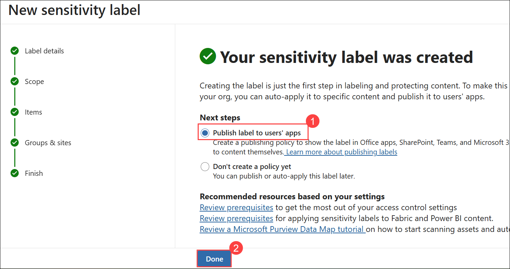

1. On the **Publish label** flyout page, select **Create new label policy**.

    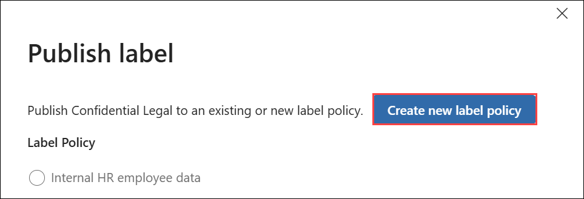

1. On the **Choose sensitivity labels to publish** page, select **Choose sensitivity labels to publish (1)** and add the **Internal/Confidential Legal (2)** label, then select **Add (3)**.

    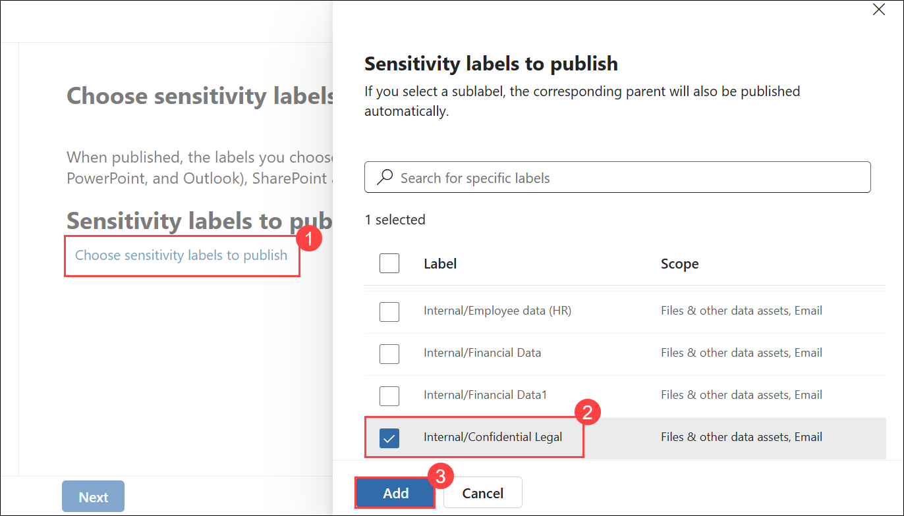

1. Select **Next**.

1. On the **Assign admin units** page, select **Next**.

1. On the **Publish to users and groups** page, leave the default selected, then select **Next**.

1. On the **Policy settings** page, select the checkbox for **Users must provide a justification to remove a label or lower its classification**, then select **Next**.

1. On the **Default settings for documents​** page, select **Next**.

1. On the **Default settings for emails​** page, select **Next**.

1. On the **Default settings for meetings and calendar events​** page, select **Next**.

1. On the **Default settings for Fabric and Power BI content​** page, select **Next**.

1. On the **Name your policy** page, enter:

   - **Name**: `Confidential Legal` **(1)**

   - **Description**: `Enables manual use of the DKE label for confidential content accessible by Legal.` **(2)**

1. Select **Next (3)**.

    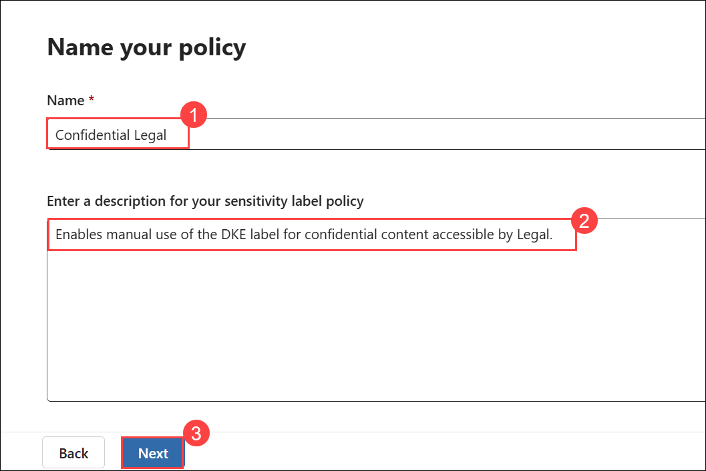

1. On the **Review and finish** page, select **Submit**.

    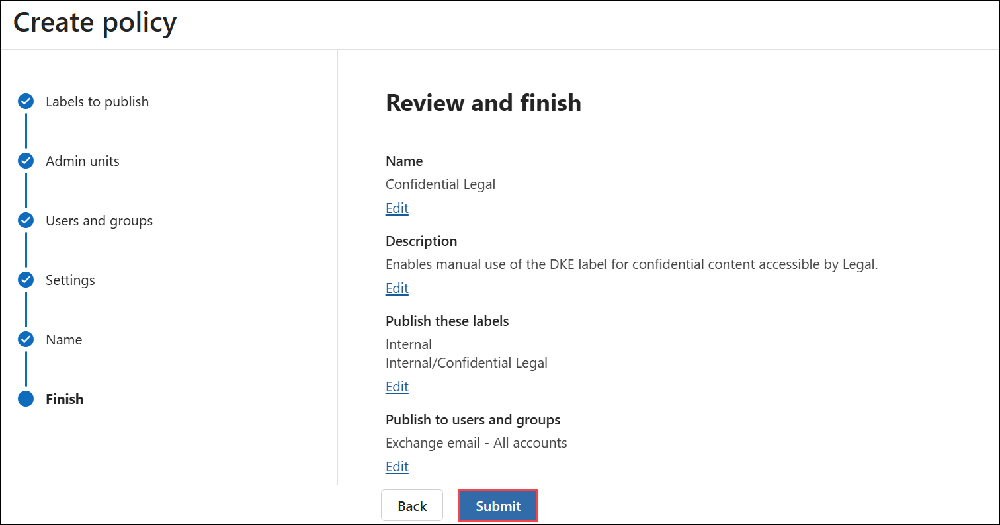

1. On the **New policy created** page, select **Done**.

You have successfully created and published a sublabel using Double Key Encryption with dynamic watermarking. This label provides strong protection for highly confidential content and enforces restricted access and justification for classification changes.

## Task 7 – Enable Microsoft Purview integration in Defender for Cloud Apps

In this task, you'll enable Microsoft Purview integration in Microsoft Defender for Cloud Apps and turn on file monitoring. This allows Defender to scan new and modified files for sensitivity labels from Microsoft Purview, inspect content based on those labels, and monitor files so that file policies can be applied.

1. Open **Microsoft Edge**, then go to **Microsoft Defender** by navigating to `https://security.microsoft.com`.

1. In the left navigation, select **Settings (1)**, then select **Cloud Apps (2)**.

    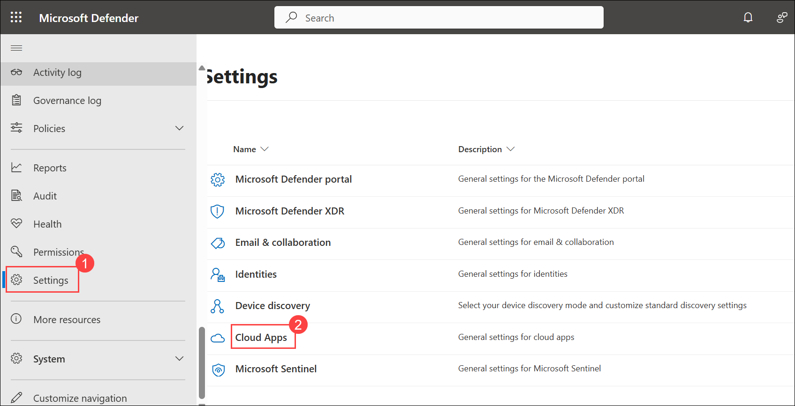

1. Under the **Information Protection** section in the left pane, select **Microsoft Information Protection**.

1. On the **Microsoft Information Protection** page, select both checkboxes available on the page.

    

   - **Automatically scan new files for Microsoft Information Protection sensitivity labels and content inspection warnings**

      Enables Defender for Cloud Apps to automatically scan new or modified files for sensitivity labels and content inspection warnings from Microsoft Purview.

   - **Only scan files for Microsoft Information Protection sensitivity labels and content inspection warnings from this tenant**

      Limits scanning to labels and warnings created in your own organization. Labels applied by external tenants will be ignored.

1. Select **Save** to apply the settings.

1. Under the **Information Protection** section in the left pane, select **Files (1)**.

1. On the **Files** page, select **Enable file monitoring (2)**.

1. Select **Save (3)** to apply the settings.

    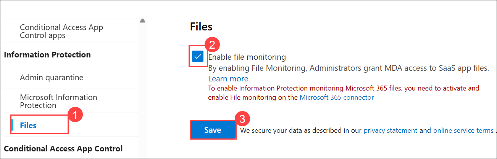

You've enabled Defender for Cloud Apps to scan files for sensitivity labels and monitor files so that file policies can evaluate and apply governance actions.

## Review

In this lab, you have completed the following tasks:

- Enable support for sensitivity labels
- Create a sensitivity label
- Create a sublabel
- Publish sensitivity labels
- Configure auto labeling
- Create and publish a DKE label for highly confidential content
- Enable Microsoft Purview integration in Defender for Cloud Apps