# Lab 1 - Exercise 4 - Deploy Microsoft Purview Message Encryption

Joni Sherman, an Information Security Administrator at Contoso Ltd., is implementing secure email communication to protect sensitive information exchanged between departments. As part of this effort, she'll configure Microsoft Purview Message Encryption (OME) by using the Exchange admin center to automatically encrypt messages sent from the Finance department and include a clear notice that the message was sent securely.

## Lab Objectives

In this lab, you will perform the following:

- Task 01: Create a mail flow rule to encrypt messages from the Finance department
- Task 02: Add a disclaimer to encrypted messages
- Task 03: Enable the mail flow rule  behavior
- Task 04: Validate message encryption

## Task 1 – Create a mail flow rule to encrypt messages from the Finance department

In this task, you'll use the Exchange admin center to create a mail flow rule that applies Microsoft Purview Message Encryption to all messages sent by members of the Finance Team group.

1. In **Microsoft Edge**, go to `https://admin.exchange.microsoft.com` and log in with below credentials.

    - **Email/Username:** **<inject key="User 01 UPN"></inject>**.
    - **Password:** **<inject key="User 01 Password"></inject>**

1. In the left navigation pane, expand **Mail flow (1)**, then select **Rules (2)**.

1. On the **Rules** page, select **+ Add a rule (3)** > **Apply Office 365 Message Encryption and rights protection to messages (4)**.

     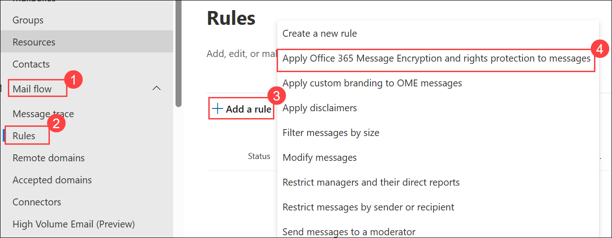

1. On the **Set rule conditions** page, configure:

   - **Name:** `Encrypt messages from Finance department` **(1)**

   - In the **Apply this rule if** section, configure:

      - For dropdown 1: **The sender (2)**

      - For dropdown 2: **is a member of this group (2)**, then select **Finance Team** and **Save** in the **Select members** flyout.

        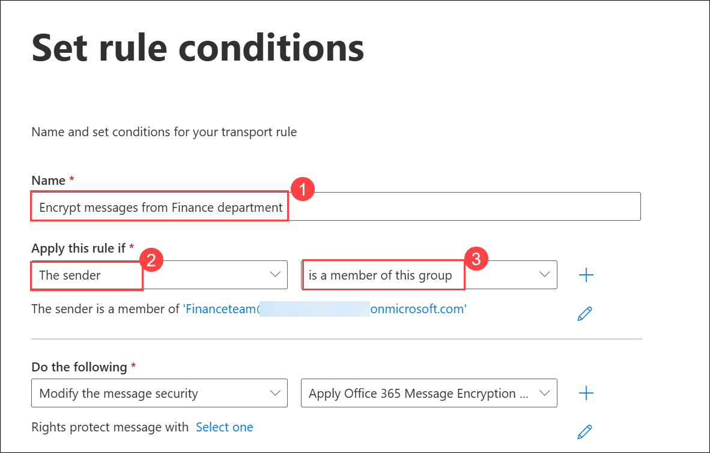

        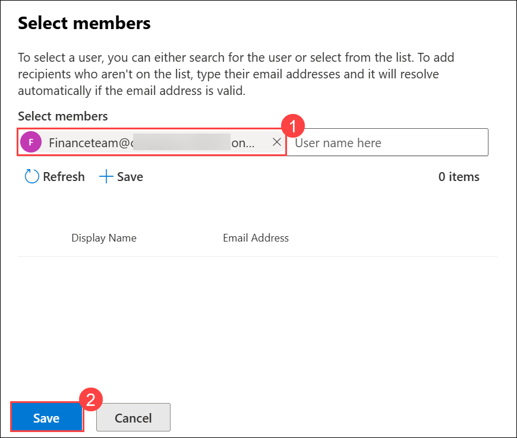

        >**Note:** If the **Finance Team** group doesn’t appear in the list automatically, go to the **Azure portal** → **Groups**, locate the **Finance Team**, and copy its **email address** (for example, `Financeteam@otuwamocxxxxx.onmicrosoft.com`).  

   - In the **Do the following** section:

     - Leave the default **Modify the message security** and **Apply Office 365 Message Encryption and rights protection** selected

     - Select the **Select one** link under the **Do the following** section.

       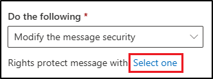

     - In the **Select RMS template** flyout, select **Encrypt (1)**, then select **Save (2)**.

        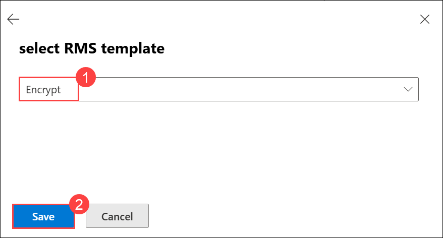

     - Select **Next** back on the **Set rule conditions** page.

1. On the **Set rule settings** page, leave the default selected, then select **Next**.

1. On the **Review and finish** page, review your mail flow rule, then select **Finish**.

     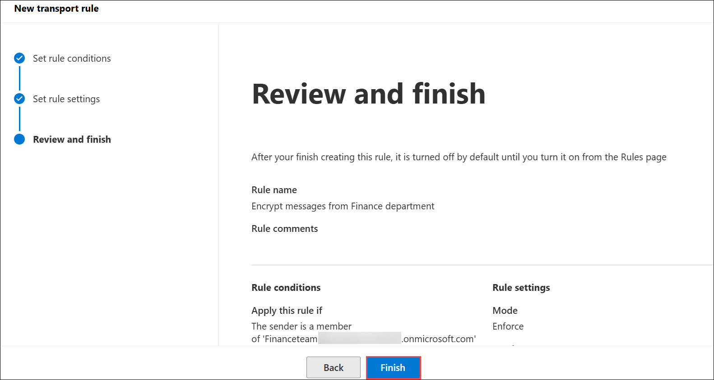

1. Select **Done** once your mail flow rule has been created.

You've successfully created a mail flow rule that encrypts messages sent from the Finance department using Microsoft Purview Message Encryption. This ensures that sensitive financial communications are protected before leaving the organization.

## Task 2 – Add a disclaimer to encrypted messages

Next, you'll modify the existing encryption rule to append a disclaimer. This disclaimer acts as a simple form of message branding, notifying recipients that the message was sent securely by Contoso Ltd.

1. On the **Rules** page, select the newly created **Encrypt messages from Finance department (1)**.

1. In the **Encrypt messages from Finance department** flyout, select **Edit rule conditions (2)**.

     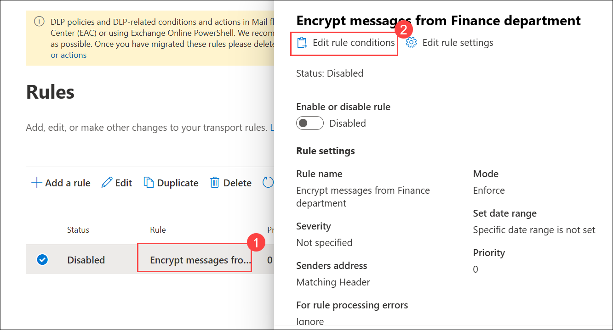

1. Select the **+** to the right of the **Do the following** section to add another action.

    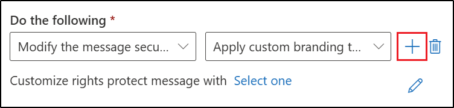

1. In the newly created **And** section:

   - For dropdown 1: **Apply a disclaimer to the message (1)**

   - For dropdown 2: **append a disclaimer (2)**.

   - Under the dropdowns, select **Enter text (3)**, then enter `This email has been encrypted and sent securely by Contoso Ltd.` **(1)** in the **specify disclaimer text** flyout.

     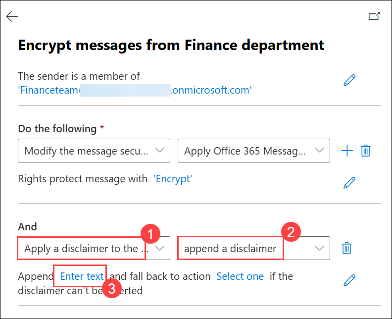

   - Select **Save (2)** at the bottom of the flyout.

     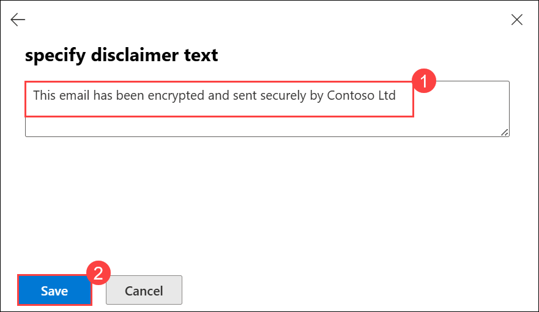

   - Select the link to add a fallback action. In the **specify fallback action** flyout, select **Wrap (1)**, then select **Save (2)** at the bottom of the flyout.

     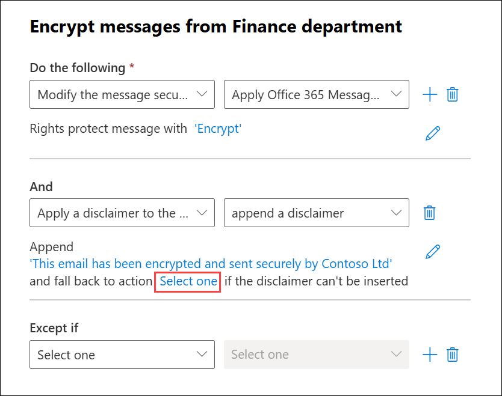

     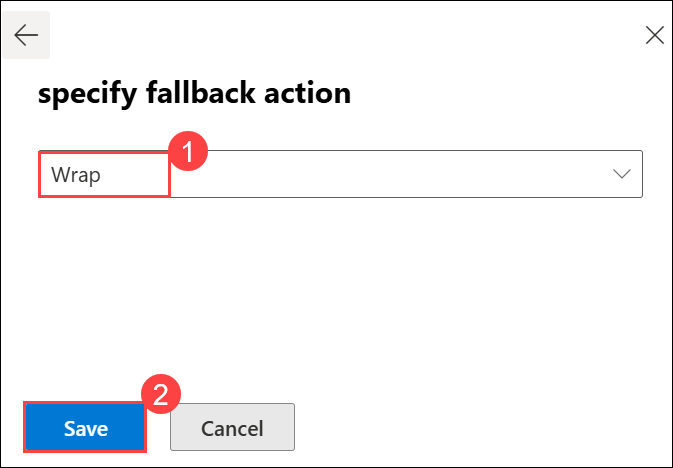

1. Select **Save** at the bottom **Encrypt messages from Finance department** flyout.

     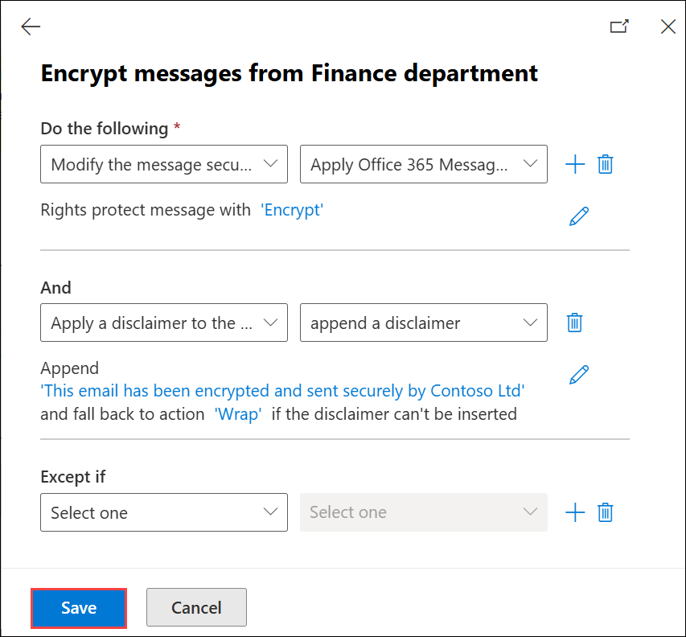

1. Once the rule has been changed, you'll see a message stating **Transport rule updated successfully**.

1. Close the flyout by selecting the **X** in the top right corner of the flyout.

You've updated the encryption rule to append a disclaimer to each protected message. This makes it clear to recipients that the email was encrypted and securely transmitted from Contoso Ltd.

## Task 3 – Enable the mail flow rule

By default, new mail flow rules are created in a disabled state. In this task, you'll enable the encryption rule so it can begin protecting messages from the Finance department.

1. On the **Rules** page, select **Disabled (1)** for the newly created **Encrypt messages from Finance department**.

1. In the **Encrypt messages from Finance department** flyout, set the toggle under **Enable or disable rule** to **Enabled (2)**.

     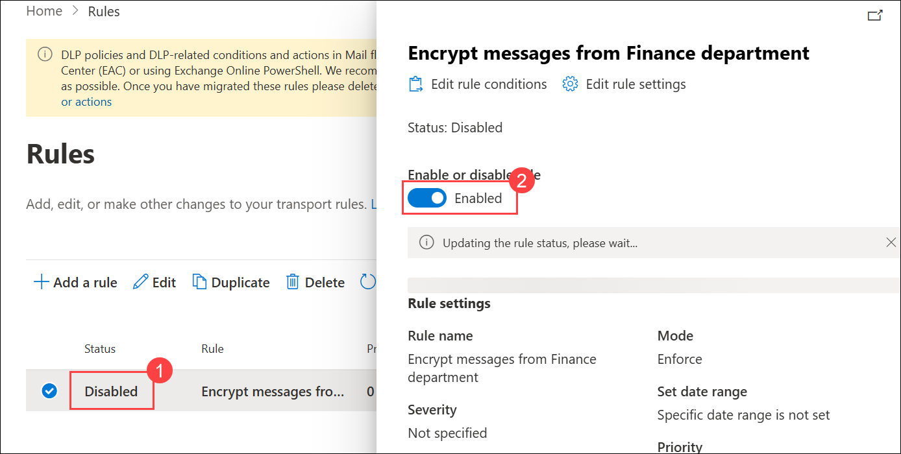

1. The mail flow rule will enable automatically. You'll see a message stating **Updating the rule status, please wait...**. Once the rule is enabled, you'll see a message stating **Rule status updated successfully**.

     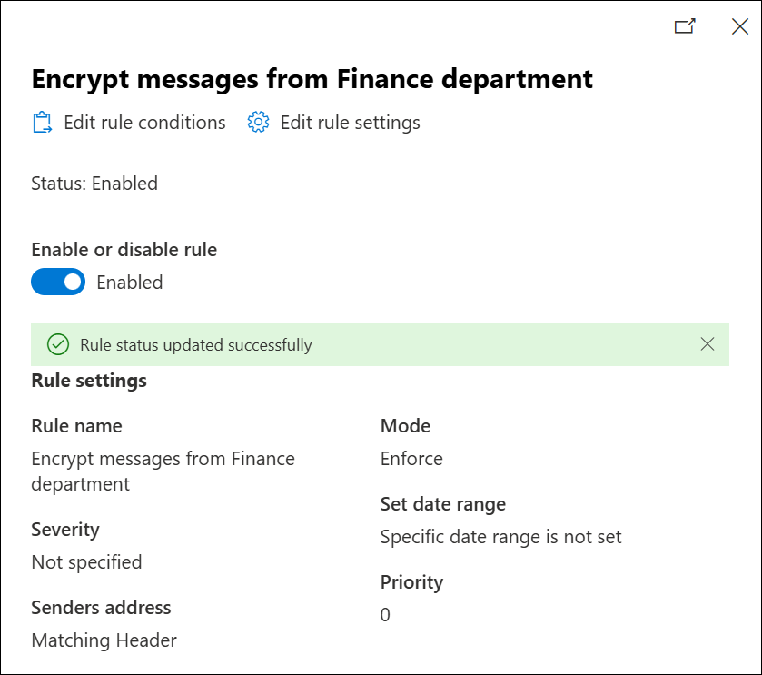

1. Close the flyout by selecting the **X** in the top right corner of the flyout.

    > [!note] **Note: Rule propagation**
    >
    > Changes can take several minutes to apply. If validation fails, wait a few minutes and send the test again.

The encryption rule is now active and enforcing Microsoft Purview Message Encryption for messages sent from the Finance department. Any future messages from Finance users will be automatically encrypted and include the Contoso Ltd. disclaimer.

## Task 4 – Validate message encryption

In this task, you'll send a test email from a member of the Finance department to confirm that Microsoft Purview Message Encryption is applied automatically and that the recipient sees the secure message notice.

> [!alert] External email delivery might be blocked in some lab environments. This task might not complete as expected.

1. Open **Microsoft Edge** in an InPrivate window by right clicking Microsoft Edge from the task bar and selecting **New InPrivate window**.

1. Navigate to **`https://outlook.office.com`** and log into Outlook on the web as `ODL User` using below credentials.

    - **Email/Username:** <inject key="AzureAdUserEmail"></inject>

    - **Password:** <inject key="AzureAdUserPassword"></inject>

1. On the **Stay signed in?** dialog box, select the checkbox for **Don't show this again** then select **No**.

1. In Outlook on the web, select **New mail**.

     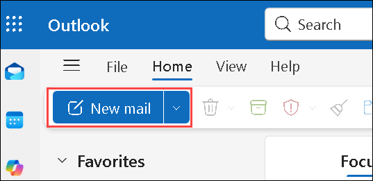

1. In the **To** line enter your personal or other third-party email address **(1)** that isn't in the tenant domain. Enter **`Secret Message` (2)** in the subject line and **`My super-secret message.` (3)** in the body of the email.

1. Select **Send (4)** to send the message. Leave the Outlook window open.

     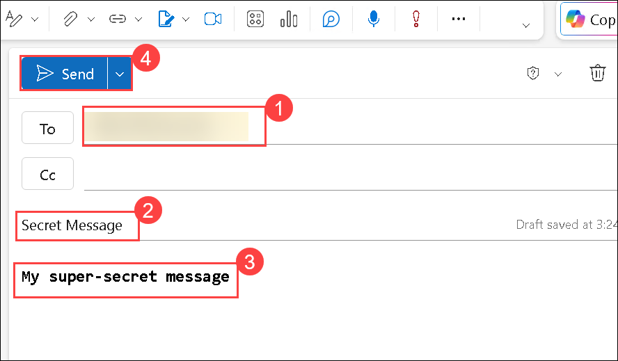

1. Sign into your personal email account in a new window and open the message from ODL User. If you sent this email to a Microsoft account (like @outlook.com) the encryption might be processed automatically, and you'll see the message automatically. If you sent the email to another email service like (@gmail.com), you might have to perform the next steps to process the encryption and read the message.

    >**Note**: You might need to check your junk or spam folder for the message from ODL User.

1. Select **Read the message**.

1. Select **Sign in with a One-time passcode** to receive a limited time passcode.

1. Go to your personal email portal and open the message with subject **Your one-time passcode to view the message**.

1. Copy the passcode, paste it into the portal and select **Continue**.

1. Review the encrypted message. You should see the **This email has been encrypted and sent securely by Contoso Ltd.** message at the bottom of your email.

You've successfully validated that messages from the Finance department are automatically encrypted and include the appended Contoso disclaimer, confirming that Microsoft Purview Message Encryption is working as expected.

## Review

In this lab, you have completed the following tasks:

- Create a mail flow rule to encrypt messages from the Finance department
- Add a disclaimer to encrypted messages
- Enable the mail flow rule  
- Validate message encryption