# Lab 2 – Exercise 1 – Implement and manage DLP policies

## Estimated Duration: 90 minutes

Joni Sherman, the newly hired Information Security Administrator at Contoso Ltd., has been asked to configure data loss prevention (DLP) policies to help protect sensitive customer data across Microsoft 365. In this lab, you'll use Microsoft Purview and Microsoft Defender to create and manage DLP policies that detect and restrict the sharing of sensitive information such as credit card numbers and employee IDs.

## Lab Objectives

In this lab, you will perform the following:

- Task 01: Create a DLP policy in simulation mode
- Task 02: Modify a DLP policy
- Task 03: Create a DLP policy in PowerShell
- Task 04: Activate a policy in simulation mode
- Task 05: Modify policy priority
- Task 06: Enable file inspection in Microsoft 365 Defender
- Task 07: Create a file policy for Microsoft 365 Defender

## Task 1 – Create a DLP policy in simulation mode

In this task, you'll create a DLP policy in simulation mode that targets credit card numbers in Teams messages. The policy will notify users when they attempt to share sensitive content and allow them to override with justification.

1. You’ll now be working within the **LabVM**, signed in as demouser.

1. In **Microsoft Edge**, navigate to **`https://purview.microsoft.com`** and log into the Microsoft Purview portal as **Joni Sherman**.

   - **Email/Username:** **<inject key="User 01 UPN"></inject>**.
   - **Password:** **<inject key="User 01 Password"></inject>**

1. Select **Solutions (1)** > **Data Loss Prevention (2)**.

    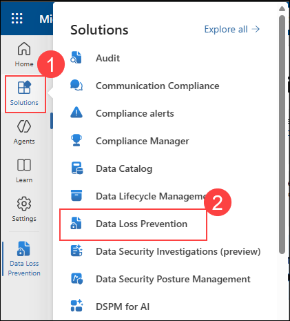

1. Select **Policies (1)** from the left toolbar. On the **Policies** page, select **+ Create policy (2)** to start the configuration for creating a new data loss prevention policy.

    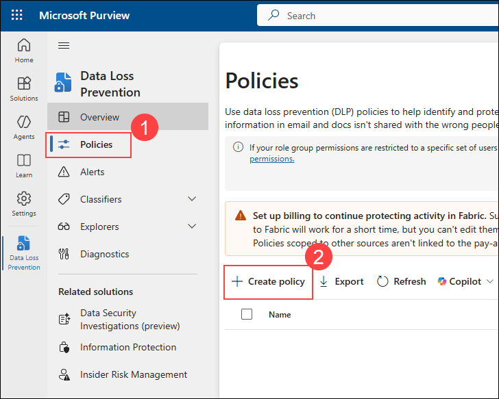

1. On the **Choose what type of data to protect** page, select **Data stored in connected sources** then select **Next**.

    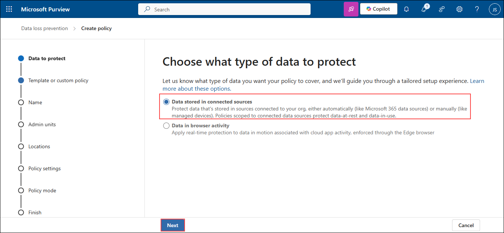

1. On the **Start with a template or create a custom policy** page, select **Custom** as the category, then select **Custom policy** under **Regulations**. Then select **Next**.

    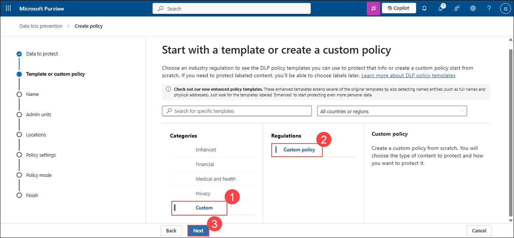

1. On the **Name your DLP policy** page provide the following details then select **Next**.:

   - **Name**: `DLP - Credit Card Protection`
   - **Description**: `Detect and restrict sharing of credit card numbers in Teams messages.`

        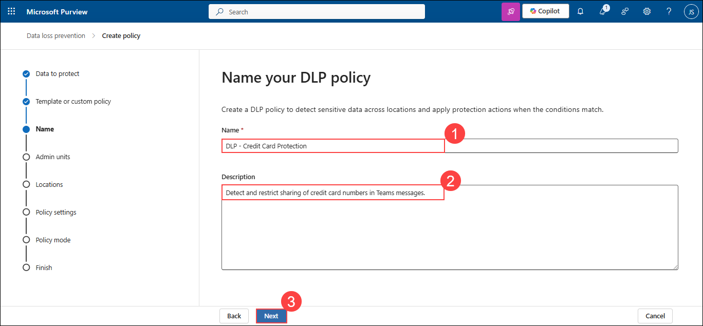

1. On the **Assign admin units** page select **Next (1)**.

    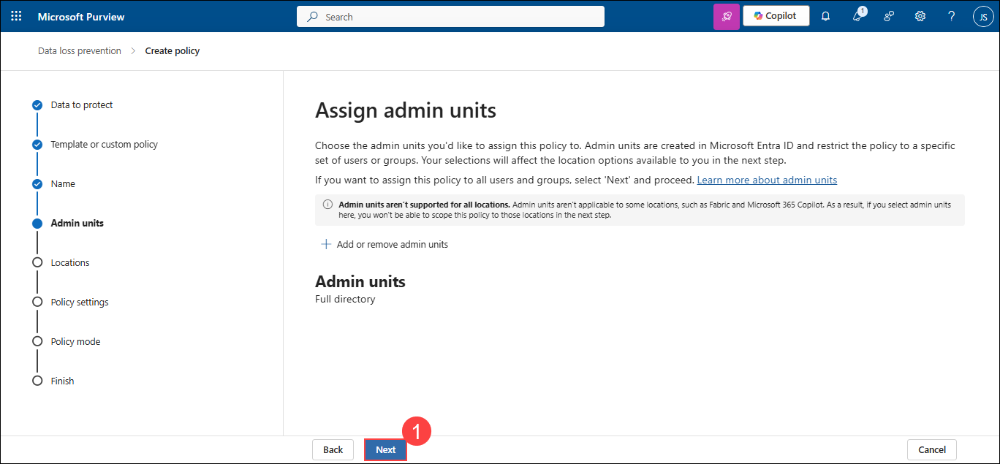

1. On the **Choose locations to apply the policy** page, enable the location for **Teams chat and channel messages (1)** only. If any other locations are selected, deselect them. Then select **Next (2)**.

    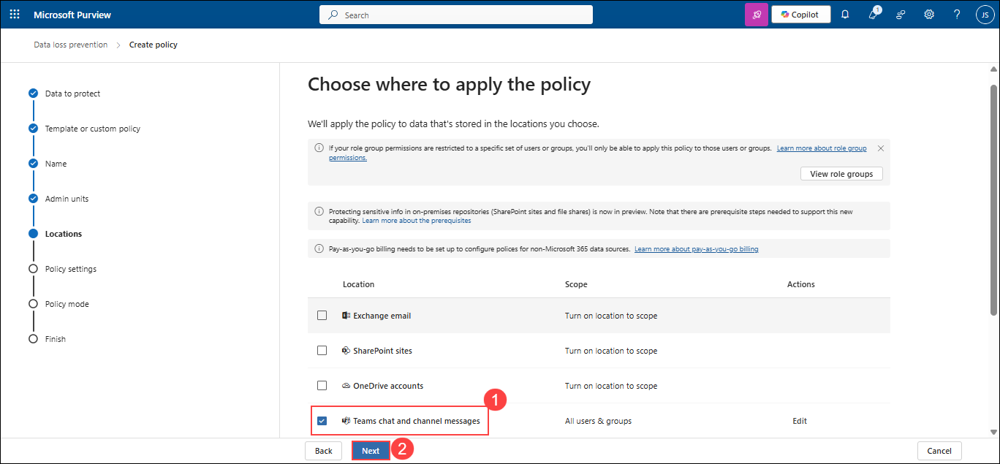

1. On the **Define policy settings** page, select **Create or customize advanced DLP rules (1)**, then select **Next (2)**.

    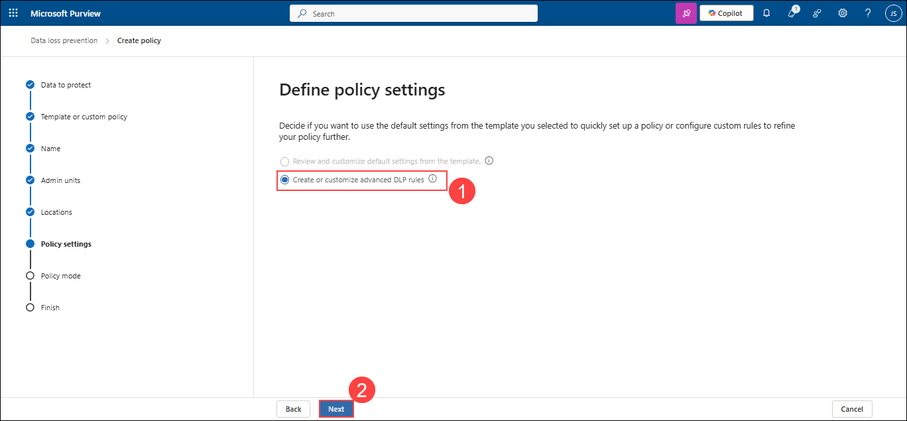

1. On the **Customize advanced DLP rules** page, select **+ Create rule (1)**.

    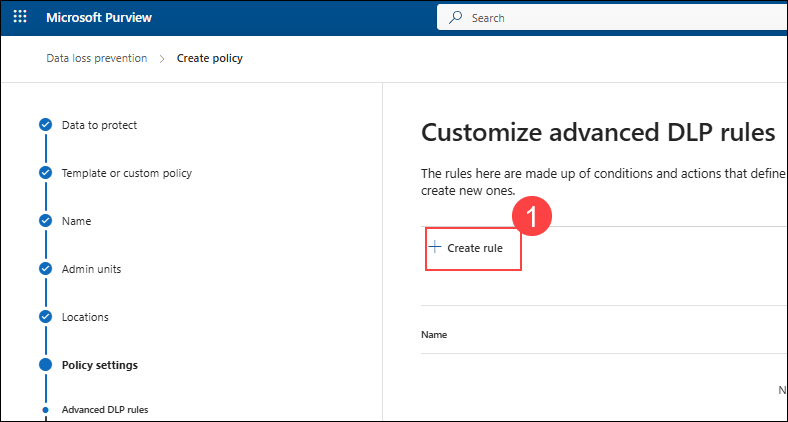

1. In the **Create rule** flyout:
    - In the **Name** field, enter **Credit card information (1)**.
    - Under **Conditions**, select **+ Add condition (2)** > **Content is shared from Microsoft 365 (3)**.

        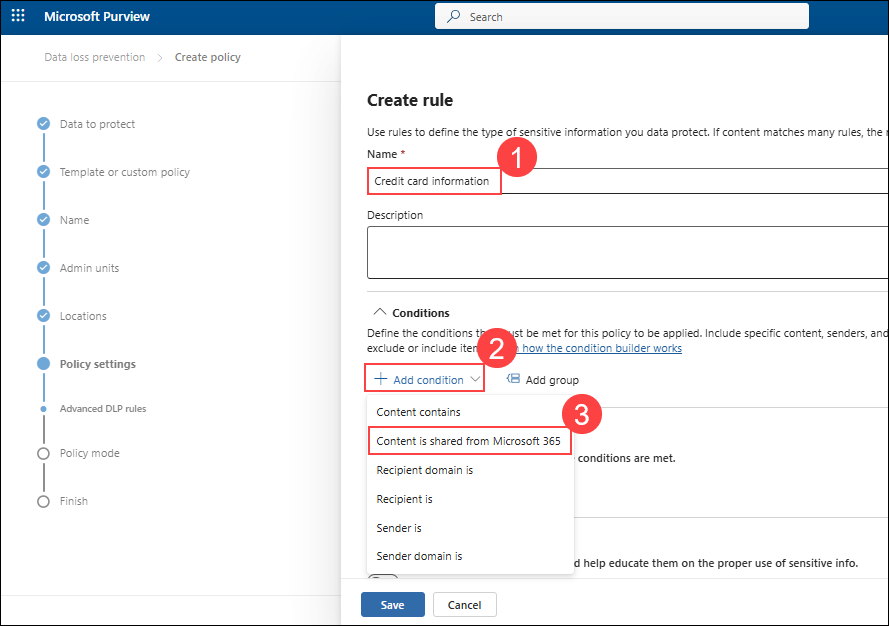

1. In the **Content is shared from Microsoft 365** section:
    - Select the option for **with people outside my organization (1)**.
    - Select **+ Add condition (2)** > **Content contains (3)**.

        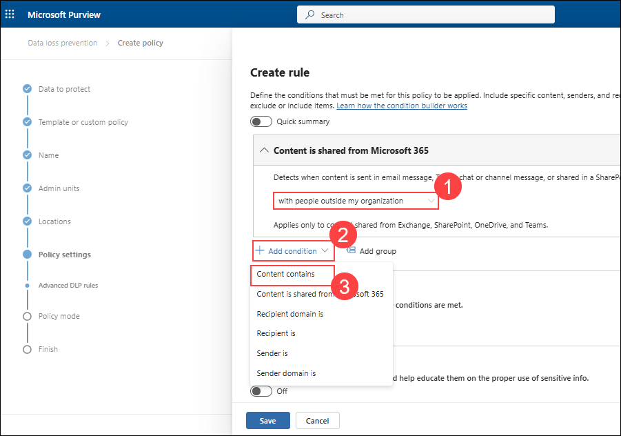

1. In the new **Content contains** section:
    - Select **Add (1)** > **Sensitive info types (2)**.
    - On the **Sensitive info types** page, search for and select **Credit Card Number (3)**, then select **Add (4)**.

        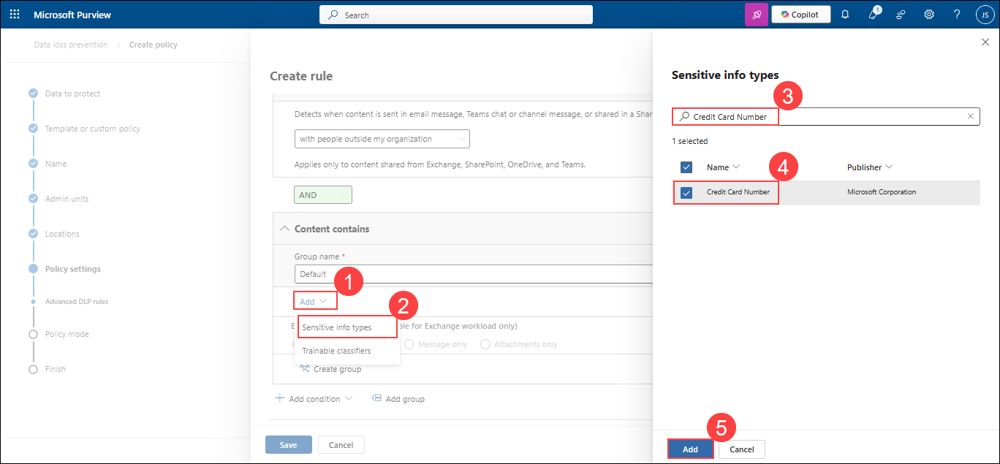

1. Under **Actions**, select **+ Add an action (1)** > **Restrict access or encrypt the content in Microsoft 365 locations (2)**.

    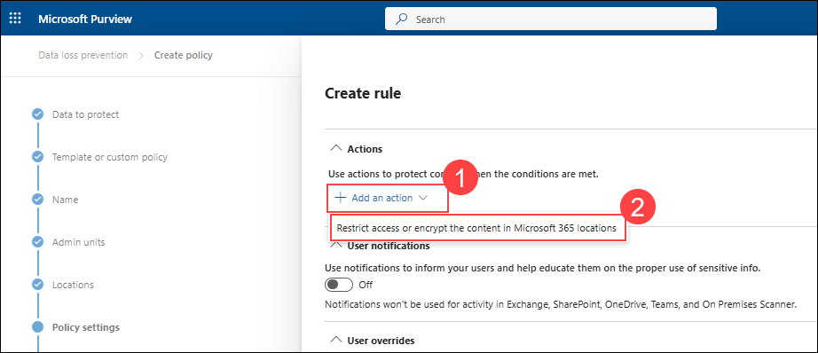

1. In the **Restrict access or encrypt the content in Microsoft 365 locations** section:
    - Select **Block only people outside your organization (1)**.
    - Under **User notifications**:
        - Turn on the toggle for **Use notifications to inform your users and help educate them on the proper use of sensitive info. (2)**.
        - Select the checkbox for **Notify users in Office 365 service with a policy tip or email notifications (3)**.

            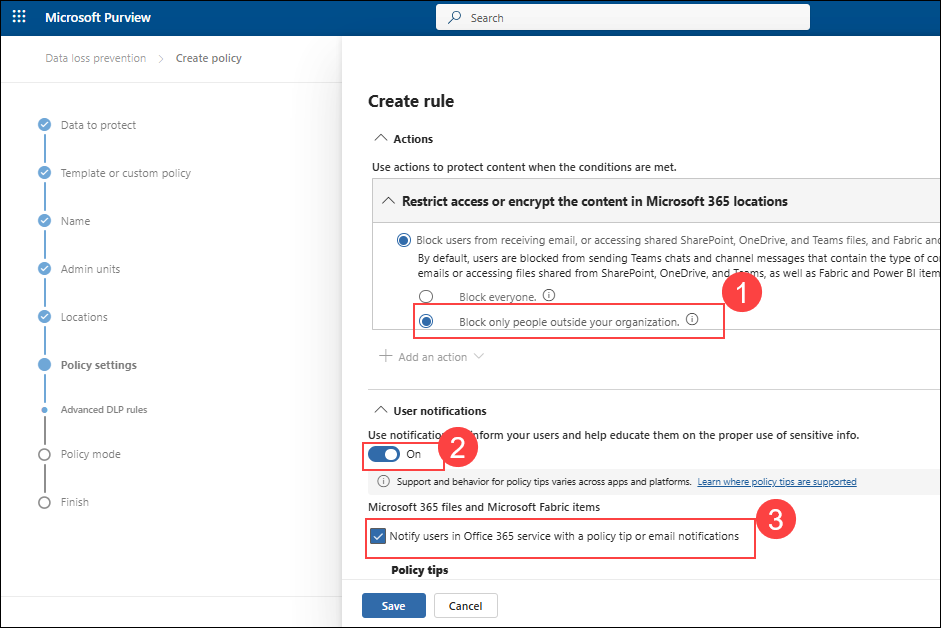

1. Under **User overrides**:
    - Select the checkbox for **Allow users to override policy restrictions in Fabric (including Power BI), Exchange, SharePoint, OneDrive, and Teams (1)**.
    - Select the checkbox for **Require a business justification to override (2)**.

        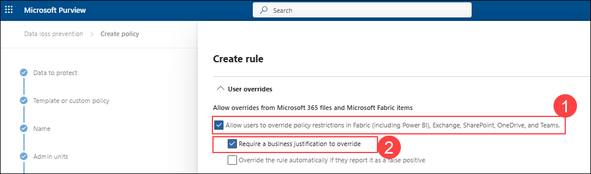

1. Under **Incident reports**, in the **Use this severity level in admin alerts and reports** dropdown:
    - Select **Low**.

1. At the bottom of the **Create rule** flyout panel, select **Save**.

1. Back on the **Customize advanced DLP rules**, select **Next**.

    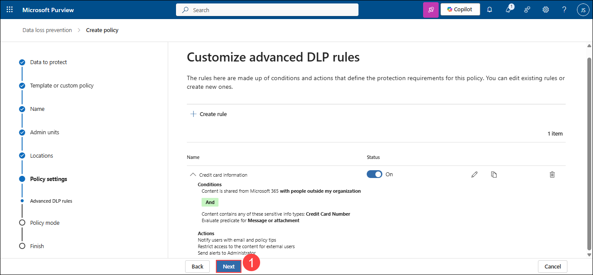

1. On the **Policy mode** page select **Run the policy in simulation mode (1)** and select the checkbox for **Show policy tips while in simulation mode (2)** then select **Next (3)**.

    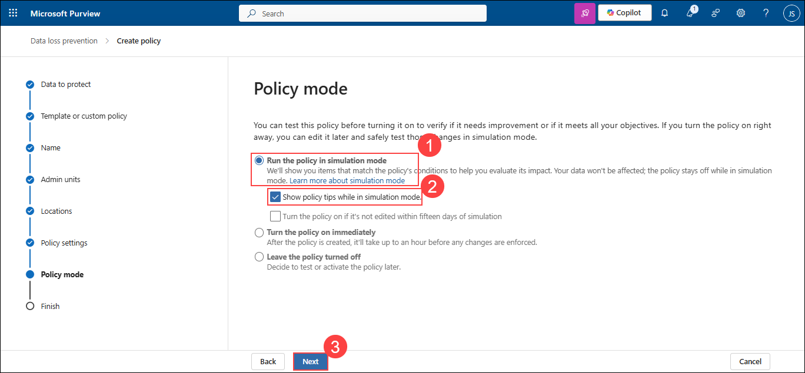

1. On the **Review and finish** page review your settings then select **Submit (1)**.

    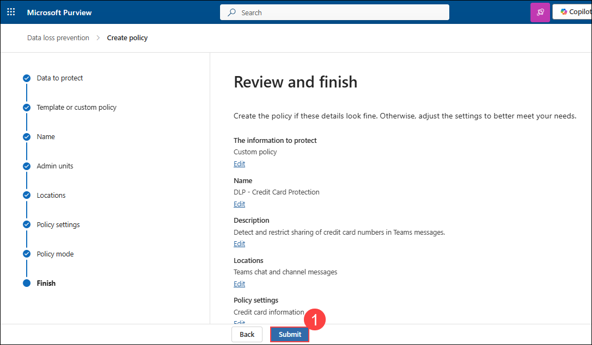

1. On the **New policy created** page select **Done (1)**.

    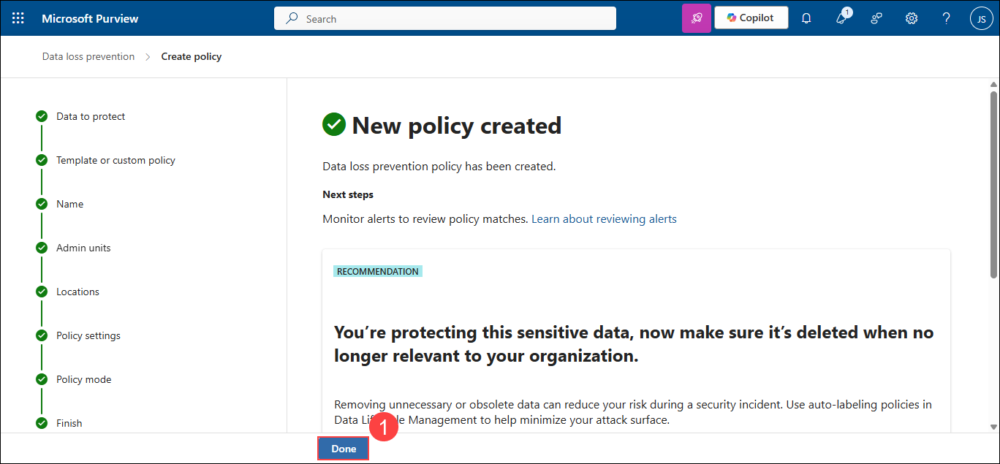

You've created a DLP policy that scans Teams content for credit card numbers and allows overrides with business justification.

## Task 2 – Modify a DLP policy

In this task, you'll expand the scope of your existing DLP policy to include Exchange email. This helps ensure consistent protection across additional communication channels.

1. You should still be logged into **LabVM**, signed in as demouser, and you should be logged into Microsoft 365 as **Joni Sherman**.

1. You should still be on the **Policies** page in Microsoft Purview. If not, open **Microsoft Edge** and navigate to `https://purview.microsoft.com`. Select **Solutions** > **Data Loss Prevention** > **Policies**.

1. On the **Policies (1)** page select the checkbox for the recently created **DLP - Credit Card Protection (2)**, then select **Edit policy (3)** to open the policy configuration.

    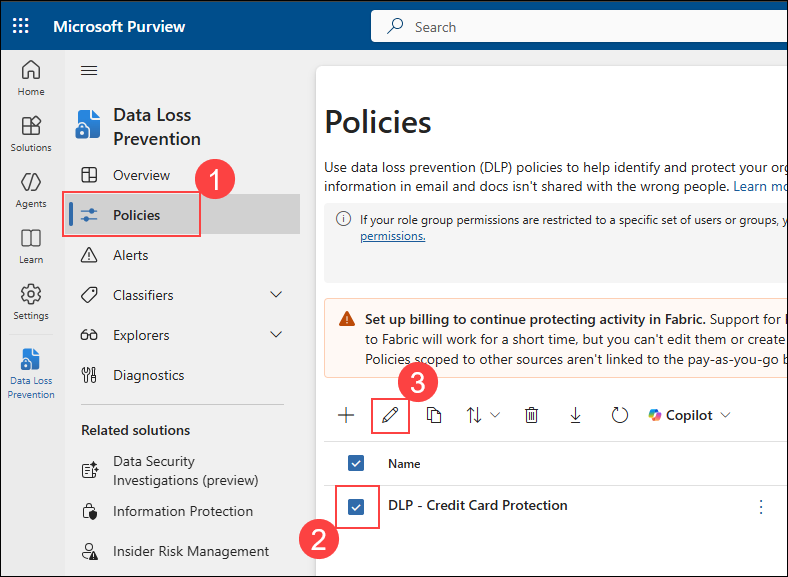

1. On the **Name your DLP policy** page, edit the description to `Detect and restrict sharing of credit card numbers in Teams and Exchange messages (1)` then select **Next (2)**.

    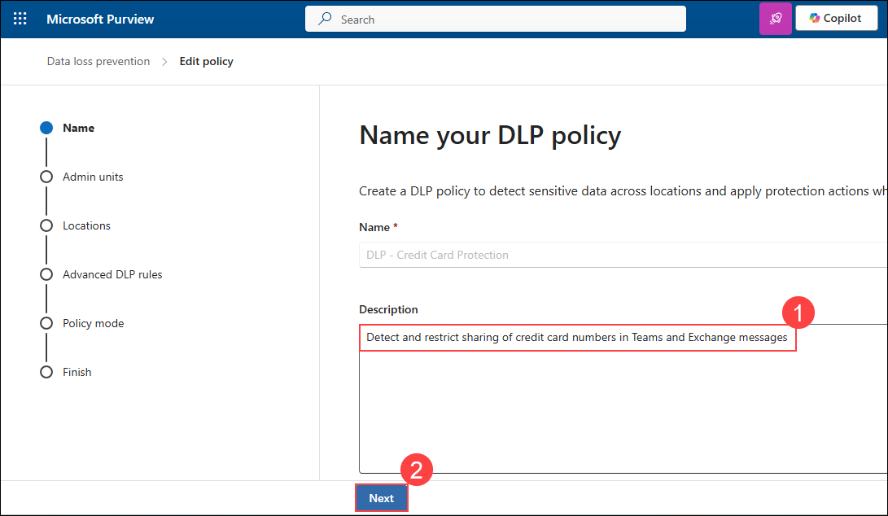

1. On the **Assign admin units** page select **Next**.

1. On the **Choose where to apply the policy** page, select the checkbox for **Exchange email (1)** to add this location to your DLP policy then select **Next (2)**.

    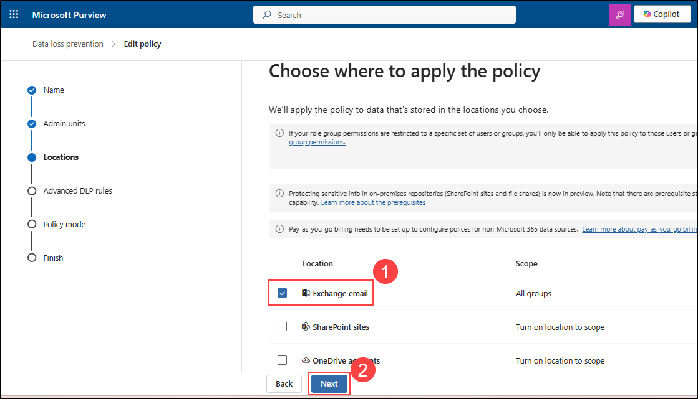

1. Select **Next** until you reach the **Review and finish** page.

1. On the **Review and finish** page to apply the change you made to the policy.

    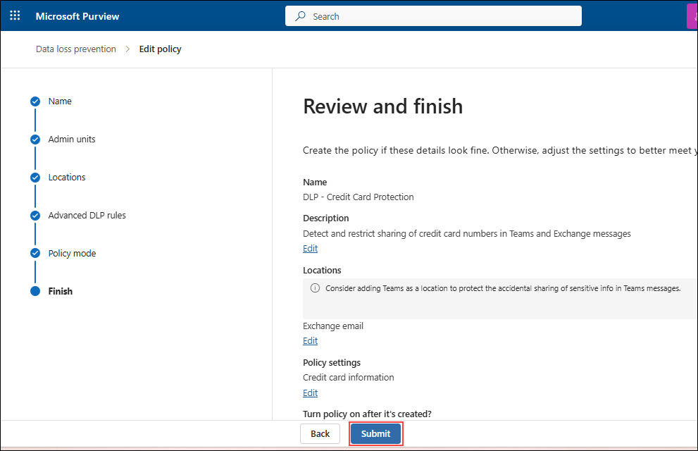

1. Once the policy is updated select **Done** on the **Policy updated** page.

    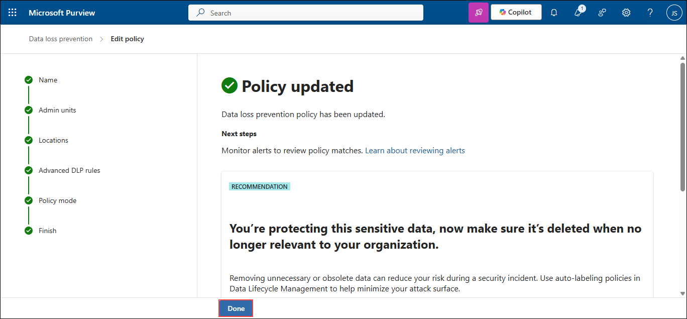

You've successfully updated the policy to scan email along with Teams messages.

## Task 3 – Create a DLP policy in PowerShell

In this task, you'll create a DLP policy using PowerShell to block sharing of employee IDs via email. This approach demonstrates how to define and enforce policy settings through scripting.

1. You should still be logged into **LabVM**, signed in as demouser account.

1. To open an elevated PowerShell, search for **Windows PowerShell** in the taskbar, right-click on **Windows PowerShell (1)** option, and select **Run as administrator (1)**.

    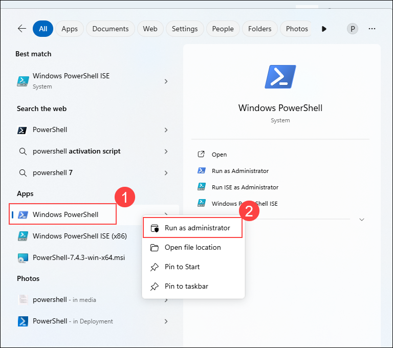

1. Run the **Connect-IPPSSession** cmdlet to connect to the Security & Compliance PowerShell:

    ```powershell
    Connect-IPPSSession
    ```

    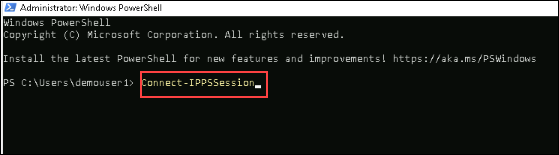

1. Sign in as **Joni Sherman**.

   - **Email/Username:** **<inject key="User 01 UPN"></inject>**.
   - **Password:** **<inject key="User 01 Password"></inject>**

1. Then, in the **Automatically sign in to all desktop apps and websites on this device?** tab choose **No, this app only.**
        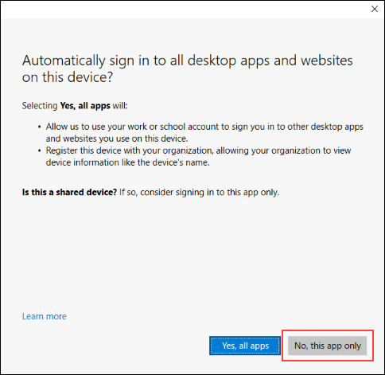

1. Run the **New-DlpCompliancePolicy** cmdlet to create a DLP policy that scans all Exchange mailboxes:

    ```powershell
    New-DlpCompliancePolicy -Name "EmployeeID DLP Policy" -Comment "This policy blocks sharing of Employee IDs" -ExchangeLocation All
    ```

1. Run the **New-DlpComplianceRule** cmdlet to add a DLP rule to the DLP policy you created in the previous step. This policy uses the **Contoso Employee IDs** sensitive info type created in a previous exercise:

    ```powershell
    New-DlpComplianceRule -Name "EmployeeID DLP rule" -Policy "EmployeeID DLP Policy" -BlockAccess $true -ContentContainsSensitiveInformation @{Name="Contoso Employee IDs"}
    ```

    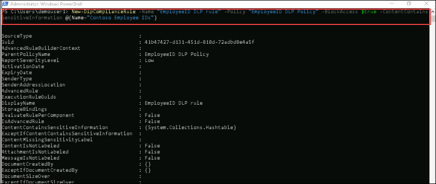

1. Run the **Get-DLPComplianceRule** cmdlet to review the **EmployeeID DLP rule**:

    ```powershell
    Get-DLPComplianceRule -Identity "EmployeeID DLP rule"
    ```

    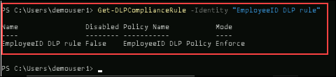

You've successfully used PowerShell to create a DLP policy that blocks the sharing of employee IDs.

## Task 4 – Activate a policy in simulation mode

Now that your DLP policy has been tested in simulation, you'll activate it to begin enforcing its actions.

1. You should still be logged into **LabVM**, signed in as demouser account, and you should be logged into Microsoft 365 as **Joni Sherman**.

1. In **Microsoft Edge**, navigate to DLP policies by going to `https://purview.microsoft.com` > **Solutions** > **Data Loss Prevention** then select **Policies** from the left sidebar.

1. On the **Policies** page select the **DLP - Credit Card Protection (1)** policy. At the bottom of the flyout on the right, select **View simulation (2)**.

    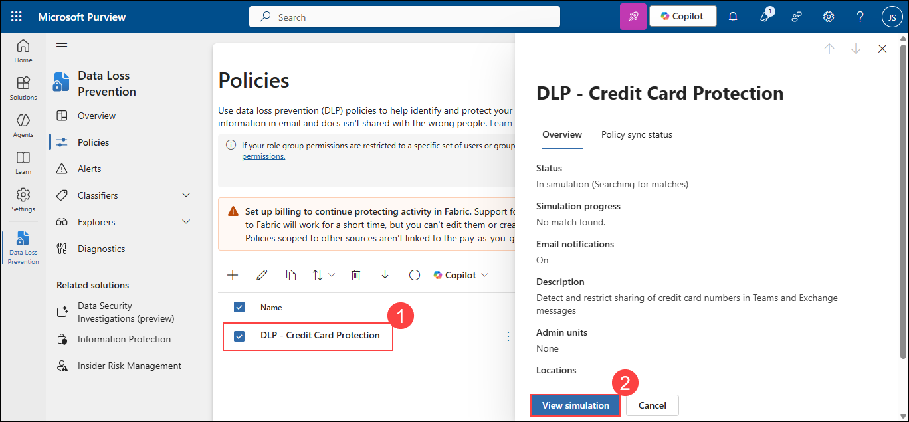

1. On the simulation page, take a moment to explore:

   - The **Simulation overview** tab, which shows scanning progress, total matches, and scanning status by location.
   - The **Items for review tab**, where any predicted matches will appear once available.
   - The **Alerts tab**, where any alerts triggered in simulation mode would be listed.

1. After exploring the insights in simulation mode, select **Turn the policy on** then **Confirm** to activate the DLP policy.

    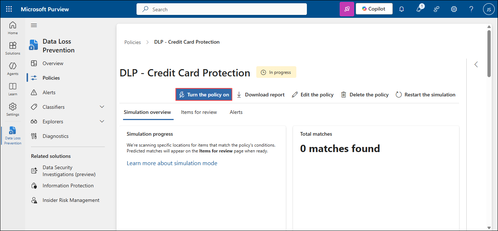

    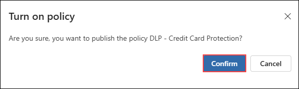

1. A confirmation flyout will appear indicating that the policy has been published successfully. The policy is now active and enforcing restrictions on credit card information in Teams and Exchange.

## Task 5 – Modify policy priority

When multiple policies exist, their priority determines which one applies first. In this task, you'll move the employee ID policy to the highest priority.

1. You should still be logged into **LabVM**, signed in as demouser account, and you should be logged into Microsoft 365 as **Joni Sherman**.

1. In **Microsoft Edge**, the Microsoft Purview portal tab should still be open to the **Policies** page. If not, open **Microsoft Edge** and navigate to `https://purview.microsoft.com`. Select **Solutions** > **Data Loss Prevention** > **Policies**.

1. On the **Policies** page, select the **EmployeeID DLP Policy**. Select **Reprioritize** from the top navigation ribbon, then select **Move to top (highest priority)**.

    

1. In the **Data loss prevention** window, select **Refresh** and review the priority in the **Order** column of the policy table.

1. Sign out of Joni's account by selecting her icon in the top right, then select **Sign out**.

You've updated policy priority so that the employee ID policy takes precedence over others.

## Task 6 – Enable file inspection in Microsoft 365 Defender

Some file policies require access to inspect the contents of protected files. In this task, you'll grant the necessary permissions to allow Microsoft Defender to scan the contents of OneDrive and SharePoint files for sensitive information.

1. You should still be logged into **LabVM**, signed in as demouser account, and you should be logged into Microsoft 365 as **Joni Sherman**.

1. In **Microsoft Edge**, navigate to Microsoft Defender by going to `https://security.microsoft.com`. Log in as  Administrator, using below credentials:

    - Username: **<inject key="AzureAdUserEmail" enableCopy="false"/>**
    - Password: **<inject key="AzureAdUserPassword" enableCopy="false"/>**

1. On the left sidebar, select **System (1)** > **Settings (2)**, then select **Cloud Apps (3)**.

    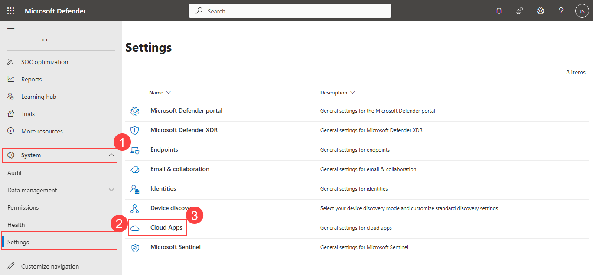

1. In the left pane within the **Cloud apps** window, scroll down to the **Information Protection** section. Under **Microsoft Information Protection (1)**, select **Grant permission (2)** to enable file inspection.

    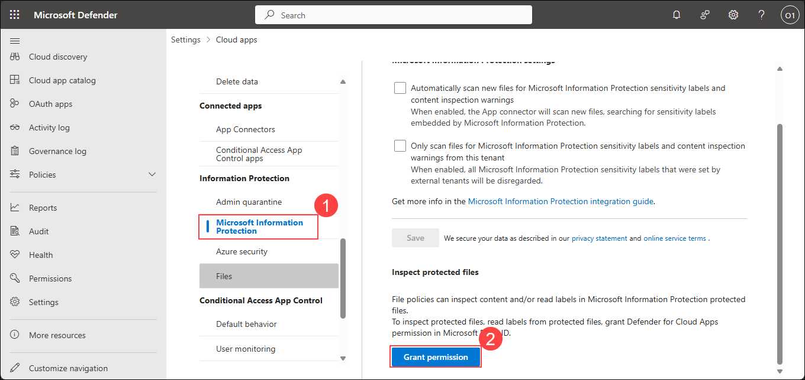

1. Follow the prompt to allow the required permissions in Microsoft Entra ID by chossing **Accept**, then you should see file inspection is **Active** in Microsoft Defender for Cloud Apps.

    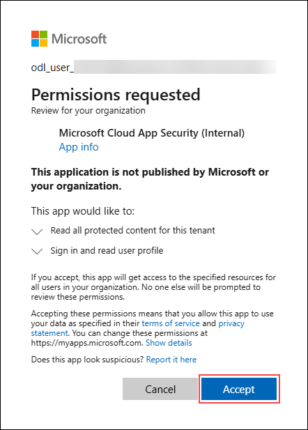

    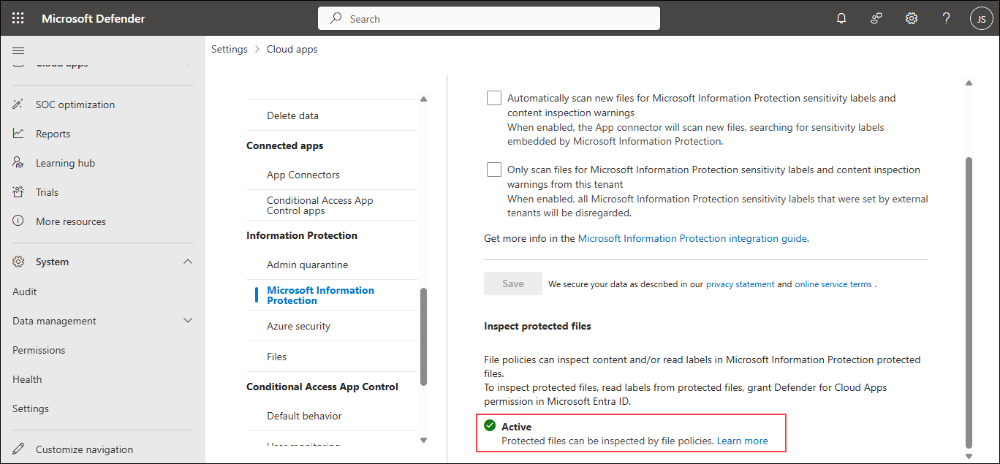

1. Sign out of the MOD Administrator account by selecting the **01** icon in the top right, select **Sign out**, then close your browser window.

File inspection is now enabled in Defender, allowing file policies to scan for sensitive content.

## Task 7 – Create a file policy for Microsoft 365 Defender [Read-Only]

In this task, you'll create a file policy in Microsoft Defender that identifies and quarantines files containing credit card numbers in OneDrive and SharePoint.

1. You should still be logged into **LabVM**, signed in as demouser account.

1. Open **Microsoft Edge** and navigate to **`https://security.microsoft.com`** and log into the Microsoft Defender portal as **Joni Sherman**.

   - **Email/Username:** **<inject key="User 01 UPN"></inject>**.
   - **Password:** **<inject key="User 01 Password"></inject>**

1. In the **Microsoft Defender** portal, in the left navigation, select  **Cloud apps** > **Policies** then select **Policy management**.

1. On the **Policies** page, select **+ Create policy**, then select **File policy**.

1. On the **Create file policy** page, configure:

   - **Policy name**: `Credit card information for files`
   - **Policy severity**: **Low**
   - **Category**: **DLP**
   - **Description**: `Protect credit card numbers from being shared in files.`
   - In the **Files matching all of the following section**:
      - For the first filter, configure the dropdowns to: **Access level equals Public (Internet), External, Public**, and add **Internal**
      - For the second filter, configure the dropdowns to: **Last modified after (date)** and use today's date

          

   - In the **Inspection method** dropdown menu, select **Data Classification Service**.
   - In the **Choose inspection type...** dropdown menu, select **Sensitive information type...**.
   - On the **Select a sensitive information type** dialog, search for then select the checkbox for `Credit Card Number`.
      - Select **Done** in the top right of the **Select a sensitive information type** dialog.

   - Under **Governance actions**, expand **Microsoft OneDrive for Business**:
      - Select the checkbox for **Put in user quarantine**
   - Repeat the same process for **Microsoft SharePoint Online**
      - Select the checkbox for **Put in user quarantine**

1. Select **Create** at the bottom of the page to create the file policy.

You've successfully created a file policy that detects and quarantines files with sensitive credit card data.

## Review

In this lab, you have completed the following tasks:

- Created a DLP policy in simulation mode
- Modified a DLP policy
- Created a DLP policy in PowerShell
- Activated a policy in simulation mode
- Modified policy priority
- Enabled file inspection in Microsoft 365 Defender
- Created a file policy for Microsoft 365 Defender