# Lab 2 – Exercise 2 – Implement and manage endpoint DLP

## Estimated Duration: 90 minutes

Joni Sherman, the newly hired Information Security Administrator at Contoso Ltd., has been asked to strengthen DLP controls on company devices. Some employees have been copying sensitive customer information to USB drives, increasing the risk of data exposure. In this lab, Joni will configure an endpoint DLP policy to block these transfers.

## Lab Objectives

In this lab, you will perform the following:

- Task 01: Onboard a device for endpoint DLP
- Task 02: Create an endpoint DLP policy
- Task 03: Configure Endpoint DLP settings
- Task 04: Configure Microsoft Purview extension

## Task 1 – Onboard a device for endpoint DLP

In this task, you'll onboard a Windows 11 device so it's ready to be protected by endpoint DLP policies.

1. Log into **Client VM (clientvm-<inject key="DeploymentID" enableCopy="false" /></inject>)** as the **azureuser** account.

1. Open Microsoft Edge, and navigate to **`https://purview.microsoft.com`** and log into the Microsoft Purview portal as **Joni Sherman**. Sign in as **JoniS@<inject key="TenantDomainName"></inject>**

1. Select **Settings (1)** from the left sidebar. On the left sidebar, expand **Device onboarding (2)**, then select **Onboarding (3)**.

    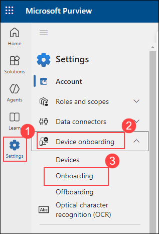

1. On the **Onboarding** page, in the **Deployment method** dropdown menu, select **Local Script (for up to 10 machines) (1)** and select **Download package (2)**.

    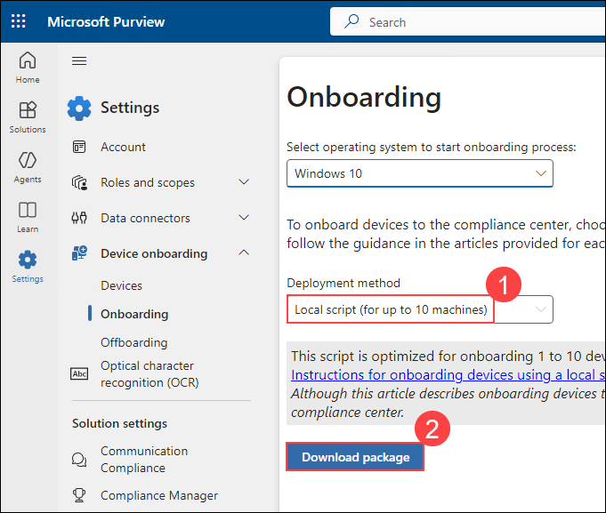

1. In the **Downloads** dialog, hover over the download, then select the folder icon to **Show in folder**.

    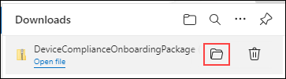

1. Extract the zip file to the **Desktop** of SC-401-CL2. You should see a script named **DeviceComplianceLocalOnboardingScript.cmd**.

1. On the desktop right click the **DeviceComplianceLocalOnboardingScript.cmd** file you just extracted and select **Show more options**, then select **Properties**.

1. Towards the bottom of the **General** tab of the properties window, in the **Security** section, select **Unblock**, then select **OK** to save this setting.

    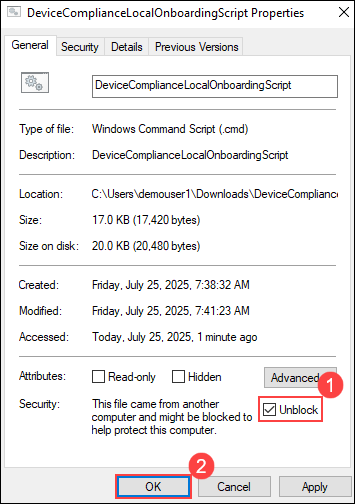

1. Back on the desktop, right click **DeviceComplianceLocalOnboardingScript.cmd**, then select **Run as administrator**. On the **User Account Control** dialogue, select **Yes**.

1. In the **Command Prompt** screen type **Y** to confirm, and then press **Enter**.

    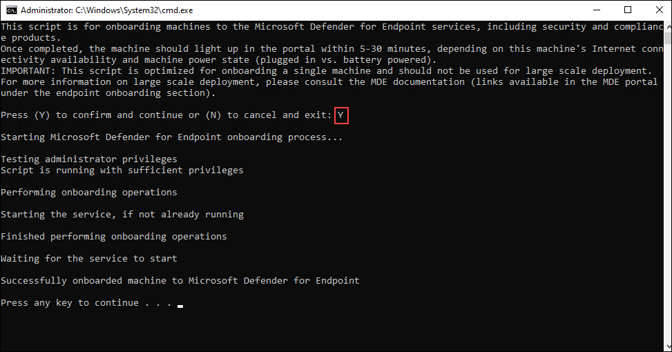

1. When the script is complete, you'll get a success message and a prompt to **Press any key to continue**. Press any key to close the command line window. It can take a minute to complete the onboarding.

1. Open the start menu and search for `Access work or school`. Select **Access work or school** under **Best match**.

    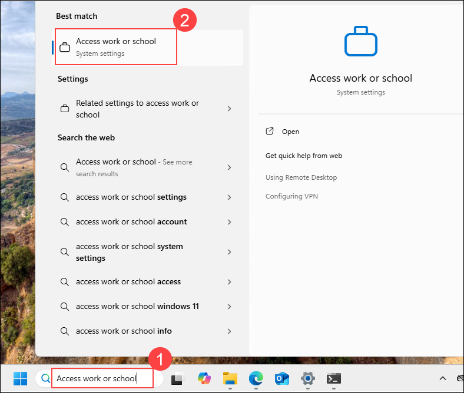

1. In the **Access work or school** window for **Add a work or school account** select **Connect**.

    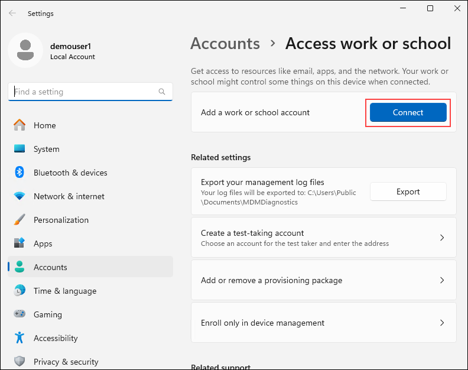

1. In the **Set up a work or school account** dialog, select the **Join this device to Microsoft Entra ID** link and sign in as **Joni Sherman** using **JoniS@<inject key="TenantDomainName"></inject>**. Click **Next**.

    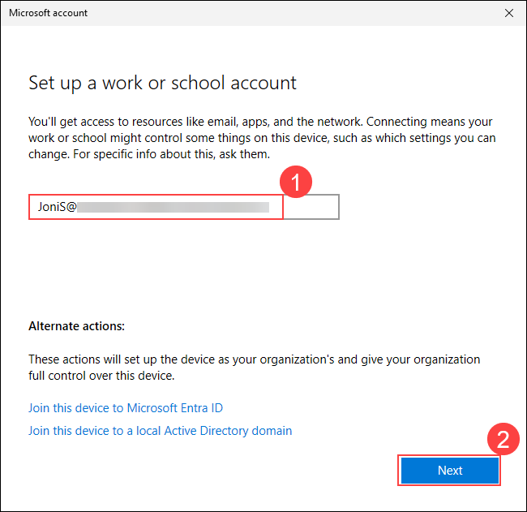

1. You will see a screen indicating that the device is being registered with the company policy. Wait a few moments for the process to complete. Once your device has connected select **Done** on the **You're all set!** screen.

    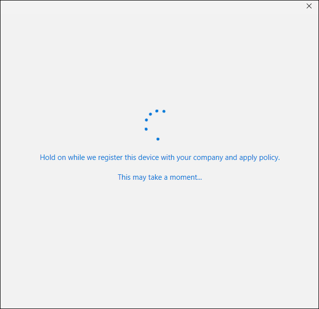

    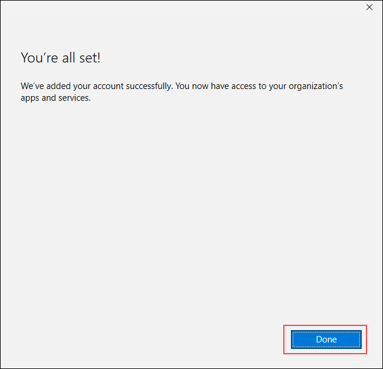

1. Restart **Client VM (clientvm-<inject key="DeploymentID" enableCopy="false" /></inject>)** and close the session.

1. You will be back into **LabVM**, signed in as demouser.

1. The Microsoft Purview window should still be open at the **Devices** page. Refresh this page and verify the device has been successfully onboarded.

You've successfully onboarded the device and joined it to Microsoft Entra ID. It can now be protected by endpoint DLP policies.

## Task 2 – Create an endpoint DLP policy

In this task, you'll create a DLP policy that blocks the transfer of sensitive information to USB drives. This helps reduce the risk of data being taken offsite without authorization.

1. You should still be logged into **LabVM**, signed in as demouser account.

1. You should still be at the **Devices** page in the Microsoft Purview portal, logged in as Joni Sherman.

1. In the Microsoft Purview portal, select **Solutions** > **Data Loss Prevention**.

1. From the left, navigation pane, select **Policies** then select **+ Create policy**.

1. On the **Start with a template or create a custom policy** page, select **Custom** and **Custom policy**, then select **Next**.

1. On the **Name your DLP policy** page, provide the details then select **Next**:

    - **Name**: `Block USB transfers`
    - **Description**: `Prevent transferring sensitive data to USB devices.`

1. On the **Assign admin units** page, select **Next**.

1. On the **Choose where to apply the policy** page, ensure only the **Devices (1)** location is selected. If any other location is selected, ensure they're deselected, then select **Next (2)**.

    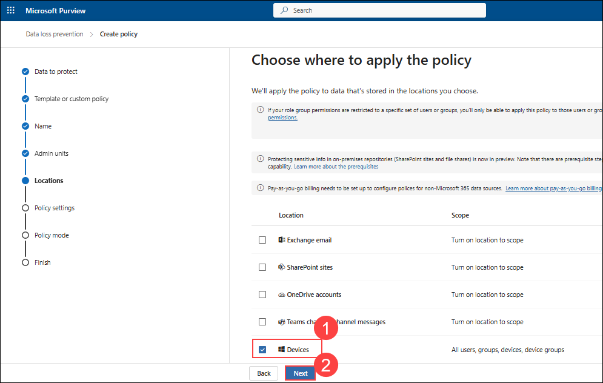

1. On the **Define policy settings** page, select **Create or customize advanced DLP rules** then select **Next**.

1. On the **Customize advanced DLP rules** page, select **+ Create rule**.

1. On the **Create rule** page, enter:

    - **Name**: `USB transfer rule`
    - **Description**: `Block USB transfers of sensitive data.`

        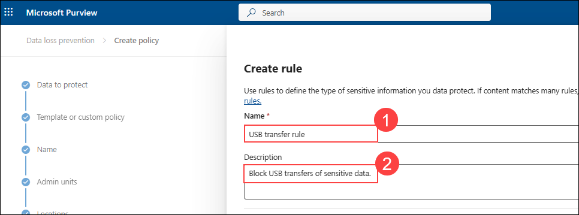

1. Under **Conditions** select **+ Add condition (1)** then select **Content contains (2)**.

    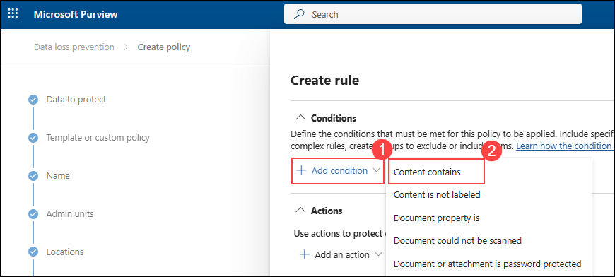

1. In the new **Content contains** section:
    - Select **Add** > **Sensitive info types**.

        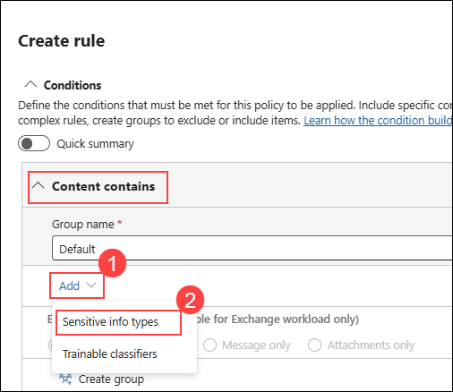

    - On the **Sensitive info types** page, search and select these sensitive info types then choose **Add** :
       - `Credit Card Number`
       - `U.S. Social Security Number (SSN)`
       - `U.S. Driver's License Number`
       - `Contoso Employee IDs`

1. Under **Actions**, select **+ Add an action (1)** > **Audit or restrict activities on devices (2)**.

    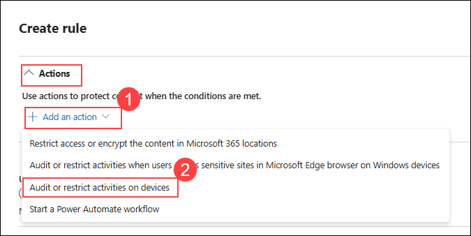

1. In the new **Audit or restrict activities on devices** section:
    - In the **File activities for all apps** section, ensure **Copy to a removable USB device (1)** is selected.
    - Select the dropdown to the left of **Copy to a removable USB device** to change the action from **Audit only** to **Block (2)**.

        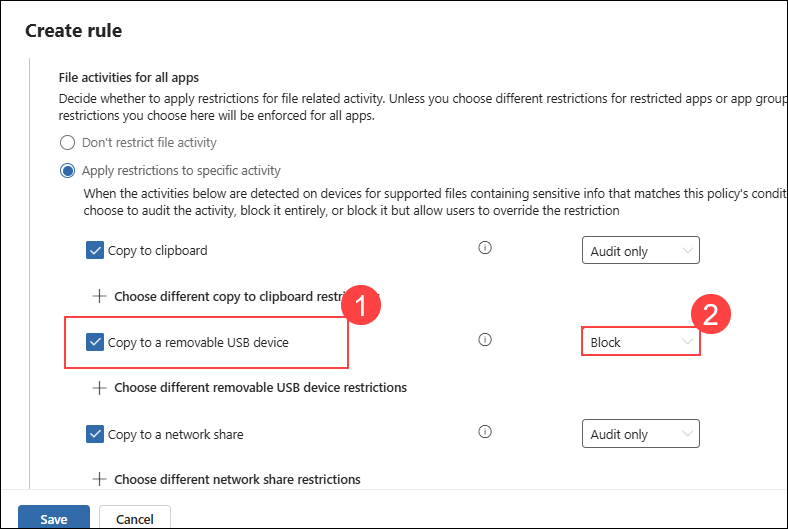

1. Under **User notifications**:
    - Turn **On (1)** the toggle for **Use notifications to inform your users and help educate them on the proper use of sensitive info.**.
    - Select the checkbox to **Show users a policy tip notification when an activity is restricted (2)**.
    - Select **Save (3)** at the bottom of the **Create rule** flyout.

        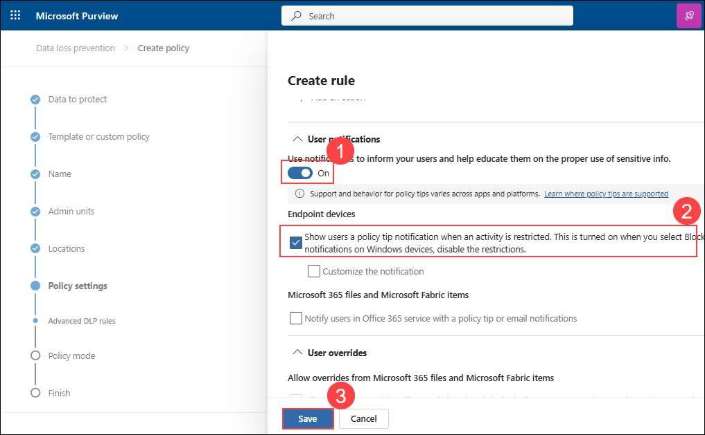

1. Back on the **Customize advanced DLP rules**, select **Next**.

    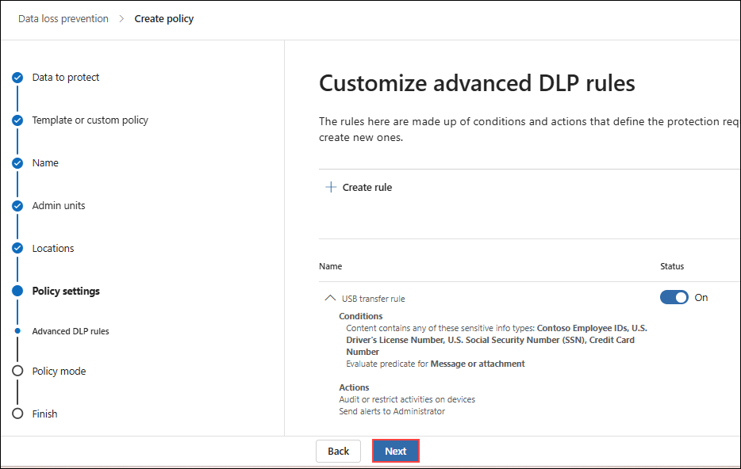

1. On the **Policy mode** page select **Run the policy in simulation mode (1)**.
   - Select the checkbox to **Show policy tips while in simulation mode (2)**.
   - Also, select the checkbox to **Turn the policy on if it's not edited within fifteen days of simulation (3)**.
   - Select **Next (4)**.


        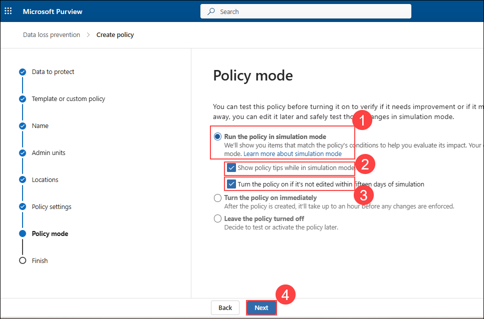

1. On the **Review and finish** page, review your policy settings then select **Submit** to create the policy.

    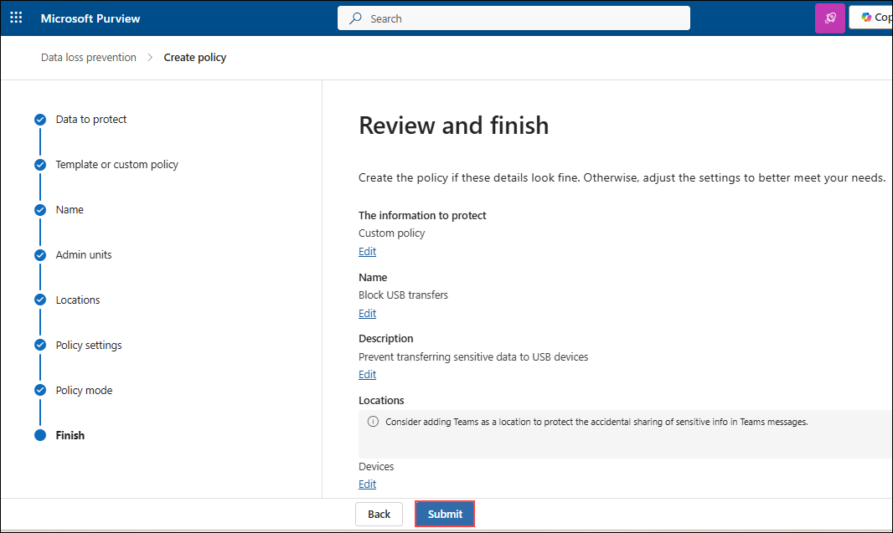

1. Once the policy is created select **Done** on the **New policy created** page.

    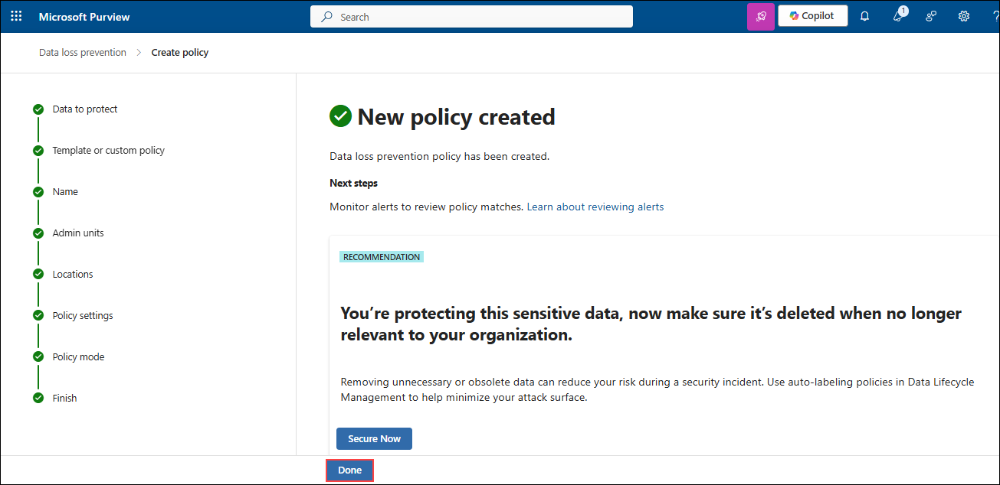

You've successfully created a DLP policy in simulation mode that blocks USB transfers of sensitive data. If the policy is not edited, it will automatically be turned on after 15 days.

## Task 3 – Configure endpoint DLP settings

In this task, you'll fine-tune endpoint DLP settings by excluding a local folder, setting browser restrictions, and blocking a cloud domain.

1. You should still be logged into **LabVM**, signed in as demouser account and you should be logged into Microsoft 365 as **Joni Sherman**.

1. In Microsoft Purview, from the left navigation pane, select **Settings (1)** > **Data Loss Prevention (2)**.

    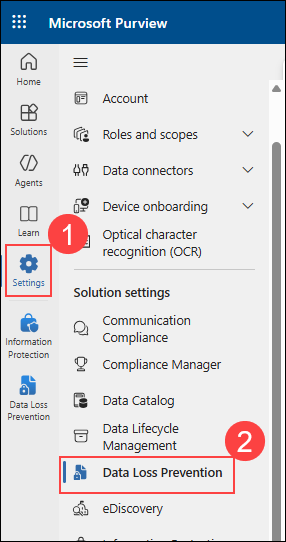

1. The **Data Loss Prevention settings** page should open to the **Endpoint DLP settings**.

1. On the **Endpoint DLP settings** page, expand **File path exclusions for Windows (1)**  then select **+ Add file path exclusion (2)**.

    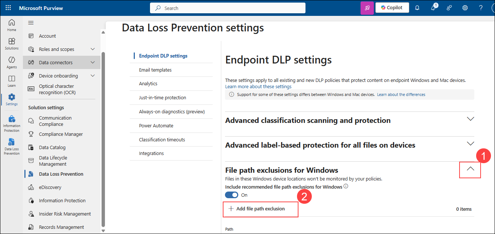

1. On the **Exclude file paths from Windows devices** flyout page in the **File path exclusion** field, enter **C:\FilePathExclusionTest** (1) then select the **+ (2)** button to the right. Select **Save (3)** to save this entry.

    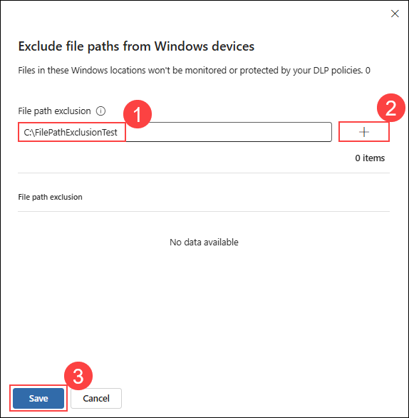

1. Back on the **Endpoint DLP settings** page, expand **Browser and domain restrictions to sensitive data (1)** and select **+ Add or edit unallowed browsers (2)**.

    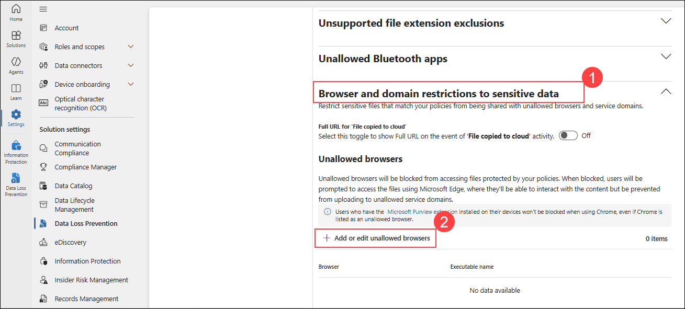

1. On the **Add unallowed browsers** flyout page select the checkbox for **Google Chrome (1)** and select **Save (2)**.

    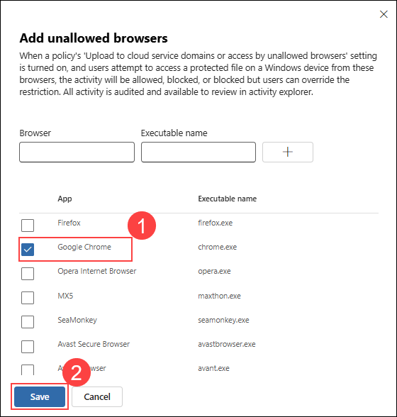

1. Back on the **Endpoint DLP settings** page, select the dropdown for **Service domains** and change it from **Off** to **Block**.

    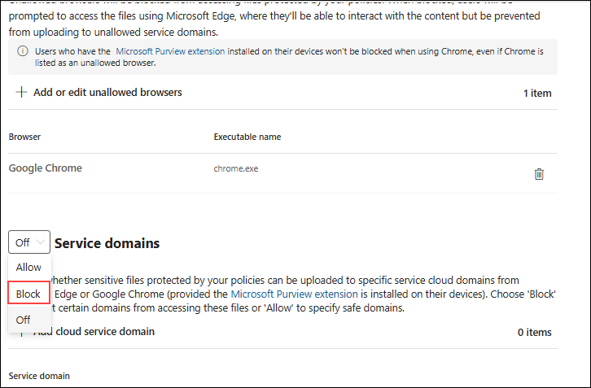

1. In the **Update cloud app mode** dialogue select **Yes** to activate the block mode.

    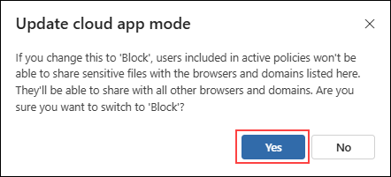

1. Under **Service domains** select **+ Add cloud service domain**.

    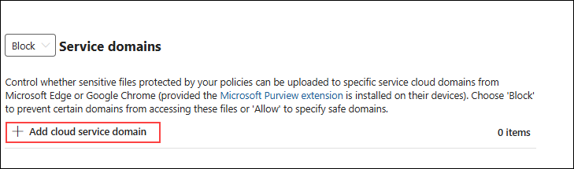

1. On the **Add cloud service domain** flyout page in the **Domain** field enter **dropbox.com (1)** then select the **+ (2)** (plus) icon to add the path. Select **Save (3)** to save this setting.

    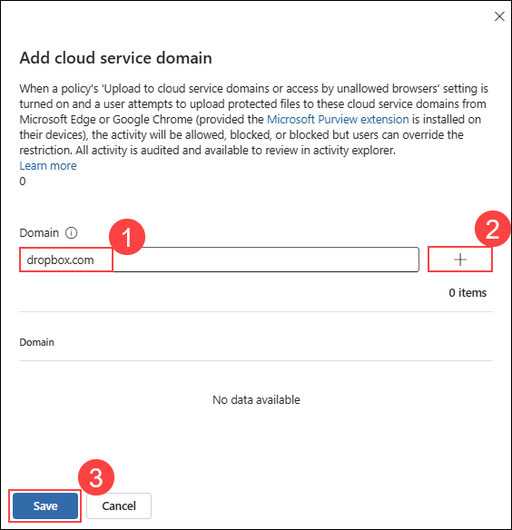

You've applied custom endpoint DLP settings that refine the behavior of your policy, including exclusions, browser restrictions, and blocking access to specific domains.

## Task 4 – Configure Microsoft Purview extension

In this task, you'll install the Microsoft Purview Extension in Google Chrome to test endpoint DLP policy behavior in supported browsers.

1. Open the Edge browser from the task bar.

1. Navigate to the Google Chrome download at **`https://chrome.google.com`**.

1. Select **Download Chrome** and select **Open file** from the **Downloads** notification for **ChromeSetup.exe**.

    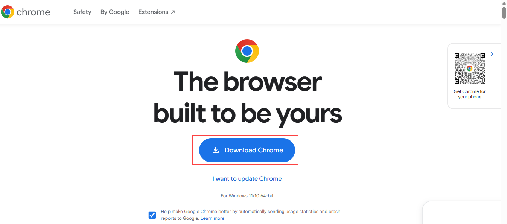

    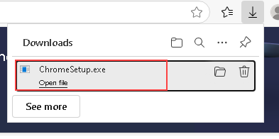

1. Select **Yes** in the **User Account Control** dialog to install the Chrome browser.

1. When the installation is finished, on the **Sign in to Chrome** screen, select **Don't sign in**.

    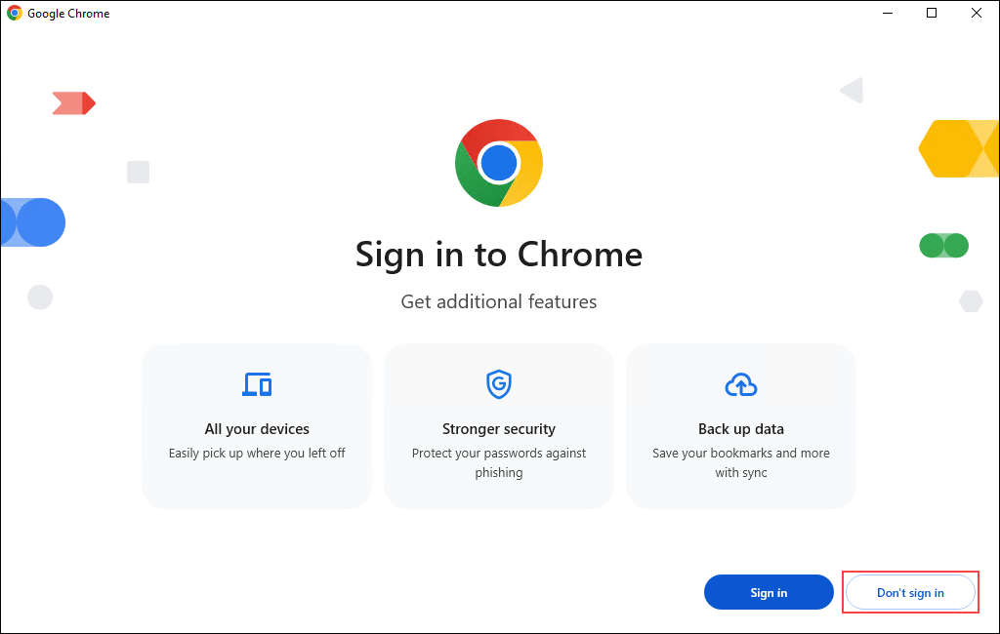

1. Select **Skip** on the **Set your default browser** page.

    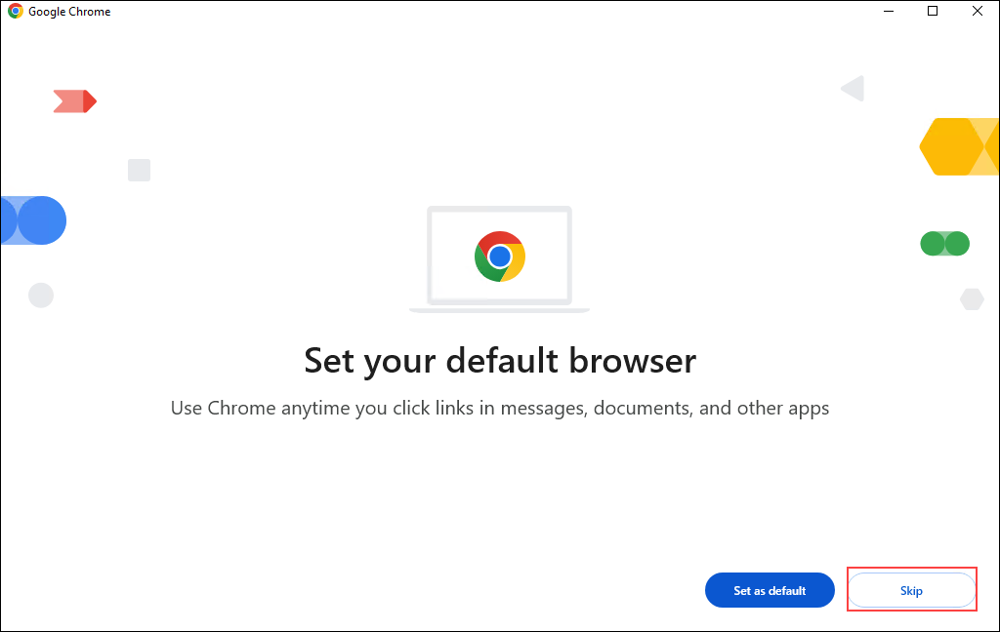

1. When the newly installed Chrome browser window opens, navigate to the **Microsoft Purview Extension** in the **Chrome web store** at:

   `https://chrome.google.com/webstore/detail/microsoft-purview-extensi/echcggldkblhodogklpincgchnpgcdco`

1. Confirm you're on the correct extension page, then select **Add to Chrome**.

    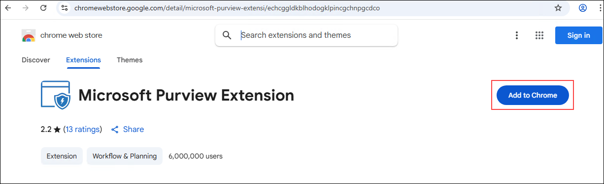

1. On the **Add "Microsoft Purview Extension"?** window, select **Add extension**.

    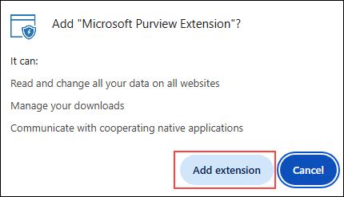

1. Close the notification for the extension being added to Chrome, then navigate to **`chrome://extensions`**.

    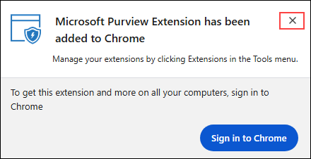

1. Validate the **Microsoft Purview Extension** is visible and activated.

    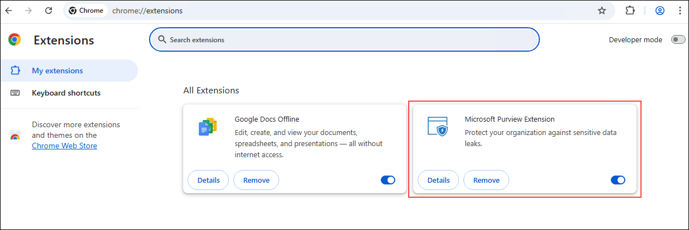

1. Close the Chrome browser window.

You've successfully installed Chrome and added the Microsoft Purview Extension. The device now supports DLP policy enforcement in both Edge and Chrome.

## Task 5 – Trigger a DLP policy in Outlook

Next, you'll send sensitive employee information in an email to verify that your DLP policy correctly detects and blocks the activity.

1. You should still be logged into **LabVM**, signed in as demouser account and you should be logged into Microsoft 365 as **Joni Sherman**.

1. In Microsoft Edge, select the app launcher in the top left and choose **Outlook**.

    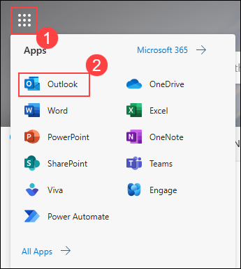

1. Select the **New mail** button on the top left to compose a new email message.

    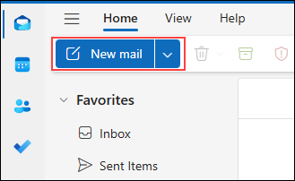

1. In the **To** field, enter `Megan` and select **Megan Bowen**'s email address.

1. In the subject field enter `Help with employee information`.

1. In the body of the email enter:

   ``` text
   Please help me with the start dates for the following employees:
   ABC123456
   DEF678901
   GHI234567

   Thank you, 
   Joni Sherman
   ```

1. Select the **Send** button in the upper right of the message window to send the email.

    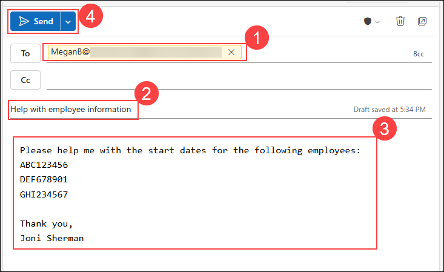

1. You should receive a message that the email was undeliverable and blocked by a DLP policy.

    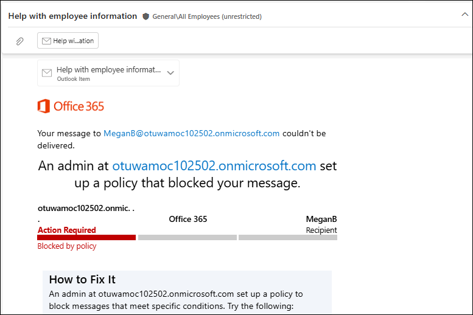

You've confirmed that your DLP policy blocked the transmission of sensitive employee IDs through email.

## Review

In this lab, you have completed the following tasks:

- Onboarded a device for endpoint DLP
- Created an endpoint DLP policy
- Configured Endpoint DLP settings
- Configured Microsoft Purview extension