# Lab 3 - Exercise 2 - Implement Adaptive Protection

You are Joni Sherman, the Information Security Administrator for Contoso Ltd. Your role involves protecting sensitive data and responding to insider risks. To enhance protection, you'll enable Microsoft Purview Adaptive Protection, which dynamically adjusts data loss prevention (DLP) enforcement based on insider risk levels.

## Lab Objectives

In this lab, you will perform the following:

- Task 01: Assign an insider risk policy to Adaptive Protection
- Task 02: Configure Conditional Access with Adaptive Protection
- Task 03: Enable Adaptive Protection

## Task 1 – Assign an insider risk policy to Adaptive Protection

1. In **Microsoft Edge**, navigate to **`https://purview.microsoft.com`** and sign in as **Joni Sherman** using below credentials.

   - **Email/Username:** **<inject key="User 01 UPN"></inject>**.
   - **Password:** **<inject key="User 01 Password"></inject>**

1. In the Microsoft Purview portal, navigate to **Solutions (1)** > **Insider Risk Management (2)** > **Adaptive Protection (3)**.

   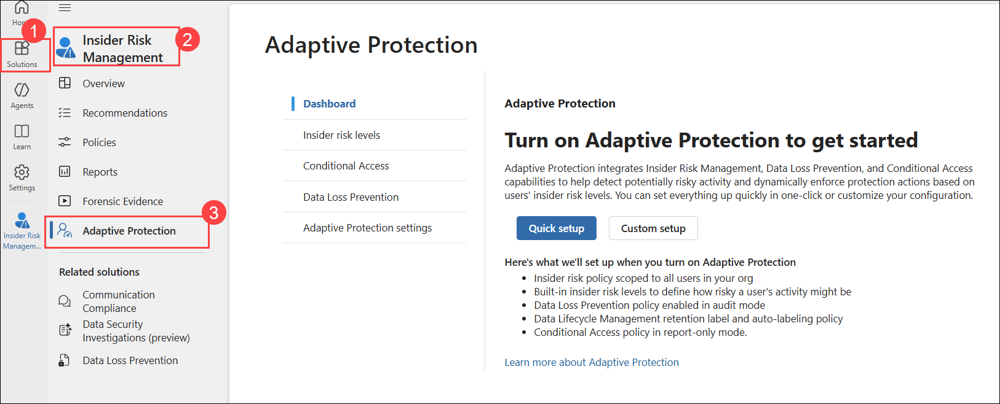

1. From the left navigation pane, select **Insider risk levels (1)**. On the **Insider risk levels** page:

   - In the Insider risk policy dropdown, select the **Data leaks quick policy (2)** you created in a previous exercise.
   - Leave the default risk level settings unchanged.
   - Select **Save (3)**.

     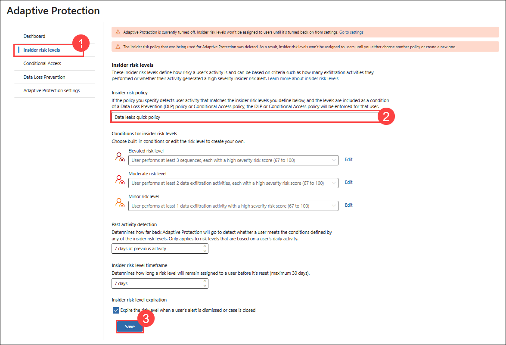   

You've linked an insider risk policy to Adaptive Protection, enabling dynamic risk-based actions across Microsoft Purview.

## Task 2 – Configure Conditional Access with Adaptive Protection

To add another layer of enforcement, you can use insider risk levels to restrict access using Conditional Access. In this task, you'll create a policy that blocks access for users with an elevated insider risk level.

1. In Microsoft Purview, sign out of Joni's account and close all browser windows.

1. Open a new Microsoft Edge window and navigate to the **Microsoft Entra admin center** at `https://entra.microsoft.com` using below credentials.

   - **Email/Username:** <inject key="AzureAdUserEmail"></inject>
   - **Password:** <inject key="AzureAdUserPassword"></inject>

     >**Note**: In some tenants, you might see a Portal MFA Enforcement prompt when signing in. If this prompt appears:

    - Select **Postpone MFA** to temporarily delay MFA setup.
     
      

   - Select **Confirm postponement**.
   - Select **Continue sign-in without MFA** to access Microsoft Entra.
   
     This postpones MFA enforcement for the tenant and allows you to proceed with the lab.

1. In the Microsoft Entra admin center, navigate to **Conditional Access (1)** > **Policies (2)**. On the **Policies** page, select **+ New policy (3)**.

   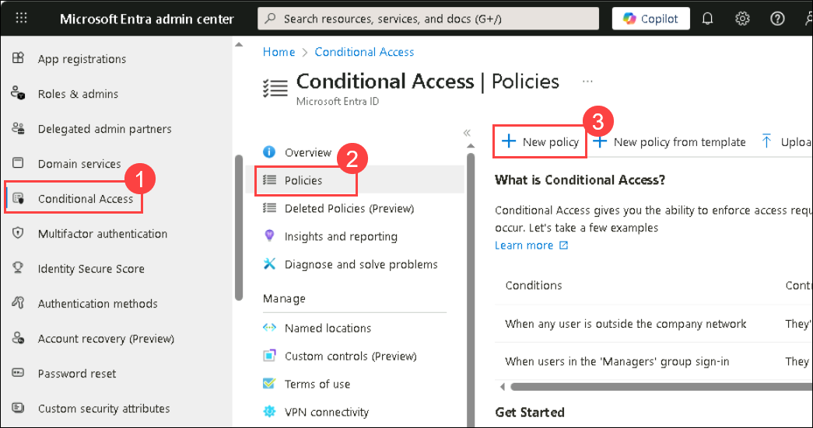

1. On the **New policy** page, name your policy: `Block all access for elevated risk`.

   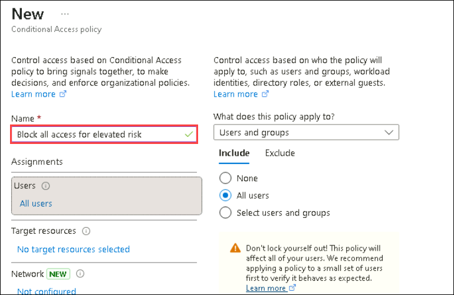

1. Under **Assignments**, select the **Users** section **(1)**:

   - **Include**: `All users` **(2)**

     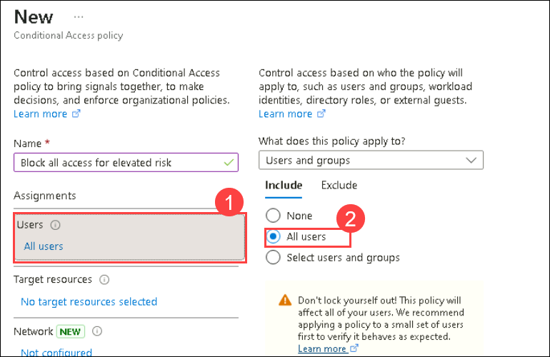     

   - **Exclude (1)**: Select **Users amd groups (2)** 

      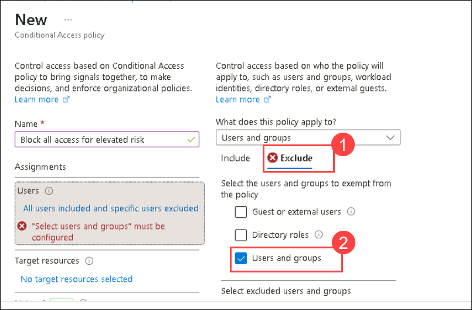
      
   - Select `Joni Sherman` and `ODL User` and then click **Select**

1. Under **Target resources**, confirm the dropdown is set to **Resources (formerly cloud apps)** and select **All resources (formerly 'All cloud apps')**.

   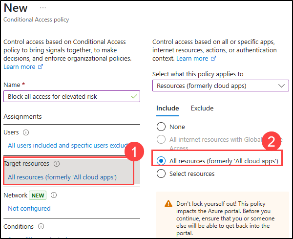

1. Under **Conditions (1)**, select **Insider risk (2)**. Set **Configure** to **Yes (3)**, then set the risk level to **Elevated (4)**. Select **Done (5)**.

   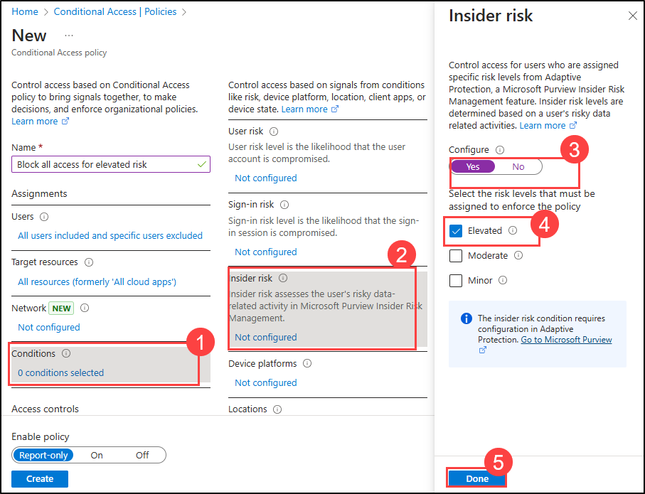

1. Under **Access controls**, select **Grant (1)**. Choose **Block access (2)**, then select **Select (3)** at the bottom of the flyout.

   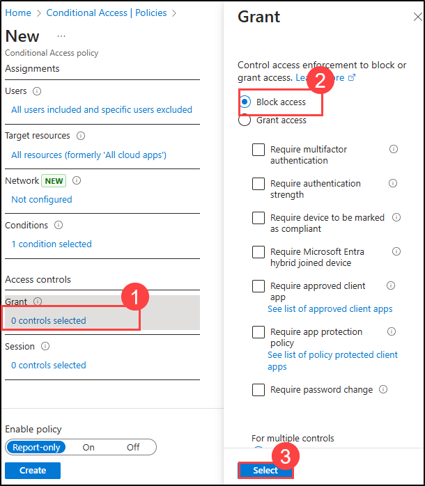

1. At the bottom of the page, confirm **Enable policy** is set to **Report-only**, then select **Create**.

   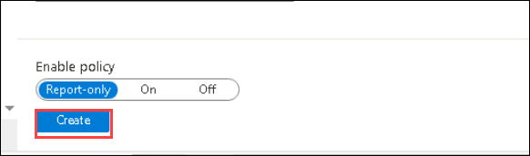

1. Back on the **Policies (1)** page for Conditional Access, select **Refresh** to verify your newly created policy appears **(2)**.

   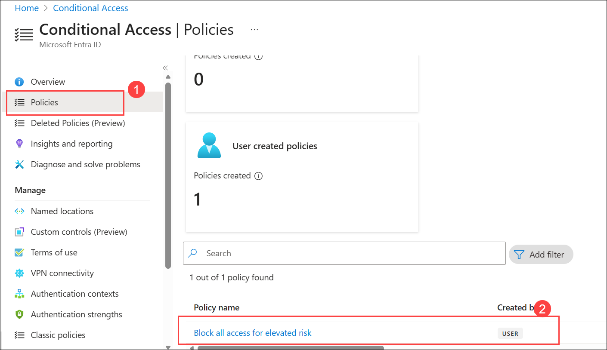

1. Sign out of the Mod Administrator account by selecting the MA icon on the top right of the window, then selecting **Sign out** and close all browser windows.

You've created a Conditional Access policy that blocks access for elevated-risk users, without affecting access immediately, since the policy is in report-only mode.

## Task 3 – Enable Adaptive Protection

In this final task, you'll turn on Adaptive Protection so the system can start applying dynamic enforcement based on insider risk.

1. Open **Microsoft Edge** and navigate to **`https://purview.microsoft.com`** and sign in as **Joni Sherman** 

   - **Email/Username:** **<inject key="User 01 UPN"></inject>**.
   - **Password:** **<inject key="User 01 Password"></inject>**

1. Navigate to **Solutions** > **Insider Risk Management** > **Adaptive Protection**.

1. Confirm your configurations:

   - On the **Insider risk levels** tab, the **Data leaks quick policy** is selected.

   - On the **Conditional Access** tab, the **Block all access for elevated risk** policy is visible.

   - On the **Data Loss Prevention** tab, the **DLP - Credit Card Protection policy** is listed.

1. Select the **Adaptive Protection settings** tab.

1. Toggle **Adaptive Protection** to **On**, then select **Save**.

You've successfully enabled Adaptive Protection. Enforcement actions will now adjust automatically based on a user's insider risk level.

## Review

In this lab, you have completed the following tasks:

- Assign an insider risk policy to Adaptive Protection
- Configure Conditional Access with Adaptive Protection
- Enable Adaptive Protection