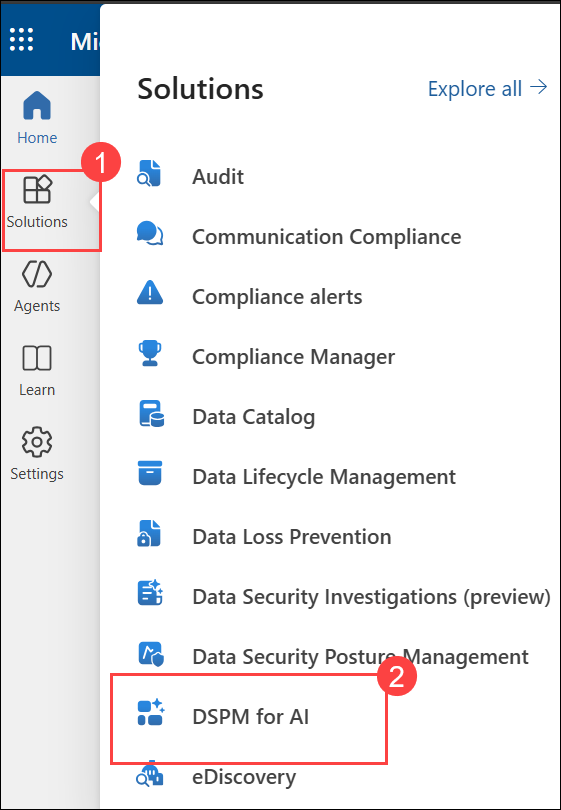
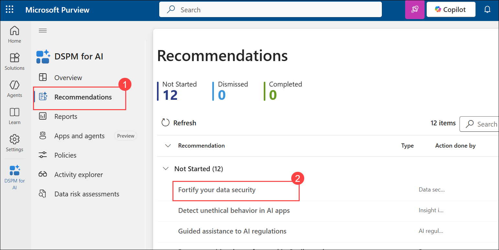
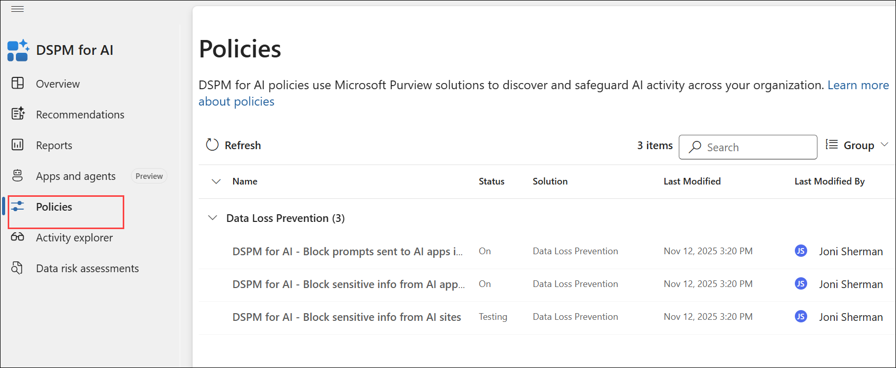
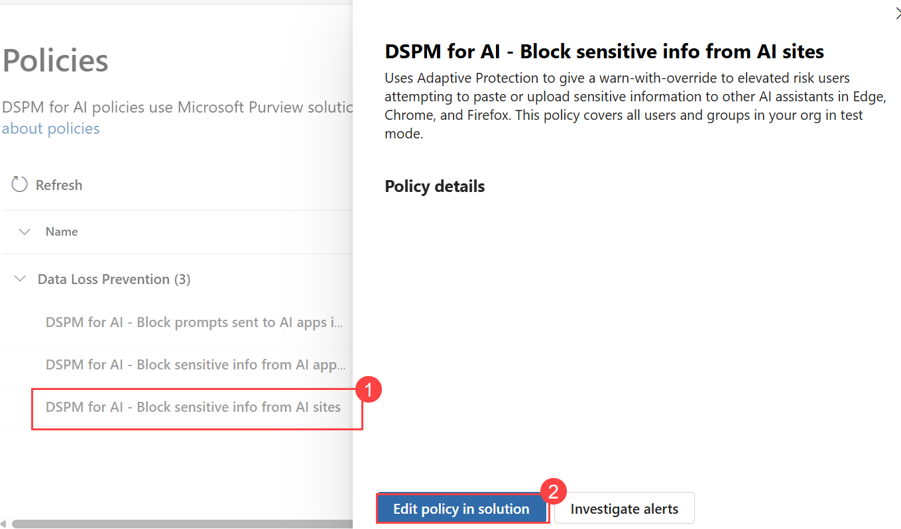
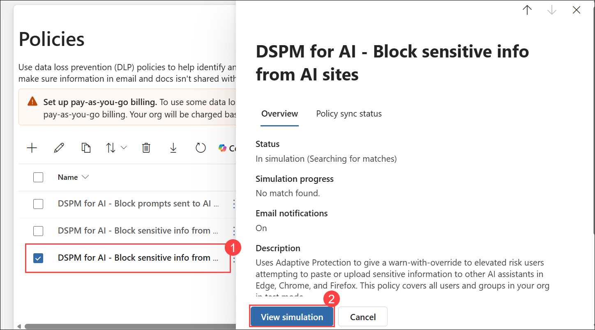
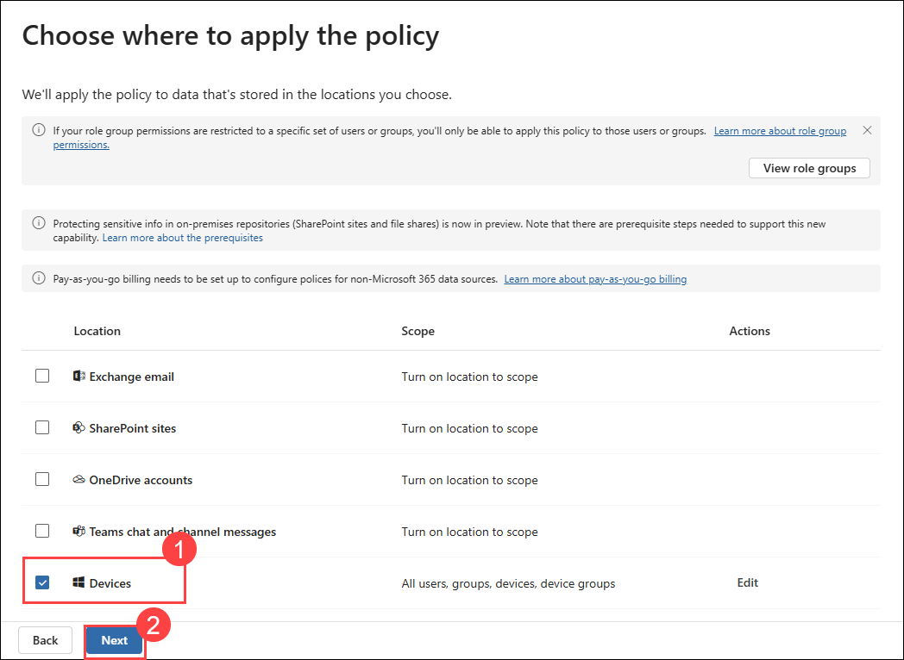
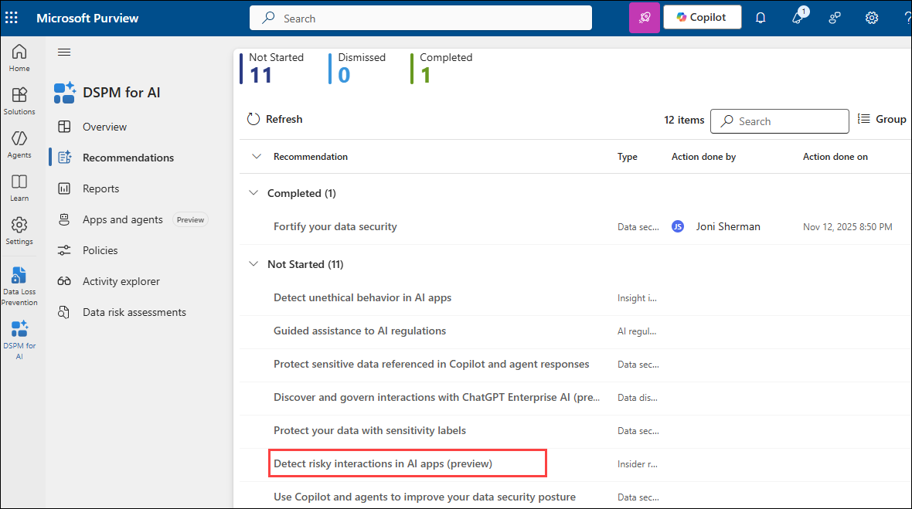
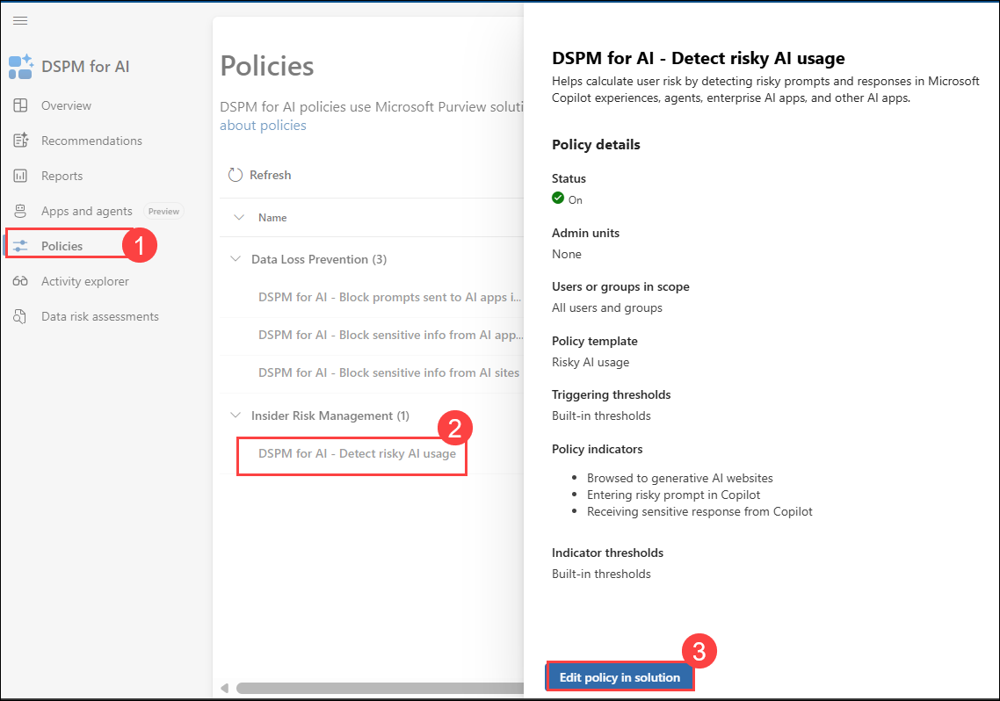
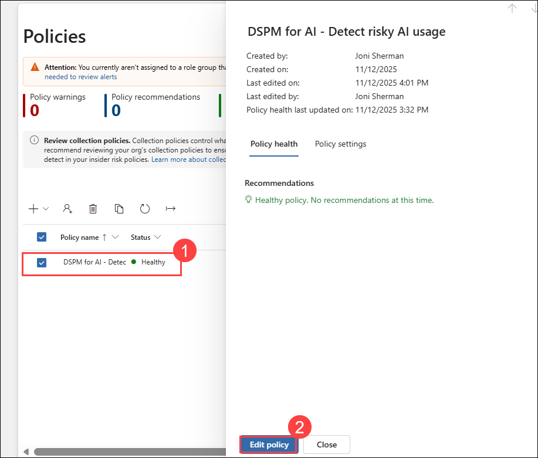
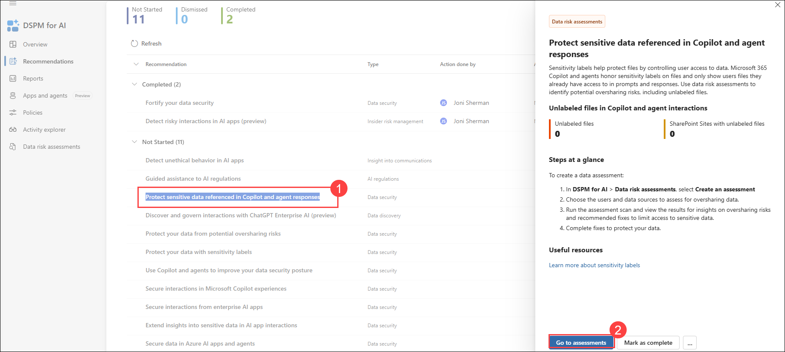

# Lab 4 - Exercise 1 - Protect data in AI environments

You are Joni Sherman, the Information Security Administrator for Contoso Ltd. As AI tools like Microsoft Copilot become more integrated into daily workflows, your team has been asked to assess and improve protections around sensitive data. In this lab, you'll explore how Microsoft Purview DSPM for AI can help secure data interactions with AI tools through policy enforcement, risk detection, and exposure assessments.

## Lab Objectives

In this lab, you will perform the following:

- Task 01: Use DSPM for AI to create a DLP policy for generative AI sites
- Task 02: Create an insider risk policy to detect risky AI interactions
<!------ Commenting out until tenant bug issues are resolved
- Task 03: Block Copilot from accessing labeled content
-->
- Task 03: Run a data assessment to detect unlabeled content

## Task 1 – Use DSPM for AI to create a DLP policy for generative AI sites

To reduce the risk of data loss through AI assistants, you'll start by creating a DLP policy using the Fortify your data security recommendation. This policy uses Adaptive Protection to restrict pasting or uploading sensitive data into AI tools like ChatGPT and Copilot in Edge, Chrome, and Firefox.

1. In **Microsoft Edge**, navigate to **`https://purview.microsoft.com`** and sign in as **Joni Sherman**

   - **Email/Username:** **<inject key="User 01 UPN"></inject>**.
   - **Password:** **<inject key="User 01 Password"></inject>**

1. In Microsoft Purview, navigate to DSPM for AI by selecting **Solutions (1)** > **DSPM for AI (2)**

   

1. Select **Recommendations (1)** and the select the **Fortify your data security (2)** recommendation.

   

1. In the **Data security for AI** flyout page, review the summary, then select **Create policies**. This creates a preconfigured DLP policy targeting generative AI sites.

1. Once the policy has been created, select **Policies** button.

   

1. On the **Policies** page, locate and select the **DSPM for AI - Block sensitive info from AI sites (1)** policy.

   - In the **Policy details** section, select **Edit policy in solution (2)** to open the **Data Loss Prevention** solution in Microsoft Purview.

     

1. On the **Policies** page, locate and select the **DSPM for AI - Block sensitive info from AI sites (1)** policy.

   - In the flyout, select **View simulation (2)**.

        

1. On the simulation dashboard, select **Edit the policy**.

1. Select **Next** until you reach the **Choose where to apply the policy** page,

   - Confirm the policy is scoped to **Devices (1)**.

   - Select **Next (2)**.

        

1. On the **Customize advanced DLP rules** page, select the pencil icon next to **Block with override for elevated risk users** to view the rule.

1. Review the configuration of the rule created by DSPM for AI:
   - Under **Conditions**, note the sensitive info types included and that the rule uses **Adaptive Protection** based on elevated risk.
   - Under **Actions**, for both the Upload and Paste activities, select **Edit** next to **Sensitive service domain group restriction(s)**.
   - In the service domain group configuration, confirm that **Generative AI Websites** is set to **Block with override**.

1. Select **Cancel** to exit the rule editor without changes.

1. Back on the **Customize advanced DLP rules** page, select **Next**.

1. On the **Policy mode** page, select **Turn the policy on if it's not edited within fifteen days of simulation**, then select **Next**.

1. On the **Review and finish** page, select **Submit**, then select **Done**.

You've created a policy that blocks high-risk users from sharing sensitive data on generative AI sites and confirmed the policy configuration set by DSPM for AI.

## Task 2 – Create an insider risk policy to detect risky AI interactions

Next, you'll create a policy that helps detect risky prompt behavior in Copilot.

1. In Microsoft Purview, navigate to **DSPM for AI** by selecting **Solutions** > **DSPM for AI** > **Recommendations**.

1. Select the **Detect risky interactions in AI apps (preview)** recommendation.

    

1. In the **Detect risky interactions in AI apps (preview)** flyout page, review the summary, then select **Create policy**.

1. Once the policy is created, select **Policies** button.

1. On the **Policies (1)** page, locate and select the **DSPM for AI - Detect risky AI usage (2)** policy.

   - In the **Policy details** section, select **Edit policy in solution (3)** to open the **Insider Risk Management** area of Microsoft Purview.

        

1. On the **Policies** page, locate and select the **DSPM for AI - Detect risky AI usage (1)** policy.

   - In the flyout, select **Edit policy (2)** to review the full policy configuration.

        

1. On the **Choose a policy template** page, observe that the policy uses the **Risky AI usage (preview)** template.

1. Select **Next** until you reach the **Choose triggering event for this policy page**.

   - Confirm that the triggering event is **User account deleted from Microsoft Entra ID**, which signals potential offboarding-related risks that might precede or follow risky AI activity.

1. Select **Next**.

1. On the **Indicators** page, expand the indicator categories to review which signals are selected:

   - Browsed to generative AI websites
   - Received sensitive response from Copilot
   - Entered risky prompt in Copilot

1. Select **Next** until you reach the **Review and finish** page.

1. Then select **Cancel** to exit the editor without making changes.

You've created a policy that detects risky AI interactions, including prompts and responses, to help identify early signs of risky user behavior.

<!------ 
## Task 3 – Block Copilot from accessing labeled content

You can further reduce risk by preventing Copilot from processing or responding with content protected by sensitivity labels.

1. In Microsoft Purview, navigate to **DSPM for AI** by selecting **Solutions** > **DSPM for AI** > **Recommendations**.

1. Select the **Protect sensitive data referenced in Microsoft 365 Copilot and agents (preview)** recommendation.

1. Review the guidance provided in this recommendation.

1. Navigate to **Solutions** > **Data Loss Prevention** > **Policies**.

1. Select **+ Create policy**, then choose **Custom policy**.

1. On the **Name your DLP policy** page, enter:

   - **Name**: `DLP - Block Copilot access to labeled content`
   - **Description**: `Prevents Microsoft 365 Copilot from processing or responding with content labeled using sensitivity labels.`

1. Select **Next** until you reach the **Choose where to apply the policy** page.

1. Select **Microsoft 365 Copilot (preview)** as the policy scope, then select **Next** until you reach the **Customize advanced DLP rules** page.

1. Select **Create rule**, and configure:

   - **Name**: `Prevent Copilot from accessing labeled data`
   - Under **Conditions**, select **Add condition** > **Content contains** > **Sensitivity labels**. Add these sensitivity labels:
     - `Trusted People`
   - Select **Add**
   - Under **Actions** select **Add an action** > **Prevent Copilot from processing content (preview)**
   - Select **Save** at the bottom of the **Create rule** flyout.

1. Back on the **Customize advanced DLP rules** page, select **Next**.

1. On the **Policy mode** page, select **Turn the policy on immediately**, then select **Next**.

1. On the **Review and finish** page select **Submit**, then select **Done** on the **New policy created** page.

1. Return to **DSPM for AI recommendations** by selecting **Solutions** > **DSPM for AI** > **Recommendations**.

1. Select the **Protect sensitive data referenced in Microsoft 365 Copilot and agents (preview)** recommendation and select **Mark as complete**.

You've created a DLP policy that prevents labeled content from being used in Copilot prompts and responses.
-->

## Task 3 – Run a data risk assessment to detect unlabeled content

To understand potential gaps in labeling coverage, you'll run a data risk assessment to identify files without sensitivity labels that may be accessed by Copilot.

1. In Microsoft Purview, navigate to **DSPM for AI** by selecting **Solutions** > **DSPM for AI** > **Recommendations**.

1. Select the **Protect sensitive data referenced in Copilot and agent responses (1)** recommendation.

   - In the **Protect sensitive data referenced in Copilot and agent responses** pane, review the summary, then select **Go to assessments (2)**.

     

1. On the **Data risk assessments** page, select **Create custom assessment**

1. On the **Basic details** page, enter:

   - **Name**: `Unlabeled File Exposure Assessment`
   - **Description**: `Identifies files without sensitivity labels that may be exposed in Microsoft 365 Copilot responses and provides recommendations to reduce oversharing risks.`

1. Select **Next**.

1. On the **Add users** page, select **All**, then select **Next**.

1. On the **Add data sources to assess** page, leave the default location of **SharePoint** selected, then select **Next**.

1. On the **Review and run the data assessment scan** page, select **Save and run**.

1. On the **Data assessment successfully created** page, select **Done**.

You've now used Microsoft Purview DSPM for AI to detect AI-related risks, enforce policies, and assess sensitive data exposure, helping your organization use AI securely.

## Review

In this lab, you have completed the following tasks:

- Use DSPM for AI to create a DLP policy for generative AI sites
- Create an insider risk policy to detect risky AI interactions
<!------ 
- Block Copilot from accessing labeled content
-->
- Run a data assessment to detect unlabeled content