# Lab 5 - Exercise 1 - Implement and manage retention

You are Joni Sherman, a Compliance Administrator at Contoso Ltd. The company is tightening its data security strategy to reduce risk exposure related to financial data and privileged communications. You've been asked to configure Microsoft Purview retention solutions that support audit readiness, limit unnecessary data retention, and ensure proper oversight for sensitive communications.

## Lab Objectives

In this lab, you will perform the following:

- Task 01: Create a retention label
- Task 02: Publish a retention label
- Task 03: Create an auto-apply retention label policy
- Task 04: Create a static retention policy
- Task 05: Recover SharePoint content

## Task 1 – Create a retention label

In this task, you'll create a retention label for sensitive financial data that needs to be retained for auditing and investigation purposes.

1. In Microsoft Edge, navigate to `https://purview.microsoft.com` and sign in to the Microsoft Purview portal as **Joni Sherman**, using below credentials.

      - **Email/Username:** **<inject key="User 01 UPN"></inject>**.
      - **Password:** **<inject key="User 01 Password"></inject>**

1. Navigate to **Solutions** > **Data Lifecycle Management** > **Retention labels**.

1. On the **Labels** page, select **Create a label**.

1. On the **Name your retention label** page, enter:

   - **Name**: `Sensitive Financial Records`
   - **Description for users**: `Use for financial files with sensitive data that must be retained for audit or security purposes.`
   - **Description for admins**: `Retains high-impact financial data for 5 years to support audits and security investigations.`

1. Select **Next**.

1. On the **Define label settings** page, select **Retain items forever or for a specific period**, then select **Next**.

1. On the **Define the period** page, ensure these values are set for the retention period configuration input:

    - **How long is the period?**: 5 Years
    - **When should the period begin?**: When items were last modified

1. Select **Next**.

1. On the **Choose what happens after the retention period** page select **Delete items automatically**, then select **Next**.

1. On the **Review and finish** page, select **Create label**.

1. On the **Your retention label is created** page, select the option to **Do nothing**, then select **Done**.

You've created a retention label that retains financial content for five years and deletes it afterward to reduce data exposure.

## Task 2 – Publish a retention label

In this task, you'll publish the retention label so users can apply it in Microsoft 365 services like Exchange, SharePoint, and OneDrive.

1. In Microsoft Purview, navigate to **Solutions** > **Data Lifecycle Management** > **Retention labels**.

1. Select the checkbox next to the **Sensitive Financial Records** label, then select the **Publish labels** icon () to publish this retention label.

1. On the **Choose labels to publish** page, verify the **Sensitive Financial Records** label is selected, then select **Next**.

1. On the **Policy Scope** page select **Next**.

1. On the **Choose the type of retention policy to create** page select **Static** then select **Next**.

1. On the **Choose where to publish labels** page select **Let me choose specific locations** and select:

    - Exchange mailboxes
    - SharePoint classic and communication sites
    - OneDrive accounts
    - Deselect all other locations

1. Select **Next**.

1. On the **Name your policy** enter:

    - **Name**: `Sensitive Financial Data Retention`
    - **Description**: `Makes the 'Sensitive Financial Records' label available to users in Exchange, SharePoint, and OneDrive.`

1. Select **Next**.

1. On the **Finish** page, select **Submit**.  

1. On the **Your retention label was published** page, select **Done**.

You've published the retention label, making it available for users to apply in key Microsoft 365 services.

## Task 3 - Create a Retention Label for Personal Financial PII

In this task, you'll create a retention label for personal financial data that needs to be retained for compliance, auditing, and investigation purposes.

1. In Microsoft Edge, navigate to `https://purview.microsoft.com` and sign in to the Microsoft Purview portal as **Joni Sherman**  

   - **Email/Username:** **<inject key="User 01 UPN"></inject>**.
   - **Password:** **<inject key="User 01 Password"></inject>**

2. Navigate to **Solutions** > **Data Lifecycle Management** > **Retention labels**

3. On the **Labels** page, select **Create a label**.

4. On the **Name your retention label** page, enter the following:

- **Name**: `Personal Financial PII`  
- **Description for users**: `Use for documents or emails that contain personal financial data like bank account or credit card numbers.`  
- **Description for admins**: `Retains sensitive personal financial information for 3 years to support compliance with privacy regulations and investigations.`

5. Select **Next**.

6. On the **Define label settings** page, select:  
- **Retain items forever or for a specific period**

7. Then select **Next**.

8. On the **Define the period** page, configure the following:

- **How long is the period?**: `5 Years`  
- **When should the period begin?**: `When items were created`

9. Select **Next**.

10. On the **Choose what happens after the retention period** page, select:  
 - **Delete items automatically**

 Then select **Next**.

11. On the **Review and finish** page, review the configuration and select **Create label**.

12. On the **Your retention label is created** page, select the option to:  
 - **Do nothing**

 Then select **Done**.

✅ You've created a retention label named **Personal Financial PII** that retains sensitive personal financial content for **three years** and **deletes it automatically** afterward to reduce risk and comply with regulatory requirements.

## Task 4 – Create an auto-apply retention label policy

In this task, you'll configure a policy that automatically applies a retention label to content containing personal financial information.

1. In Microsoft Purview, navigate to **Solutions** > **Data Lifecycle Management** > **Policies** > **Label policies**.

1. On the **Label policies** page, select **Auto-apply a label** to start the label configuration.

1. On the **Let's get started page**, enter:

   - **Name**: `Auto-apply Personal Financial PII`
   - **Description**: `Applies this label to personal financial data to help meet audit and investigation requirements. Retains content for 3 years.`

1. Select **Next**.

1. On the **Choose the type of content you want to apply this label to** page, select **Apply label to content that contains sensitive info**, then select **Next**.

1. On the **Content that contains sensitive info** page, select the **Financial** category, then select the **U.S. Gramm-Leach-Bliley Act (GLBA)** regulation, then select **Next**.

1. On the **Define content that contains sensitive info** page, select **Next**.

1. On the **Policy Scope** page, select **Next**.

1. On the **Choose the type of retention policy to create​** page, select **Static**.

1. On the **Choose where to publish labels** page, select :

    - Exchange mailboxes
    - SharePoint classic and communication sites
    - OneDrive accounts
    - Deselect all other locations

1. On the **Choose a label to auto-apply** page, select **Add label**.

1. On the **Choose a label** flyout, select **Personal Financial PII**, then select **Add**.

1. Back on the **Choose a label to auto-apply** page, select **Next**.

1. On the **Decide whether to test or run your policy**, select **Test the policy before running it**, then select **Next**.

1. On the **Review and finish** page, select **Submit**, then select **Done** on the **Your auto-labeling policy has been created** page.

You've created an auto-apply policy that identifies personal financial data and applies a retention label automatically.

## Task 5 – Create a static retention policy

In this task, you'll create a static retention policy for Microsoft Teams content to help reduce long-term data risk.

1. In Microsoft Purview, navigate to **Solutions** > **Data Lifecycle Management** > **Policies** > **Retention policies**.

1. On the **Retention policies** page, select **New retention policy**.

1. On the **Name your retention policy** page, enter:

   - **Name**: `Teams Retention`
   - **Description**: `Retains Teams chats and channel messages for 3 years, then deletes them to reduce long-term data risk.`

1. Select **Next**.

1. On the **Policy Scope** page, select **Next**.

1. On the **Choose the type of retention policy to create** page, select **Static**, then select **Next**.

1. On the **Choose locations to apply the policy** page, enable:

   - Teams channel messages
   - Teams chats
   - Leave all other locations disabled.

1. Select **Next**.

1. On the **Decide if you want to retain content, delete it, or both** page, ensure these values are set for the retention configuration:

   - Select **Retain items for a specific period**.
   - Under **Retain items for a specific period**, select **Custom** from the dropdown list
   - Change the years field to `3`
   - **Start the retention period based on**: When items were last modified
   - **At the end of the retention period**: Delete items automatically

1. Select **Next**.

1. On the **Review and finish** page select **Submit**, then select **Done** on the **You successfully created a retention policy** page.

You've configured a static retention policy that retains Teams messages for three years before automatically deleting them.

<!------ Commenting out until tenant bug issues are resolved
## Task 5 – Create an adaptive scope

In this task, you'll define an adaptive scope that targets Microsoft 365 groups associated with leadership and operations roles.

1. In Microsoft Purview, **Settings** > **Roles and scopes** > **Adaptive scopes**.

1. On the **Adaptive scopes** page select **+ Create scope**.

1. On the **Name your adaptive policy scope** page enter:

    - **Name**: `Leadership and Ops Groups`
    - **Description**: `Targets Leadership and Operations M365 groups with privileged access to sensitive data.`

1. Select **Next**.

1. On the **Assign admin unit** page select **Next**.

1. On the **What type of scope do you want to create?** page select **Users**, then select **Next**.

1. On the **Create the query to define users** page, in the **User attributes** section, ensure these values are selected for the user attribute configuration:

   - Select the **Attribute** dropdown then select **Department**
   - Leave the default **is equal to** value in the next field
   - Enter `Leadership` as the **Value**

1. Add a second attribute by selecting **+ Add attribute** on the **Create the query to define users** page. In the new field under the one we just configured, configure these values:

   - Select the dropdown for the query operator and update it from And to **Or**
   - Select the **Attribute** dropdown then select **Department**
   - Leave the default **is equal to** value in the next field
   - Enter `Operations` as the **Value**

1. Select **Next**.

1. On the **Review and finish** page select **Submit**.

1. Once your adaptive scope is created select **Done** on the **Your scope was created** page.

You've created an adaptive scope to support targeted retention for privileged groups in the organization.

## Task 6 – Create an adaptive retention policy

In this task, you'll use the adaptive scope you created to configure a retention policy for Microsoft 365 groups with sensitive responsibilities.

1. In Microsoft Purview, navigate to **Solutions** > **Data Lifecycle Management** > **Policies** >  **Retention policies**.

1. On the **Retention policies** page, select **+ New retention policy**.

1. On the **Name your retention policy** page enter:

    - **Name**: `Privileged Group Retention`
    - **Description**: `Retains content from Leadership and Operations groups for 5 years to support audit and investigation.`

1. Select **Next**.

1. On the **Policy Scope** page select **Next**.

1. On the **Choose the type of retention policy to create** page select **Adaptive** then select **Next**.

1. On the **Choose adaptive policy scopes and locations** page select **+ Add scopes**.

1. On the **Choose adaptive policy scopes** flyout panel select the checkbox for **Leadership and Ops Groups** then select **Add** at the bottom of the panel.

1. Back on the **Choose locations to apply the policy** enable:

    - Microsoft 365 Group mailboxes & sites
    - Leave all other locations disabled.

1. Select **Next**.

1. On the **Decide if you want to retain content, delete it, or both** page, ensure these values are set for the retention configuration:

   - Select **Retain items for a specific period**.
   - Under **Retain items for a specific period**, select **5 years** from the dropdown list
   - **Start the retention period based on**: When items were last modified
   - **At the end of the retention period**: Delete items automatically

1. Select **Next**.

1. On the **Review and finish** page select **Submit**.

1. Select **Done** once the policy is created.

You've created a retention policy that applies to content owned by privileged groups, retaining it for five years before deletion.
-->

## Task 5 – Recover SharePoint content

In this task, you'll simulate restoring a deleted document from a SharePoint site to validate your recovery options.

1. You should still be logged into **LabVM**, signed in as demouser, and you should be logged into Microsoft 365 as **Joni Sherman**.

1. Select the **App launcher (the grid icon) (1)** in the top-left corner, then select **SharePoint (2)** from the sub-menu.

   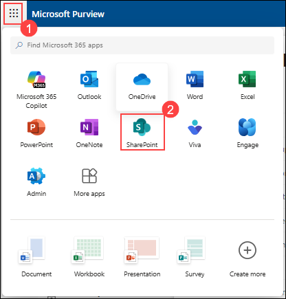

1. Choose **+ Create site**  to create new sites in sharepoint.

   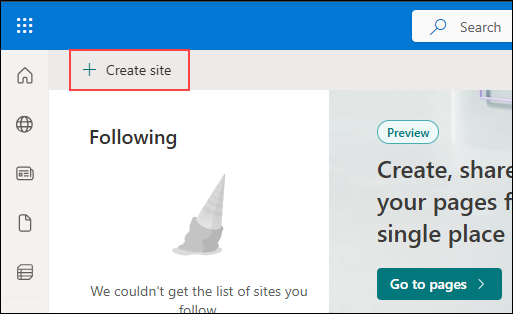

1. On the **Create a site: Select the site type** page, select **Communication site** option.

   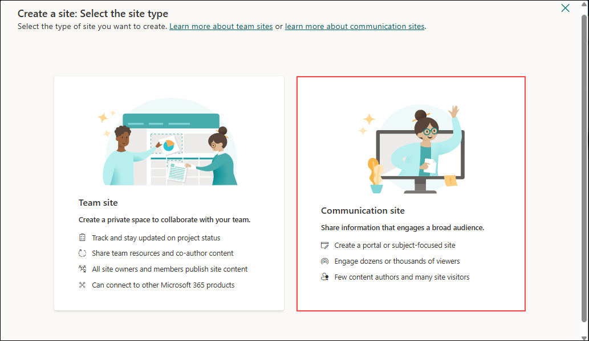

1. Under Select a template, choose **Standard communication (2)** from **From Microsoft (1)** provided options.

   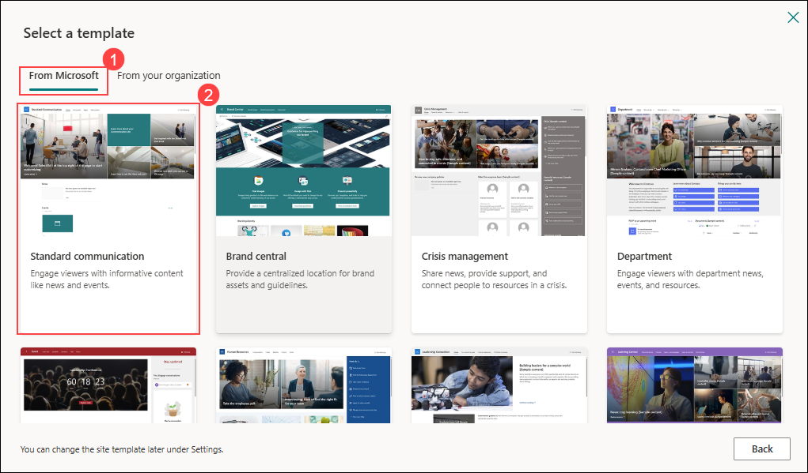

1. From the **Preview and use Standard communication template** page, select **Use template**.

   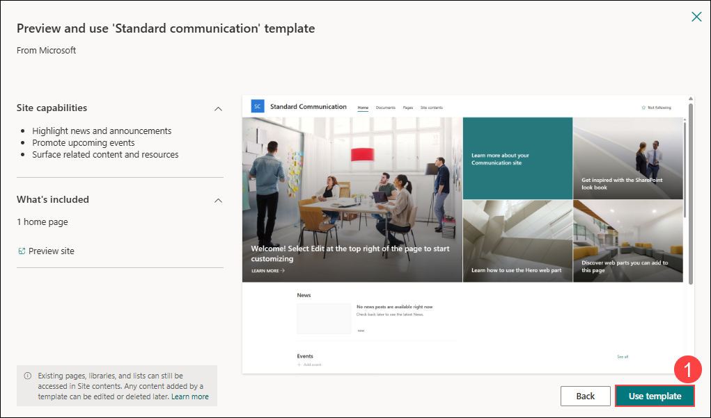

1. From **Give your site a name** page, provide Site name as **Communication site (1)** and choose **Next (2)**.

   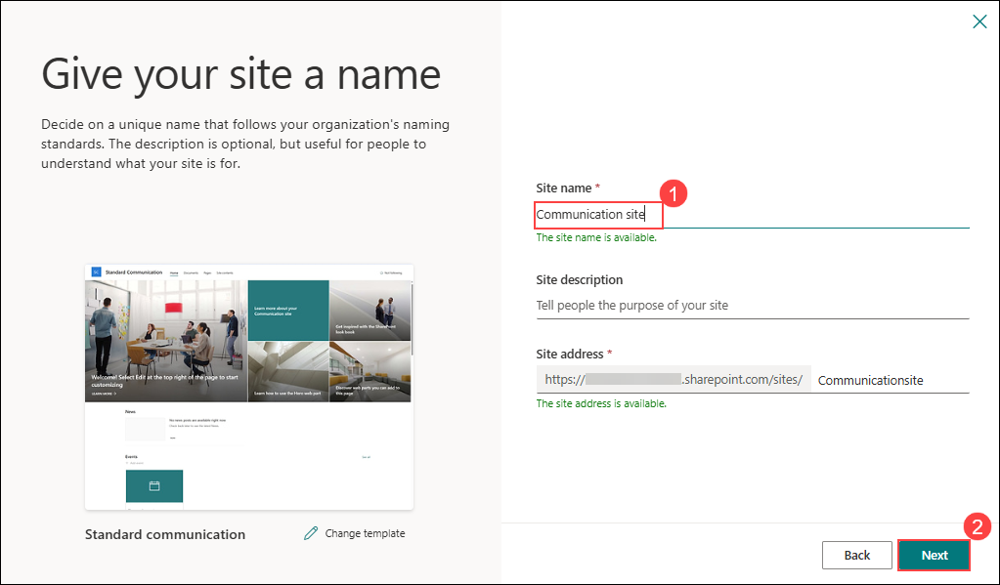

1. From **Set language and other options** page, under **Select a language** choose **English (1)** then select **Create site (2)**.

   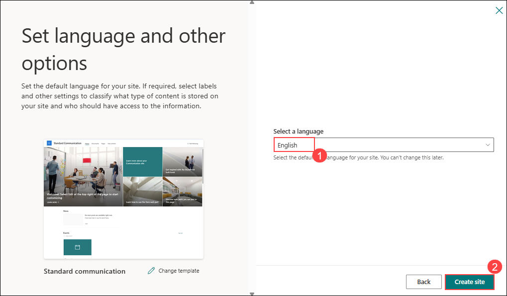

1. On the SharePoint landing page, select **My sites (1)** from the left toolbar then choose **Communication site (2)**.

   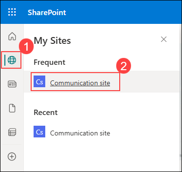

1. In the Communication site page, select **Documents (1) >> + New (2) >> PowerPoint presentation (3)**.

   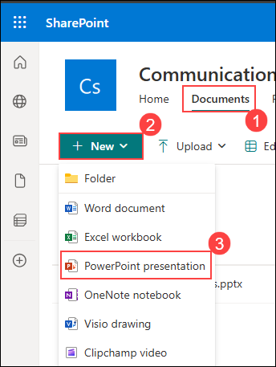

1. On the new presentation page, select **Presentation (1)** then rename it with **Vacation Policies (2)**.

   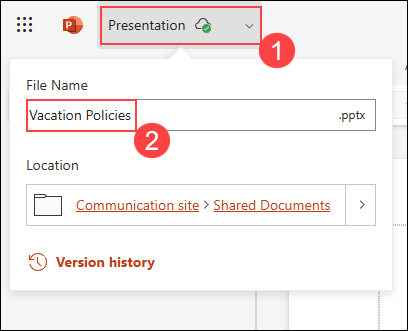

1. Navigate back to the **Documents** page, select the checkbox for **Vacation Policies.pptx (1)** then select **Delete (2)** from the action bar.

   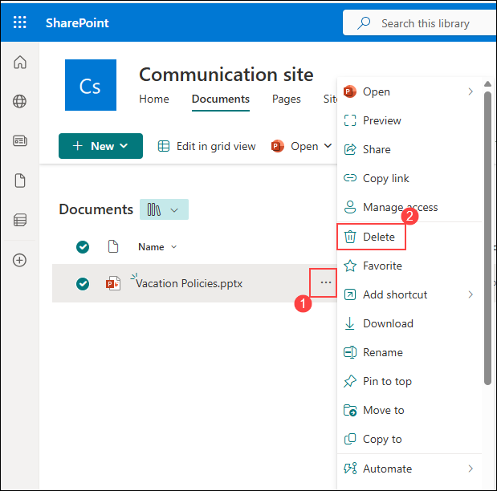

1. On the **Delete?** dialog, select **Delete**.

   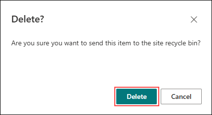

1. On the top right corner toolbar, select **Settings (1) >> Site contents (2)**.

   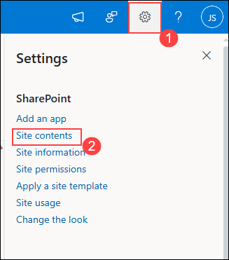

1. Select **Recycle bin** option from the top right corner of the page.

   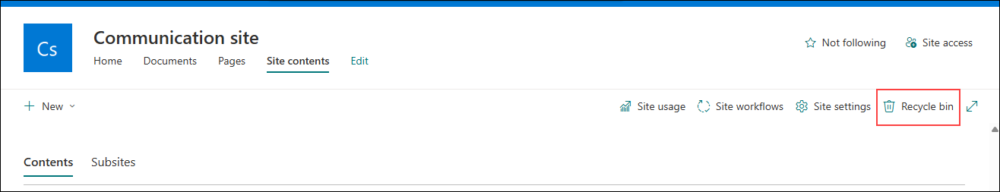

1. On the **Recycle bin** page, right click **Vacation Policies.pptx (1)**, then select **Restore (2)**.

   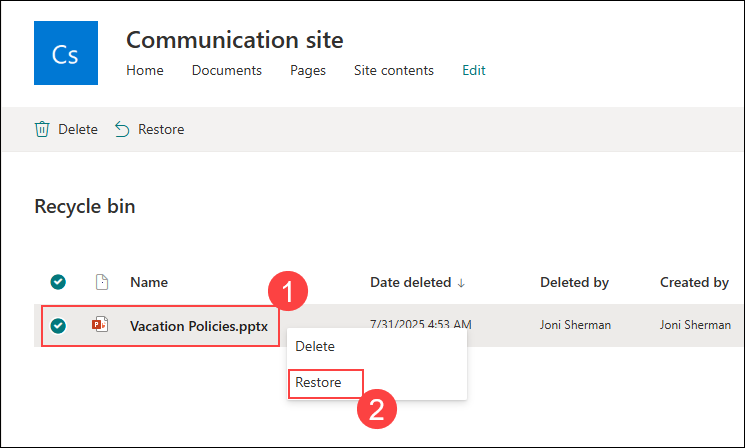

1. On the left sidebar, select **Documents (1)** and notice the **Vacation Policies.pptx (2)** file has been restored.

   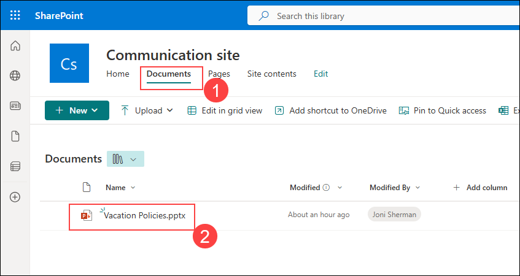

You have successfully recovered a deleted document from a SharePoint Site.

## Review

In this lab, you have completed the following tasks:

- Create a retention label
- Publish a retention label
- Create an auto-apply retention label policy
- Create a static retention policy
- Recover SharePoint content