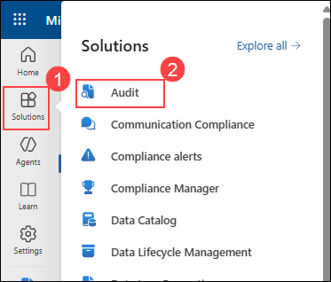
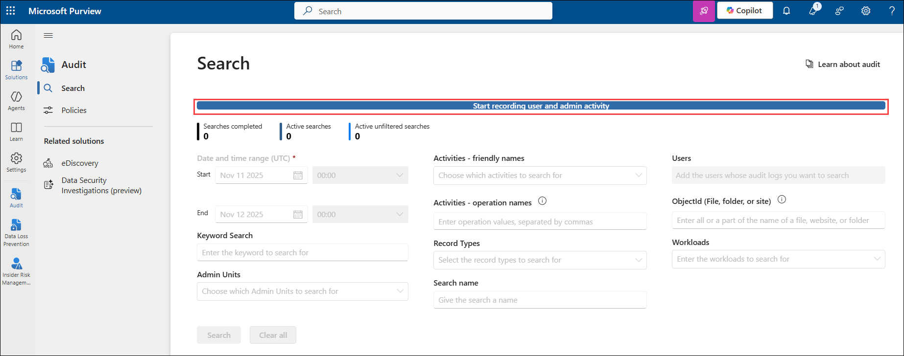
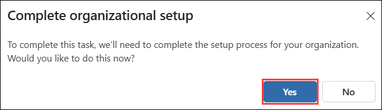
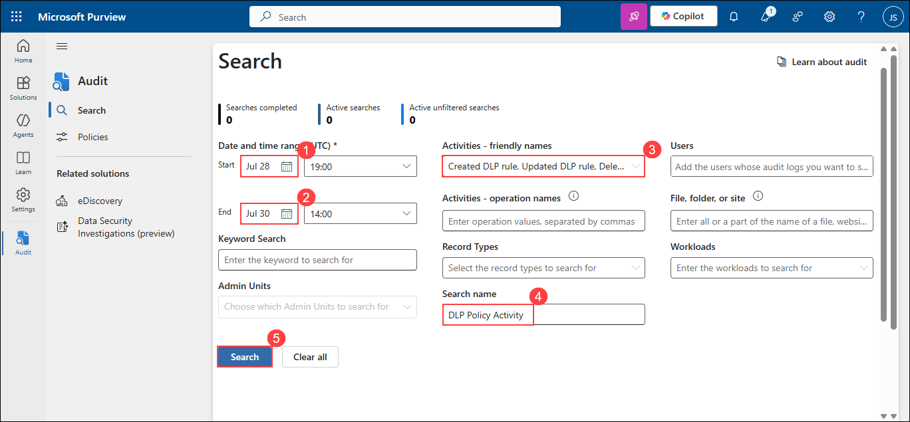
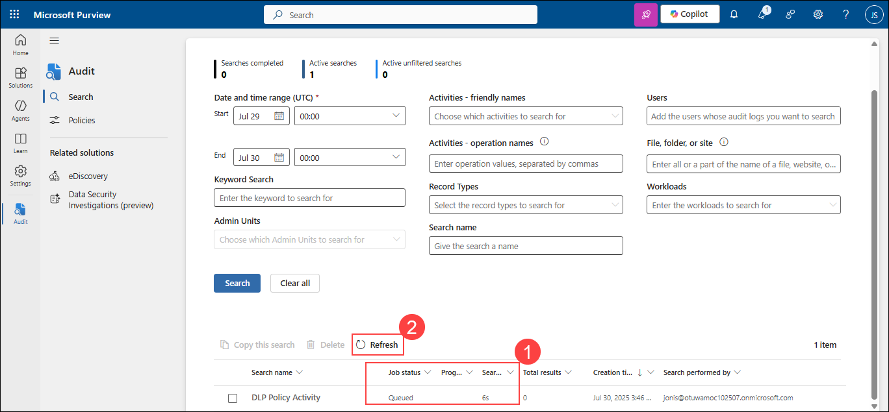
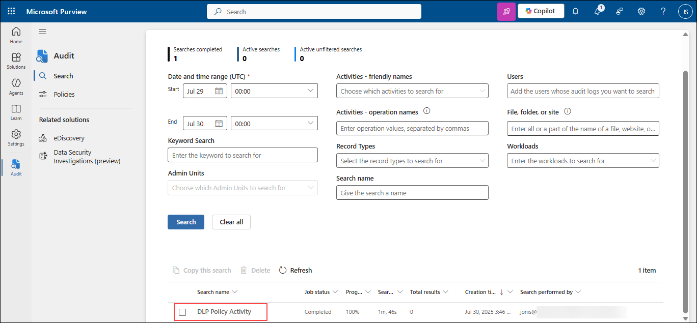
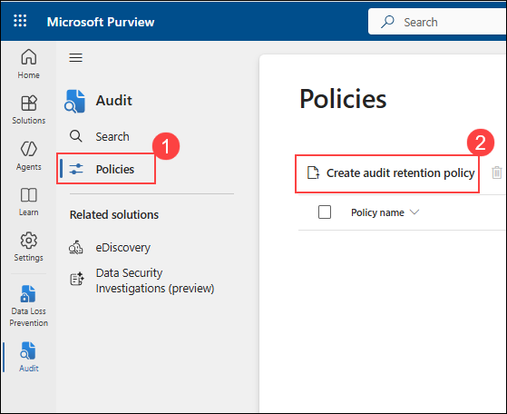
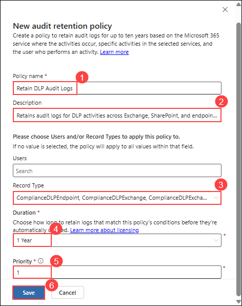

# Lab 6 - Exercise 1 - Search the Audit log

You're Joni Sherman, an Information Security Administrator at Contoso Ltd. As part of strengthening your organization's investigation and compliance readiness, you've been asked to use Microsoft Purview Audit to review DLP configuration changes and ensure that audit records for sensitive activity are retained for an extended period. You'll search for audit events related to DLP policies, export the results for offline analysis, and configure an audit retention policy that preserves key records across Exchange, SharePoint, and endpoint activity.

## Lab Objectives

In this lab, you will perform the following:

- Task 01: Search for DLP-related activity
- Task 02: Export audit search results
- Task 03: Create an audit retention policy

## Task 1 – Search for DLP-related activity

In this task, you'll use the Microsoft Purview Audit solution to search for recent audit events related to DLP policy and rules.

1. In **Microsoft Edge**, navigate to **`https://purview.microsoft.com`** and sign into the Microsoft Purview portal as **Joni S**.

   - **Email/Username:** **<inject key="User 01 UPN"></inject>**.
   - **Password:** **<inject key="User 01 Password"></inject>**

1. In Microsoft Purview, navigate to **Solutions (1)** > **Audit (2)**.

    

1. Select **Start recording user and admin activity**.

    

1. Select **Yes** to complete set up.

    

1. On the **Search** page, configure your search:

   - **Date and time range (UTC)**:

     - **Start date**: **3 days ago (1)**
     - **End date**: **Today's date (2)**

   - **Activities - friendly names**: Search for `DLP` and select the following activities under **Information protection and DLP activities (3)**:

     - Created DLP rule
     - Updated DLP rule
     - Deleted DLP rule
     - Created DLP policy
     - Updated DLP policy
     - Deleted DLP policy

   - **Search name**: `DLP Policy Activity (4)`
   - Select **Search (5)**.

      

1. It may take several minutes for the search to complete. While Audit processes your search, refresh the page to check the **Job status, Progress (%) and Search time (1)**. Choose **Refresh (2)** to see the updated status.

    

1. Once complete, select **DLP Policy Activity** to view the results.

    

     >**Note:** It may take some time for the DLP policy activity to appear. If it’s not visible yet, you can proceed to Task 3 and return to this step later.

1. Select individual results to view detailed information about each DLP activity.

You've searched for and reviewed audit activity related to DLP policy and rule configuration.

## Task 2 – Export audit search results [Read-Only]

In this task, you'll export the DLP audit search results for offline analysis or compliance record-keeping.

1. In Microsoft Purview, navigate to **Solutions** > **Audit**.

1. On the **Search** page, select the **DLP Policy Activity** search you created in the previous task.

1. Select **Export** at the top of the page.

1. In the confirmation dialog, select **OK** to start the export.

1. When the export completes, select the **Download file** link in the green **Your export is complete** banner.

   > **Note** : Audit export files are saved in CSV format and can be opened in any text editor or spreadsheet application. For easier review, use Excel or another spreadsheet tool. In this lab environment, you can open the CSV in Notepad to confirm that the export completed successfully.

You've exported DLP-related audit logs, which can be used for offline review or recordkeeping.

## Task 3 – Create an audit retention policy

In this task, you'll configure an audit retention policy to preserve logs related to DLP matches and actions for long-term investigation.

1. In Microsoft Purview, navigate to **Solutions (1)** > **Audit (2)**.

    

1. Select **Policies (1)** from the left sidebar. On the **Policies** page select **Create audit retention policy (2)**

    

1. On the **New audit retention policy** panel, enter:

   - **Policy name**: `Retain DLP Audit Logs (1)`
   - **Description**: `Retains audit logs for DLP activities across Exchange, SharePoint, and endpoints to support investigation and compliance. (2)`
   - **Users**: Leave blank to apply to all users
   - **Record Type (3)**:
      - ComplianceDLPEndpoint
      - ComplianceDLPExchange
      - ComplianceDLPExchangeClassification
      - ComplianceDLPSharePoint
      - ComplianceDLPSharePointClassification
   - **Duration**: **1 year (4)**
   - **Priority**: **1 (5)**
   - Select **Save (6)** to create the audit retention policy.

      

You've configured an audit retention policy that keeps logs of DLP matches and activity for one year.

## Review

In this lab, you have completed the following tasks:

- Search for DLP-related activity
- Export audit search results
- Create an audit retention policy