# Lab 6 - Exercise 2 - Perform a content search

You are Joni Sherman, an Information Security Administrator at Contoso Ltd. The organization has received an alert that sensitive financial data may have been exposed. You've been asked to use Microsoft Purview to search for content containing key financial terms across Microsoft 365 services. Your goal is to determine whether any sensitive content was shared inappropriately and support the investigation.

## Lab Objectives

In this lab, you will perform the following:

- Task 01: Assign eDiscovery permissions
- Task 02: Search for content using sensitive financial terms

## Task 1 – Assign eDiscovery permissions

In this task, you'll assign eDiscovery permissions to Joni Sherman so she can perform a content search in Microsoft Purview.

1. You should now be working within the **LabVM**, signed in as demouser.

1. If you're signed in as Joni, sign out and close all browser windows.

1. In Microsoft Edge, navigate to **`https://purview.microsoft.com`** and sign into the Microsoft Purview portal as Administrator, 

    - Username: **<inject key="AzureAdUserEmail" enableCopy="false"/>** 
    - Password: **<inject key="AzureAdUserPassword" enableCopy="false"/>**.

1. In the left sidebar, select **Settings (1)** > **Roles and Scopes (2)** > **Role groups (3)**.

    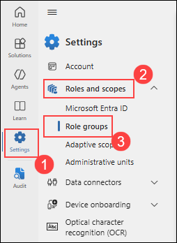

1. On the **Role groups for Microsoft Purview solutions** page, search for `eDiscovery (1)`, then select **eDiscovery Manager (2)**.

    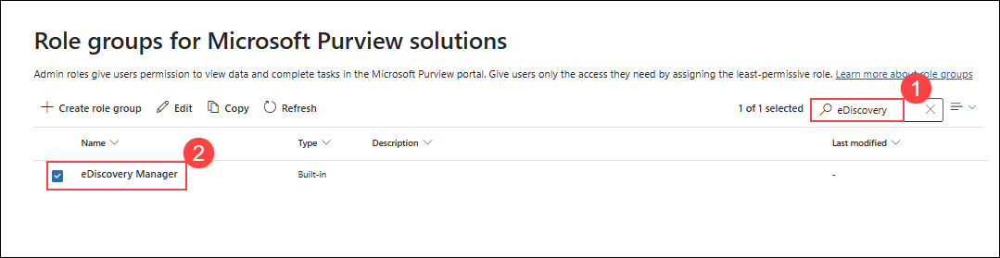

1. On the **eDiscovery Manager** flyout panel, select **Edit**.

    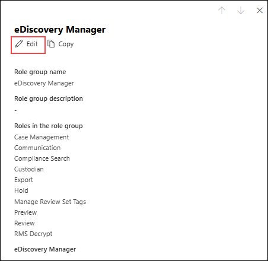

1. On the **Manage eDiscovery Manager** page, select **Choose users (1)**. On the **Choose users** flyout page, search for `Joni (2)`, then select the checkbox for **Joni Sherman (3)**. Select the **Select (4)** button at the bottom of the panel. Back on the **Manage eDiscovery Manager** page, select **Next (5)**.

    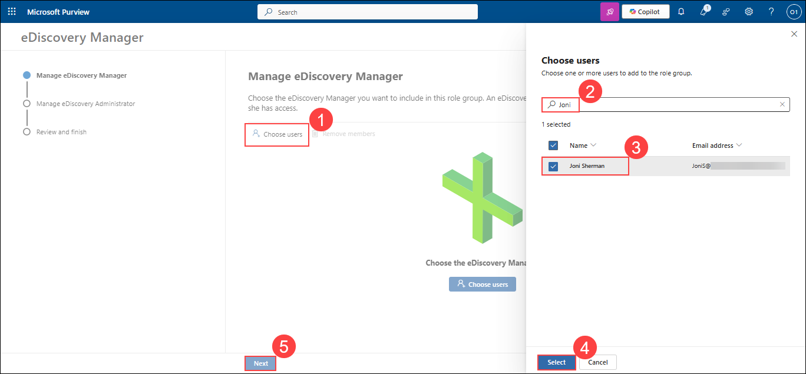

1. On the **Manage eDiscovery Administrator** page, select **Next (1)**.

    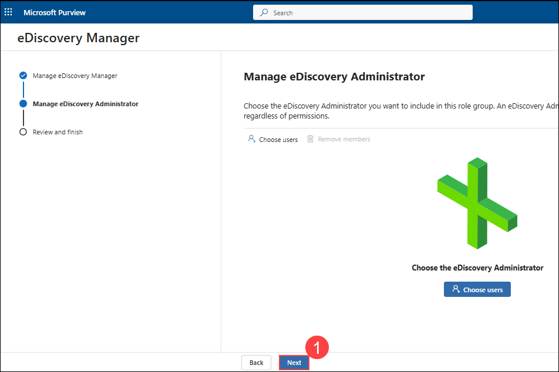

1. On the **Review the role group and finish** page, select **Save (1)**.

    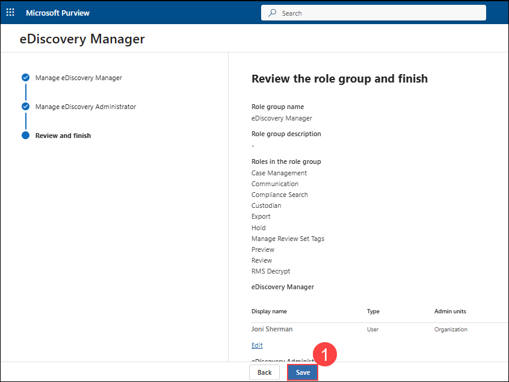

1. On the **You successfully updated the role group** page, select **Done (1)**.

    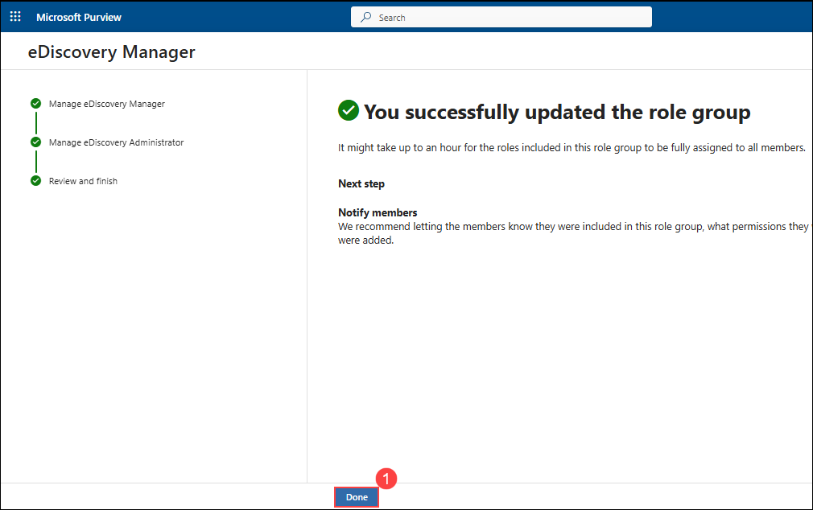

1. Sign out of the Administrator account by selecting the **01 (1)** icon on the top right of the window, then select **Sign out (2)**.

    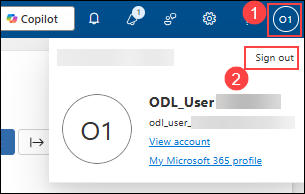

You've assigned eDiscovery permissions to Joni Sherman, enabling her to search for sensitive content as part of the investigation.

## Task 2 – Search for content using sensitive financial terms

1. In **Microsoft Edge**, navigate to **`https://purview.microsoft.com`** and sign into the Microsoft Purview portal as **JoniS@<inject key="TenantDomainName" enableCopy="false" /></inject>**.

1. In Microsoft Purview, navigate to **Solutions (1)** > **eDiscovery (2)**.

    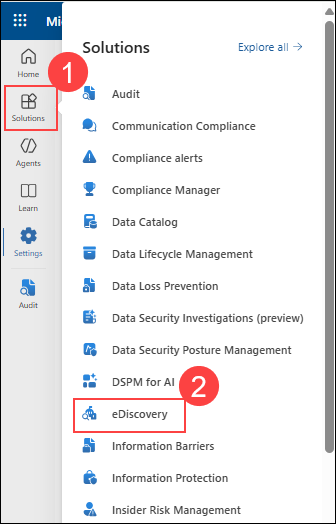

1. On the **Cases** page, select the dropdown next to **Create case (1)**, then select **Create search (2)**.

    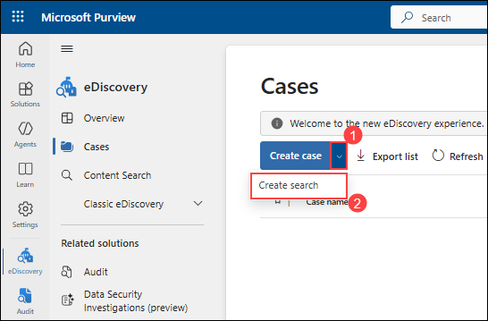

1. On the **Enter details to get started** dialogue, enter:

   - **Case name**: `Financial Data Exposure Review (1)`
   - **Search name**: `Financial Data Leak Investigation (2)`
   - **Case description**: `Case opened to support security investigation efforts by identifying potential exposure of sensitive financial terms in Microsoft 365 content. (3)`
   - **Search description**: `Search targets common high-risk financial keywords to support data security monitoring and policy validation. (4)`
   - Select **Create (5)** to create the search.

      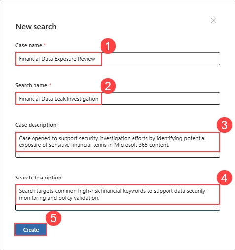

1. On the **Financial Data Leak Investigation** page, under **Data sources** select **+(plus sign) (1)** > **+ Add data sources (2)**.

   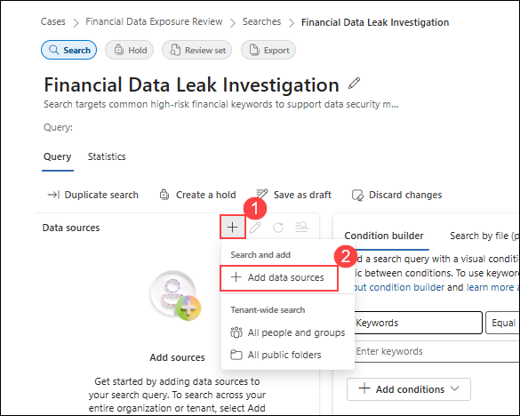

1. On the **Search for sources** flyout, select the **Finance team (1)** group, then select **Save and close (2)**.

   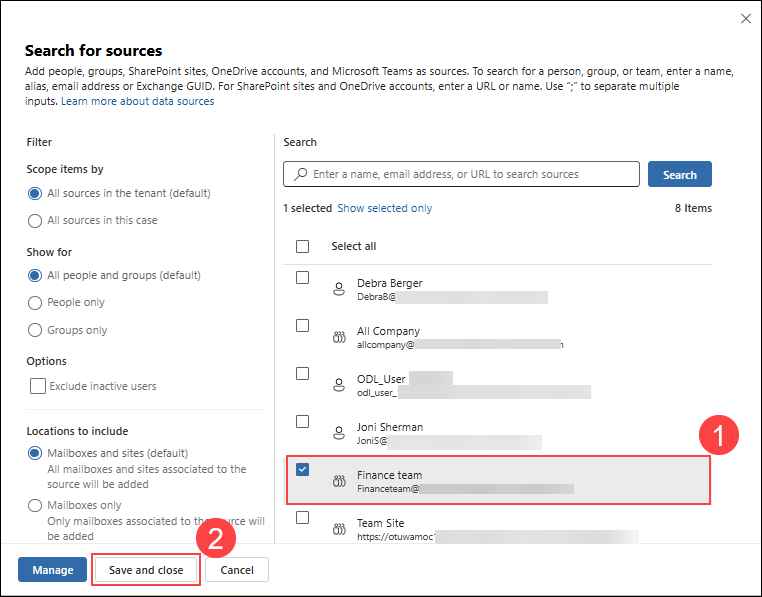

1. In the **Condition builder** pane, add the keywords `bank account (1)` and `credit card (2)`, then select **Run query (3)**.

   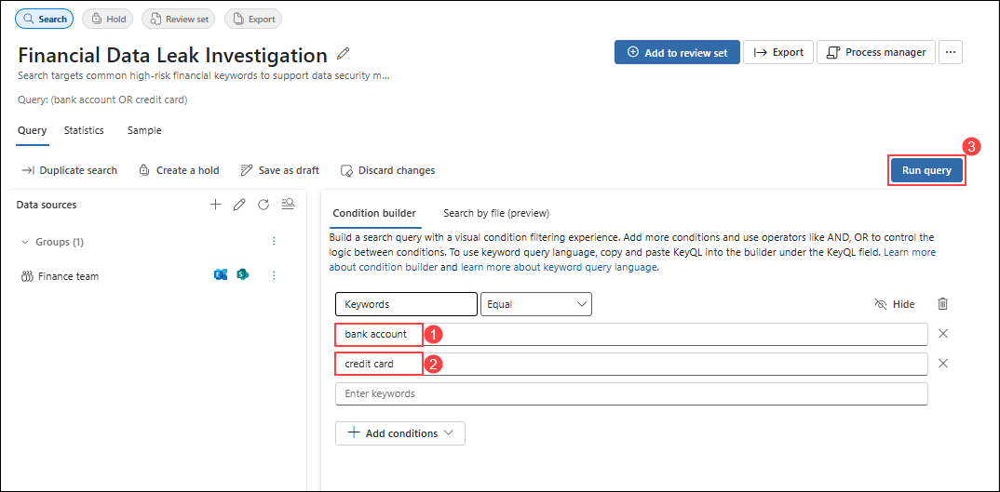

1. In the **Choose search results** flyout under **Statistics**, select the checkboxes for **Include categories (1)** and **Include query keywords report (2)**, then select **Run Query (3)**.

   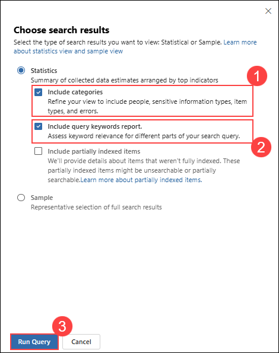

1. Review the results of the search by:

   - Select the **Statistics** tab to view a summary of search metrics.
   - Select the **Sample** tab to preview matched content.

      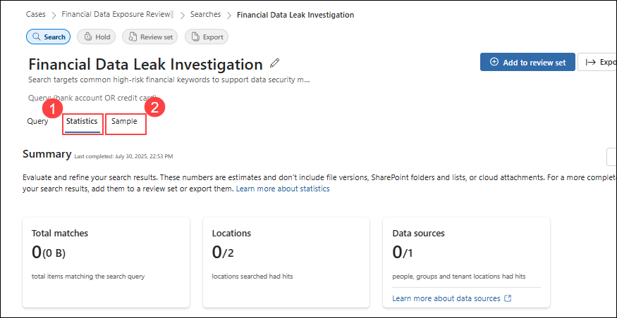

     >**Note:** As we haven't shared sensitive content and wasn't shared inappropriately so there will not be any resultsin above step.

You've performed a keyword-based content search to help identify whether sensitive financial data was shared inappropriately. These results support security investigations and help guide risk response.

## Review

In this lab, you have completed the following tasks:

- Assign eDiscovery permissions
- Search for content using sensitive financial terms