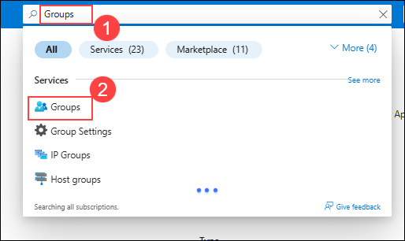
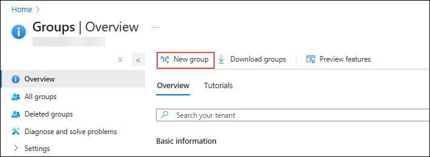
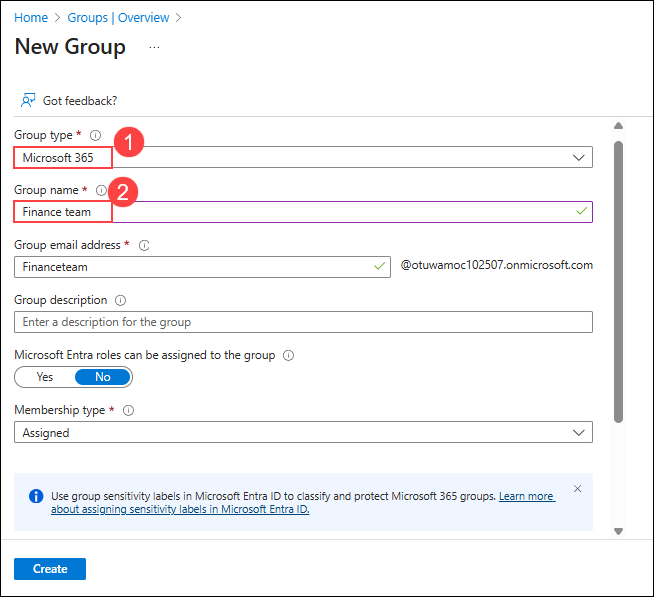
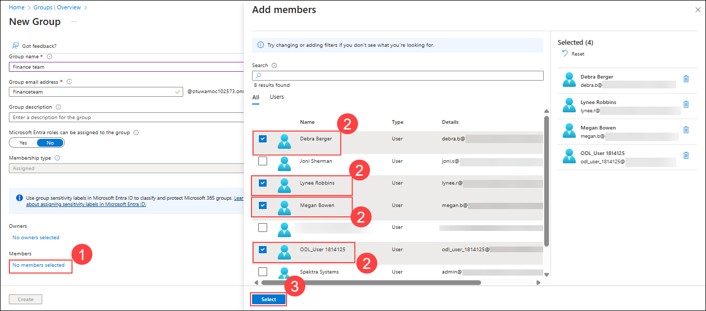
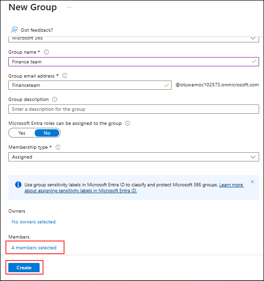

# Lab setup - Prepare your environment for administration

In this lab, you'll configure and prepare your environment for administration tasks. You'll enable required features, configure permissions, and prepare core services for administration.

**Tasks:**

1. Enable Audit in the Microsoft Purview portal  
1. Enable device onboarding  
1. Enable insider risk analytics and data sharing  
1. Set user passwords for lab exercises  
1. Initialize Microsoft Defender XDR

## Task 1 - Enable Audit in the Microsoft Purview portal

In this task, you'll enable Audit in the Microsoft Purview portal to monitor portal activities.

1. In the LabVM, Open Microsoft Edge, navigate to the Microsoft Purview portal, `https://purview.microsoft.com`, and log in using below credentials.

   - **Email/Username:** <inject key="AzureAdUserEmail"></inject>
   - **Password:** <inject key="AzureAdUserPassword"></inject>

1. A message about the new Microsoft Purview portal will appear on the screen. Select **Get started** to access the new portal.

    

1. Select **Solutions** from the left sidebar, then select **Audit**.

1. On the **Search** page, select the **Start recording user and admin activity** bar to enable audit logging.

    

1. Once you select this option, the blue bar should disappear from this page.

<!----- PowerShell instructions

1. Open an elevated Terminal window by selecting the Windows button with the right mouse button and then select **Terminal (Admin)**.

1. Run the **Install Module** cmdlet in the terminal window to install the latest **Exchange Online PowerShell** module version:

    ```powershell
    Install-Module ExchangeOnlineManagement
    ```

1. Confirm the NuGet provider prompt by typing **Y** for Yes and press **Enter**.

1. Confirm the Untrusted repository security dialog with **Y** for Yes and press **Enter**.  This process may take some time to complete.

1. Run the **Set-ExecutionPolicy** cmdlet to change your execution policy and press **Enter**

    ```powershell
    Set-ExecutionPolicy -ExecutionPolicy RemoteSigned -Scope CurrentUser
    ```

1. Close the PowerShell window.

1. Open a regular (non-elevated) PowerShell window by right-clicking the Windows button and selecting **Terminal**.

1. Run the **Connect-ExchangeOnline** cmdlet to use the Exchange Online PowerShell module and connect to your tenant:

    ```powershell
    Connect-ExchangeOnline
    ```

1. When the **Sign in** window is displayed, sign in as `admin@WWLxZZZZZZ.onmicrosoft.com` (where ZZZZZZ is your unique tenant ID provided by your lab hosting provider). Admin's password should be provided by your lab hosting provider.

1. To check if Audit is enabled, run the **Get-AdminAuditLogConfig** cmdlet:

    ```powershell
    Get-AdminAuditLogConfig | FL UnifiedAuditLogIngestionEnabled
    ```

1. If _UnifiedAuditLogIngestionEnabled_ returns false, then Audit is disabled.

1. To enable the Audit log, run the **Set-AdminAuditLogConfig** cmdlet and set the **UnifiedAuditLogIngestionEnabled** to _true_:

    ```powershell
    Set-AdminAuditLogConfig -UnifiedAuditLogIngestionEnabled $true
    ```

1. To verify that Audit is enabled, run the **Get-AdminAuditLogConfig** cmdlet again:

    ```powershell
    Get-AdminAuditLogConfig | FL UnifiedAuditLogIngestionEnabled
    ```

1. _UnifiedAuditLogIngestionEnabled_ should return _true_ to let you know Audit is enabled.

-->

You have successfully enabled auditing in Microsoft 365.

## Task 2 – Enable device onboarding

In this task, you'll enable device onboarding for your organization.

1. In **Microsoft Edge**, navigate to **`https://purview.microsoft.com`** to log into Microsoft Purview, then select **Settings** from the left sidebar.

1. In the left sidebar, expand **Device onboarding** then select **Devices**.

1. On the **Devices** page, select **Turn on device onboarding** then select **Ok** to enable device onboarding.

1. When prompted, select **OK** to confirm that device monitoring is being turned on.

You have now enabled device onboarding and can start to onboard devices to be protected with Endpoint DLP policies. The process of enabling the feature might take up to 30 minutes.

## Task 3 – Enable insider risk analytics and data sharing

In this task, you'll enable analytics and data sharing for Insider Risk Management.

1. In Microsoft Purview, navigate to **Settings** > **Insider Risk Management** > **Analytics**.

1. Toggle these settings to **On**:

   - **Show insights at tenant level**

   - **Show insights at user level**

1. Select **Save** at the bottom of the page.

1. Select **Data sharing** on the left navigation pane.

1. In the Data sharing section, toggle **Share user risk details with other security solutions** to **On**.

1. Select **Save** at the bottom of the page.

You have enabled analytics and data sharing for Insider Risk Management.

## Task 4 – Initialize Microsoft Defender XDR

In this task, you'll open Microsoft Defender and wait for Microsoft Defender XDR to finish initializing.

1. In **Microsoft Edge**, navigate to **`https://security.microsoft.com/`** to open Microsoft Defender.

1. From the navigation pane, select **Investigation & response** > **Incidents & alerts** > **Incidents**.

> [!note] **Note**: The Microsoft Defender XDR initialization screen might or might not appear depending on your lab tenant. If it appears, you can continue with other tasks while it completes in the background.

1. You'll see a message stating that Microsoft Defender XDR is being prepared. This process runs automatically and might take a few minutes.

   

Microsoft Defender XDR is being initialized. You can continue with other tasks while it finishes setting up.

## Task 4 – Create a new M365 group

In this task, you will create a new Microsoft 365 (M365) group and ensure it is properly provisioned with an associated Exchange mailbox and SharePoint site. This setup is essential to make the group eligible as a data source in Microsoft Purview eDiscovery.

1. Go to **portal.azure.com**.

1. On the Azure portal, in **Search resources, services and docs (G+/)** box at the top of the portal search for **Groups (1)** and select **Groups (2)**.

   

1. From the **Groups| Overview** page, select **New group** option.

   

1. On the **New Group** blade, configure the following settings while leaving all other options at their default values.

      | Setting | Value |
      | --- | --- |
      | Group type | **Microsoft 365 (1)** |
      | Group name | **Finance team (2)** |

   

1. Scroll down, select **No members selected (1)**, then choose **Debra Berger (2)**, **Lynne Robbins (2)** and **Megan Bowen (2)**, **ODL_User <inject key="DeploymentID" enableCopy="false" /></inject>(2)**. Choose **Select (3)** option.

   

1. After selecting all four members, choose **Create** to provision the M365 group.

   