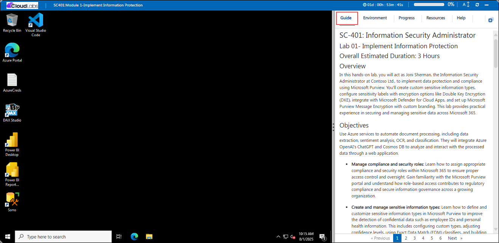
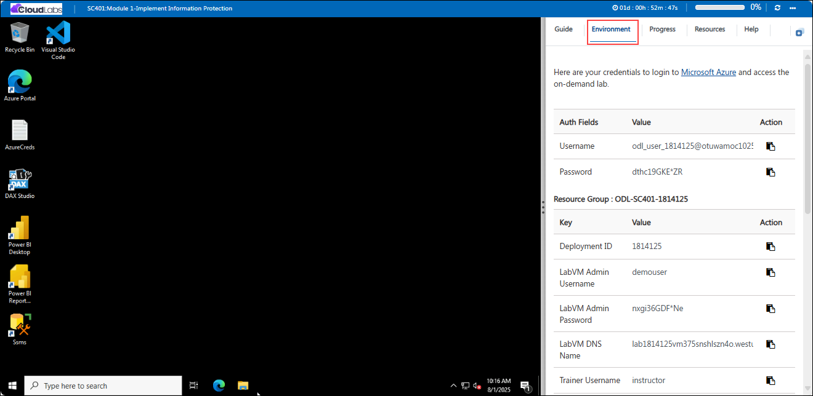
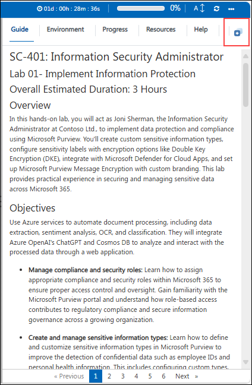
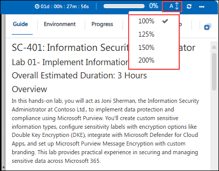
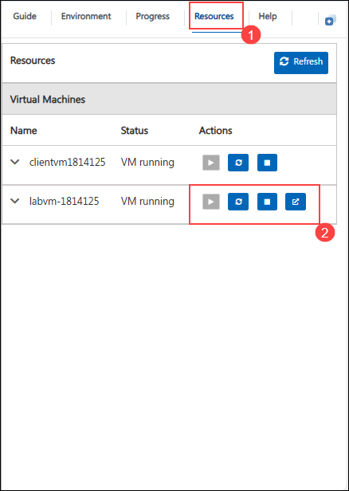
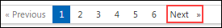

# SC-401: Information Security Administrator

## Lab 03- Implementing Retention and Data Protection Strategies for AI Workloads

## Overall Estimated Duration: 2 Hours

## Overview

In this hands-on lab, you will step into the role of Joni Sherman, the Information Security and Compliance Administrator at Contoso Ltd., to enhance data security and governance using Microsoft Purview. You'll explore how to protect sensitive data in AI interactions by configuring Microsoft Purview Data Security Posture Management (DSPM) for AI, enforcing policies, and assessing potential data exposures. Additionally, you'll implement retention policies and settings that support regulatory compliance, minimize unnecessary data retention, and provide oversight for sensitive communications. This lab offers practical experience in safeguarding organizational data in both traditional and AI-driven environments.

## Objectives

- **Protect data in AI environments:** Learn how to use Microsoft Purview Data Security Posture Management (DSPM) for AI to secure organizational data accessed through generative AI tools like Microsoft Copilot. Gain experience creating DLP and insider risk policies tailored to AI usage, blocking access to sensitive labeled content, and running data assessments to identify and manage unlabeled or exposed information. This exercise supports proactive protection and risk mitigation in AI-driven environments.

- **Implement and manage retention:** Learn how to configure Microsoft Purview retention solutions to support data governance, audit readiness, and reduce unnecessary data exposure. In this lab, you'll create and publish retention labels, apply them through auto-apply and static policies, and practice content recovery in SharePoint. This exercise helps ensure sensitive communications and financial data are properly preserved and managed.
  
## Prerequisites

Participants should have basic knowledge and understanding of the following:

- Microsoft 365 administration and familiarity with navigating the Microsoft Purview compliance portal
- Core concepts of data lifecycle management and retention strategies
- Understanding of retention labels and policies in Microsoft Purview
- Experience working with Microsoft 365 services such as Exchange Online, SharePoint Online, and OneDrive for Business
- Knowledge of compliance and governance principles, including regulatory data requirements
- Basic understanding of permissions and role-based access control (RBAC) in Microsoft Entra ID (Azure AD)
  
## Architecture

The lab uses the Microsoft Purview Compliance Portal to manage data protection and retention. DSPM for AI secures sensitive data accessed by tools like Microsoft Copilot through DLP and insider risk policies. Purview Information Protection enforces access control with sensitivity labels, while retention policies manage data lifecycle across services like SharePoint and Exchange Online. Integration with Microsoft Defender for Cloud Apps and Microsoft Entra ID ensures policy enforcement and identity management.

## Explanation of Components

The architecture for this lab involves the following key components:

- **Microsoft Purview Compliance Portal:** The central hub for managing compliance features across Microsoft 365, including retention, information protection, and governance settings.

- **Microsoft Purview Data Lifecycle Management:** Provides the ability to create, publish, and manage retention labels and policies. Supports auto-apply conditions, static policies, and label-based retention for both compliance and operational requirements.

- **Microsoft 365 Workloads (Exchange Online, SharePoint Online, OneDrive for Business):** These services host the content affected by retention policies. The configuration ensures consistent retention behaviors across emails, documents, and files.

- **Microsoft Entra ID (formerly Azure AD):** Manages user identities and access control, ensuring only authorized personnel can configure and apply retention policies.

- **Microsoft Purview eDiscovery (optional):** While not directly used in every task, this component supports compliance investigations that may rely on data retained by configured policies.

## Getting Started with the Lab

Welcome to your SC-401: Information Security Administrator Workshop! We've prepared a seamless environment for you to explore and learn about Information Security. Let's begin by making the most of this experience.
 
## Accessing Your Lab Environment
 
Once you're ready to dive in, your virtual machine and lab guide will be right at your fingertips within your web browser.

  
 
## Exploring Your Lab Resources
 
To get a better understanding of your lab resources and credentials, navigate to the **Environment** tab.
 
  
 
## Utilizing the Split Window Feature
 
For convenience, you can open the lab guide in a separate window by selecting the **Split Window** button from the Top right corner.
 
  

## Utilizing the Zoom In/Out Feature

To adjust the zoom level for the environment page, click the A↕ : 100% icon located next to the timer in the lab environment.

  

## Managing Your Virtual Machine
 
Feel free to **Start, Restart,** or **Stop** your virtual machine as needed from the **Resources** tab. Your experience is in your hands!

  

## Support Contact
The CloudLabs support team is available 24/7, 365 days a year, via email and live chat to ensure seamless assistance at any time. We offer dedicated support channels tailored specifically for both learners and instructors, ensuring that all your needs are promptly and efficiently addressed.

Learner Support Contacts:

   - Email Support: cloudlabs-support@spektrasystems.com
   - Live Chat Support: https://cloudlabs.ai/labs-support

Now you're all set to explore the powerful world of technology. Feel free to reach out if you have any questions along the way. Enjoy your workshop!

Now, click on **Next** from the lower right corner to move on to the next page.

  

## Happy Learning!!